# Java(多看源码)
# 一.JAVA基础
## 1.1-JAVA本身
1. JAVA是解释性语言（编译后的代码不能直接执行，**需要解释器**，换个角度，JAVA编写的代码保存后是为.java形式的，如果想运行，还需要额外再编译为.class文件才能在解释器中运行，**不要忘记编译了**）
（C/C++是编译性语言，可以直接被机器执行）
//**JAVA会自动内存回收**
//**JAVA有接口,程序包,可以多线程**
2. JAVA是跨平台的语言，运行逻辑：（一次编译，到处运行）
（**.java是源文件，通过编译器的编译变成.class文件**，如果出错就会编译出错，形成不了.class文件
**.class是字节码文件**）

//JDK：(Java Development Kit Java 开发工具包) JDK = JRE + java 的开发工具 [java, javac,javadoc,javap 等]
（安装路径不能有中文或特殊符号）
//JRE(Java Runtime Environment Java 运行环境) JRE = JVM + Java 的核心类库[类]
(有JRE就可以运行.class文件)
//JVM：Java 虚拟机 [java virtual machine]
3. 配置path（指定目录寻找执行程序,）：
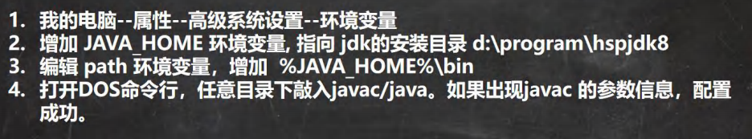
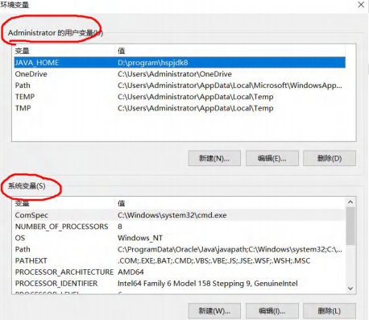
4. 运行原理：

## 1.2-JAVA入门
### 1. 简单举例：
~~~
public class Hello { //编写一个 main 方法 
public static void main(String[] args) { 
    System.out.println("Darling,I love you!"); } //表示输出"hello,world~"到屏幕
    }
~~~
//**println输出自带换行,print不带**
//**一个源文件中最多只能有一个public类，且文件名要与该public类名相同（没有public类就对文件名不限定），其它类个数不限，编译后每一个类都会生成一个.class文件**
//执行出口是main（类比C++），每个类都能有main，因为.class文件每个类都有，自然**运行哪个类的.class，就是运行哪个类的main函数**
//若要输出字符串加数字,格式可为:
**System.out.println("a="+a);**此处a为数字

### 2. **转义字符：**
**控制台输入 tab 键，可以实现命令补全,就是自动补齐一个语段 
编写时，tab右移，shift+tab左移
\t ：一个制表位，实现对齐的功能 
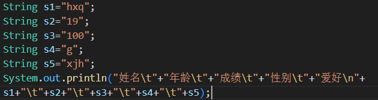
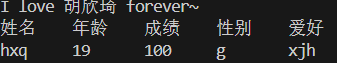
\n ：换行符 
\\ ：一个\ 
\" :一个" 
\' ：一个' 
\r :一个回车 System.out.println("Darling   and I,\rlover hxq");**  //会输出lover hxq and I,

### 3. 注释(先选中,再快捷键ctrl+/一次可注释多行)：
单行注释：//
多行注释：/*  */（内部不允许嵌套多行注释）
文档注释（例）：
/ ** 
*@author xjh&hxq
*@version 1.0
*/

### 4. 代码与命名规范：
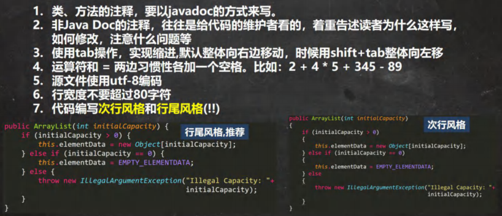
**开发过程尽量不使用诸如a,b的变量名,这也是很容易理解的吧**
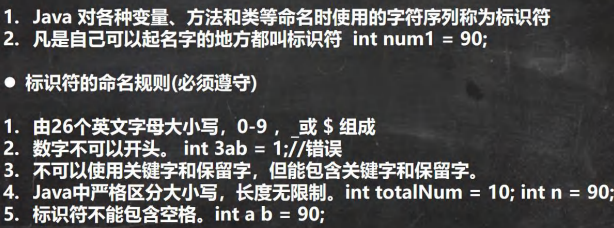

Java 保留字：现有 Java 版本尚未使用，但以后版本可能会作为关键字使用。自己命名标识符时要避免使用这些保留字 byValue、cast、future、 generic、 inner、 operator、 outer、 rest、 var 、 goto 、const

### 5. DOS命令（就是windows控制台命令，了解）：
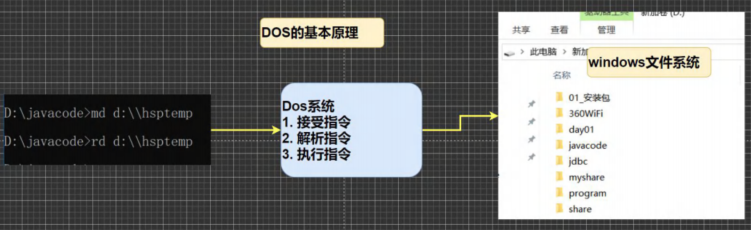
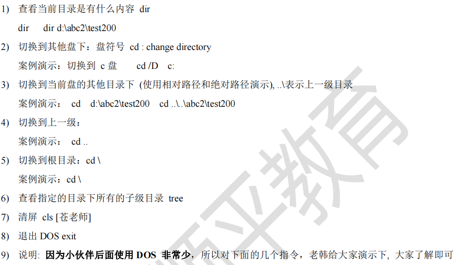

### 6. 相对路径和绝对路径：
相对路径：从当前目录开始定位(..\表示上一目录)
绝对路径：从顶级目录开始定位（c盘，d盘等）

### 7. JAVA的API文档:
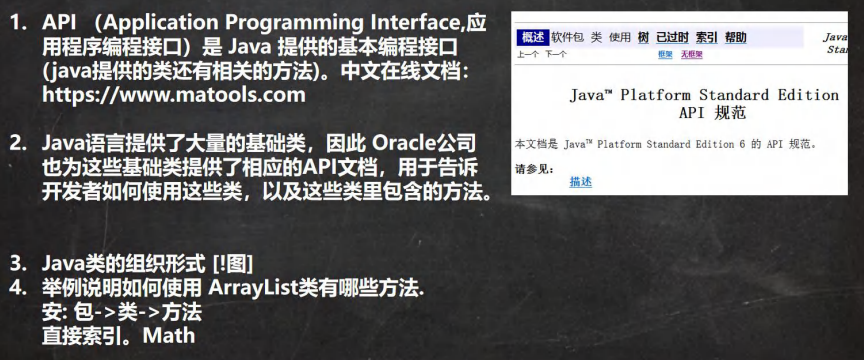
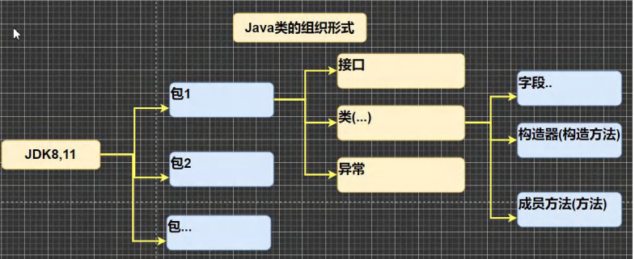

### 8. 字符编码表
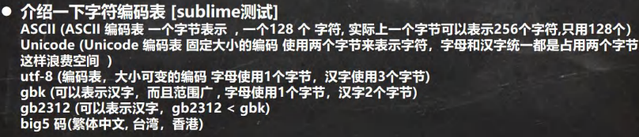
## 1.3变量
### 1. 三个要素:
   1. 类型(int是4个字节,double是8个字节)
   2. 名称(**在同一个作用域不能重名,即例如已经声明一个变量int a=50,不能在后续再添加一个int a=70,应当直接写作a=70**)
   3. 值
### 2. 声明及赋值规则同C++
### 3. "＋"运算
   1. 两方均为数值时加法运算(**char类型算作数值,哪怕为中文字符,结果也为其数值运算,结果是一个数**)
   2. **其一为字符串时作拼接运算**
   3. 顺序为从左到右
### 4. **数据类型(JAVA版):**
##### 1. **基本数据类型:**
1.  **int(整数类型,以下皆为全拼)**
            1. **byte:1字节(1字节,1byte = 8bit)**
            2. **short:2字节**
            3. **int:4字节(2的31次方31-1 ~ -2的31次方)**
            4. **long:8字节(声明且只有long常量后面要加'l'或者'L',别的类型后面加会报错,形式:long a = 100L;)**
2. 浮点数 = 符号位+指数位+尾数位
   **(浮点类型,即小数类型,尾数位可能会丢失,让精度损失,也就是说float和double类型运算可能会出现小数点后很多位数值有偏差的情况**,**运算时需要格外注意这点**,因此小数都是近似值)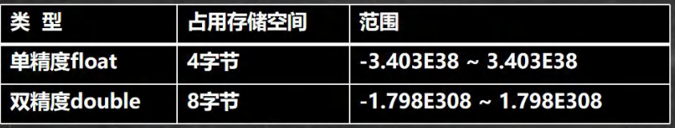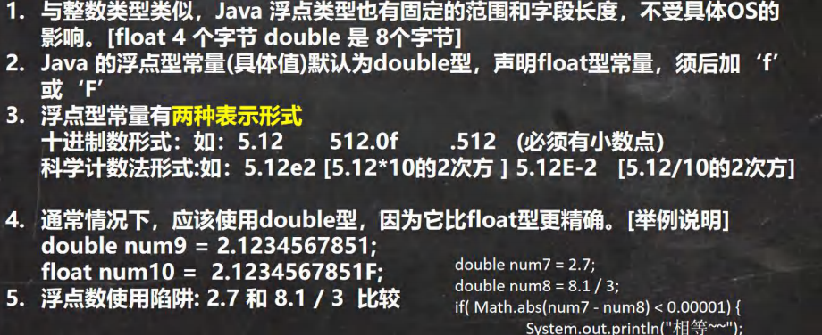
   // 此处3.的0,512允许省略0,而浮点数512会变成512.0来突出有小数点的特征,**对于小数直接的相等运算是计算差值绝对值在某个精度区间判断,而非以完全相等判断,当然,直接赋值是精确可相等的**
            1. **float:4字节(必须在常量后加f或F,因为浮点数的值默认为double类型,所以要特别说明)**
            2. **double:8字节(可以存放float类型的值,也就是说double b = 3.0F可以,不过空间会有浪费)**
   3. **char(单个字符型,存放单个字符'a',常用单引号,可以将字符型赋值为特殊字符型常量,例如char c3 = '\n',多个字符用字符串string):2字节**
        (char的本质是整数,对应的unicode码,所以可以加减运算,同C++)
   4. **boolean**(布尔型,存放true和false):1字节
         //若要return布尔型的数据,**return true;return false;**
##### 2. **引用数据类型:**
   1. **class (类)**
   2. **interface (接口)**
   3. **[ ] (数组)**
##### 1. 基本数据类型转换:
   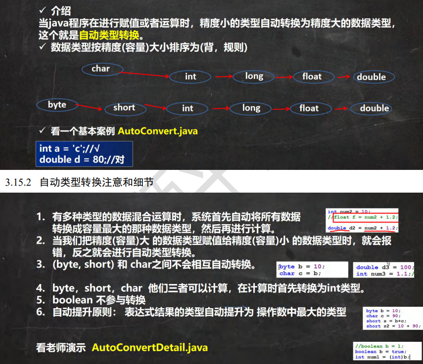
   **简而言之就是精度大的可以用精度小的赋值,而char本质上是一个整数,通过编码规则变成的字符,所以可以用char的字符赋值给int等精度更大的数据类型,精度大与精度小的运算结果以精度最大的数据类型为准**
##### 2. 强制类型转换(从精度大变为精度小):
   形式:int x = (int)10*3.5
   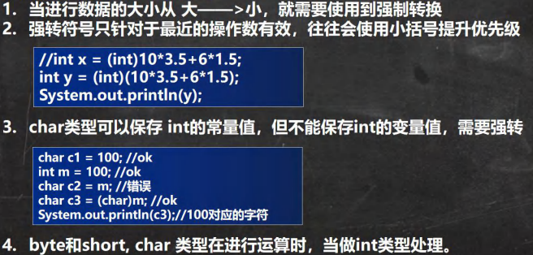
   //char只能存int的常量,不能用int的变量赋值
   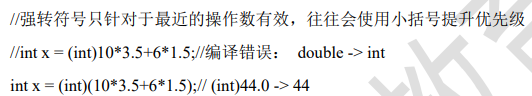
   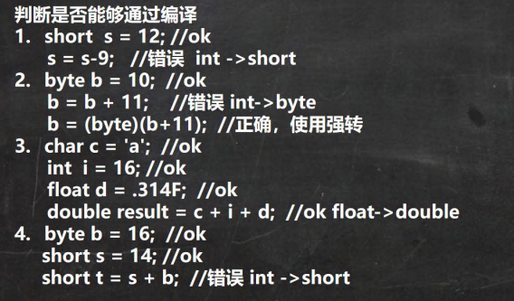
   //short,byte,char运算结束自动变成int
   //需要跟数字运算时,数字一般默认为整数int,小数double **(另一个角度上,为了凸显小数,即便是整数也要变成xx.0)**,注意可能需要强制转换
##### 3. 与String互相转换**注意String的S一定是大写的,否则错误**:
   1. 基本类型转String:
    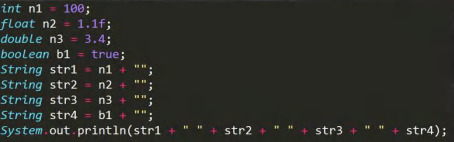
   //在后面加上 +"" 即可
   2. String转基本类型:
      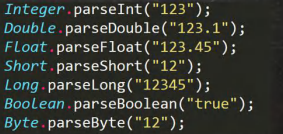
      **//int的不能用例如double和float的String类型来转变,此处也遵循精度大的兼容精度小的规则,boolean不被看作0和1,所以也不能转换,否则会出现异常,程序终止**
      **//String变成char时指String第一个字符变为char**
### 5.Double和double和Decimal(精准计算小数)
Double是一个包装类,可以包含double类型的值,默认值null
double是一个原始数据类型,默认值0.0
BigDecimal:需要以字符串作为参数,可以精准计算小数,避免浮点的误差
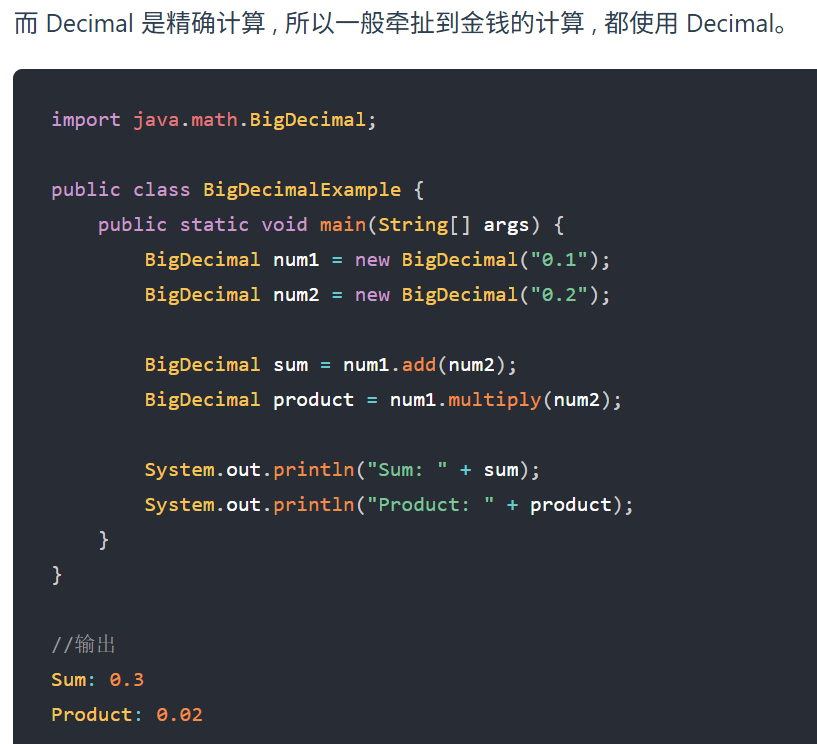
## 1.4运算符:(可以当作在C++的基础上加上python的&,|,%,/)
#### 1. 算术运算符:
   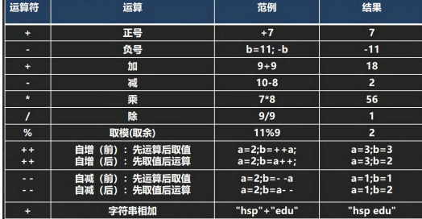
   //  **% 取余,本质为a % b = a - a / b * b**(与python语法相同)
   //  **/ 除号,10/4 = 2,而10.0/4 = 2.5,此处注意数据类型**(与python语法相同)
   //  **++和--与C++同理,例:i=i++,i不变**
#### 2. 关系运算符(**结果均为boolean型**):
   
   //**注意instanceof**
   //(不论是否为中文)字符串判断是否相等时,使用equals()函数,如下:
   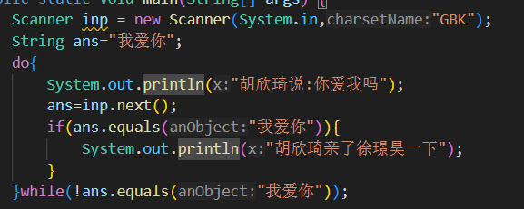
#### 3. **逻辑运算符:**
   **1. & 逻辑与:全1出1,否则为0(两条件均判断)**
   **2. && 短路与:全1出1,否则为0(若前者为0,则直接跳过第二个条件,出0)**
   **3. | 逻辑或:有1出1,全0出0(同理,两条件均判断)**
   **4. || 短路或:有1出1,全0出0(同理,前者为1则跳过后者,直接出1)**
   1. ! 非/取反:与C++同理
   **6. ^ 逻辑异或:不同出1,相同出0**
#### 4. 赋值运算符(=,+=,-=等,与C++同理):
   1. 运算顺序从右往左
   2. 赋值运算符的左边只能是变量,右边可以是变量、表达式、常量值
   3. 复合赋值运算符会进行类型转换。
   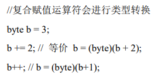
#### 5. 三元运算符
   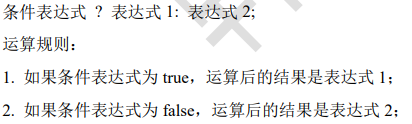
   //与C++同理
   //可参与类型转换
   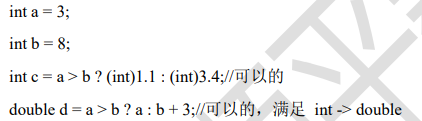
#### 6. 运算符优先级:
   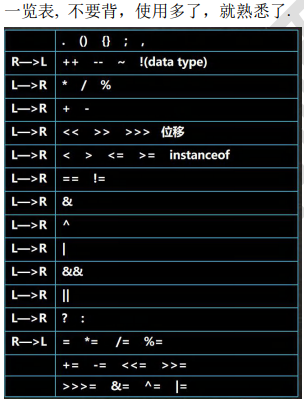
#### 7. 进制:
   1. 二进制：0,1 .以**0b 或 0B 开头**
   int n1=0b1010;为10
   2. 十进制：0-9 
   int n2=1010;为1010
   3. 八进制：0-7 ， 以**数字 0 开头表示**
   int n3=01010;为520             
   4. 十六进制：0-9 及 A(10)-F(15) ,以 **0x 或0X开头,此处A~F不区分大小写**
   int n4=0X1010;为4112
#### 8. 位运算:
   1. 运算符:
   
   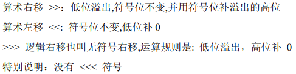
   //**注意<<与>>不改变正负,准确来描述是改变绝对值**
   2. 原码补码反码:
   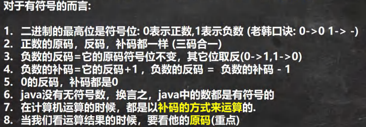
## 1.5输入
#### 1. 键盘输入语句形式:
   ~~~
   import java.util.Scanner;//导入类Scanner所在的包,类比C++的函数库
   public class Helloworld{
	public static void main(String[] args) {
		Scanner myScanner=new Scanner(System.in,"GBK");
		//创建一个Scanner类的对象
		//中文需声明编码格式,否则中文变乱码

		System.out.println("请输入你的名字");
		String lover1=myScanner.next();
		System.out.println("请输入爱人的名字");
		String lover2=myScanner.next();
           //next()接收字符串,nextInt()接收数字,nextDouble()接收小数...
           //要是懒得改函数类型那就要手动强制改变数据类型
           //next().charAt(0)或者写成这样,0代表把字符串索引位置为0的字符提出变为char
		//next会等待用户输入,再将用户输入赋值给lover1,lover2

		System.out.println( lover1+" love "+lover2+" forever~");
		String mylover = "胡欣琦";
		System.out.println("I love "+mylover+" forever~");
		System.out.println("Darling,I,forever~");
           //这一段是夹杂的私货XD
	}
   }
   ~~~
   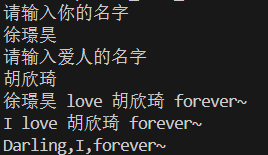
#### 2. 流程(逻辑结构,递归在1.7里面):
   1. 顺序(字面意思)
   2. 分支(**if,else if.else,与C++语法相同**)
   3. 嵌套(字面意思,分支套分支,**建议不超过三层,为了阅读**)
   4. switch分支(**与C++语法相同**):
      ~~~
         //记得导入 import java.util.Scanner;
        Scanner inp=new Scanner(System.in);
		String str1=inp.next();
		switch(str1){
			case "a":System.out.println("星期一");
			case "b":System.out.println("星期二");
			case "c":System.out.println("星期三");break;
			case "d":System.out.println("星期四");break;
			case "e":System.out.println("星期五");break;
			case "f":System.out.println("星期六");break;
			case "g":System.out.println("星期日");
			default:System.out.println("输错了你个小猪");break;
              //如果条件匹配语句不写break,则会无视后续条件继续往下实现所有的语句
              //直到遇到break语句退出或全部语句(包括default)实现完毕
		}
      ~~~
      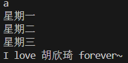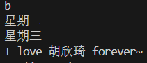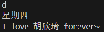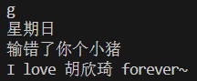
   5. 循环(建议最多套三层循环,为了可读):
      1. for循环(**语法同C++**):
         多语句条件: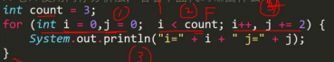
         //增强for:
         for(int i : nums){//i的数据类型要与nums中的一致(接口,类,枚举什么的)
            System.out.println(i)//依次从**数组nums**取出数据赋给i,直至取完退出
         }
      2. while循环(**语法同C++**)
      3. do...while循环(**语法同C++**,先执行一次循环再同while):
         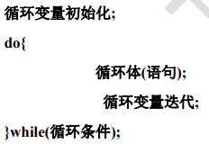 
      4. break(C++基础上,**不同处:可以指定确定退出哪一层循环,未指定则默认退出最近的**):
      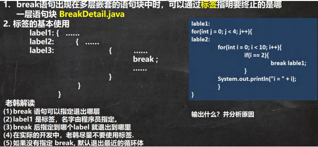
      //标签说明终止该条标签对应的循环
      //不建议用标签是因为可读性
      5. continue(C++基础上,不同处同break)
      6. return(同C++,直接跳出方法(即C++中的函数))
### 1.6数据结构
#### 1. 数组:
   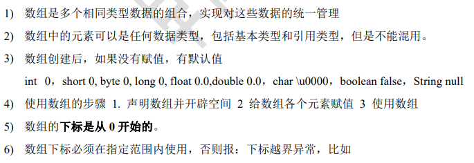
   
   //若数据类型比数组类型精度小,则会强制类型转换,例如int变double
   1. 静态初始化:例如:**double[] hens={x,y,z,...};double hens[]={x,y,z,...};**
   2. 动态初始化:例如:
      1. **double hens[]= new double[5];**
      2. **double hens[];**
         **hens= new double[5]**
         //先声明再分配空间
         //**若要赋值:double hens[]= new double[]{1.0,2.0,3.0,4.0,5.0};**
         //**这个算静态数组,Java不能同时用[...]和{...},也就是说不能同时指定数组大小和初始化值**
         **//声明方式:int[] x 或者 int x[];推荐前者,方便阅读**
   3. 查询:
      1. 单个数据(同C++语法下标查询)
      2. 长度:**hens.length即可**
   4. 赋值(**数组赋值**默认为**引用传递,赋值地址,即指向同一地址的值**):
      //也就是说**基本数据类型赋值是独立赋值,互不影响**
      //也就是说可以通过**逐个赋值基本类型数据来让数组间数据相同又各自独立**
      //**同时关于后续的类,赋值也为引用传递,指向同一地址**
      ~~~
      int[] arr1 = {1,2,3};
      int[] arr2 = arr1;
      arr[0] = 10;
      //此处即为引用赋值
      //(改变arr[0],同时会改变arr1[0]的值为10)
      ~~~
   5. 数组扩容/删减:(创建新数组,拷贝添加/删减,再指向新数组)
      arr = arrNew;
      //**指向**新数组,也就是说**两个数组此时指向地址相同,会一起改变数值**
      //可使用do...while来控制退出
   6. 排序:
      1. 内部排序(将数据存到内部处理器中排序:**交换,选择,插入**)
      2. 外部排序法(数据量过大需借助外部储存排序:**合并,直接合并**)
      3. 冒泡排序法(字面意思)
   7. 查找:
      1. 顺序查找(**若为字符串,则难以用二分法,用findNum.equals(num[p])**)
      2. 二分法:(**前提是有固定规律可比较先后**)
      ~~~
         while(first<=last){
			int p=(first+last)/2;
			if(num[p]==findNum){
				System.out.println("存在,下标为"+p);
				findFlag=1;
				break;
			}
			if(num[p]<findNum)
				first=p+1;//划重点
			if(num[p]>findNum)
				last=p-1;//划重点
		}
		if(findFlag==0)
		System.out.println("不存在");

		//私货:
        String mylover = "胡欣琦";
		System.out.println("I love "+mylover+" forever~");
		System.out.println("Darling,I,forever~");
      ~~~
#### 2. 二维数组:
   (同C++,**arr[i][j]arr[i].length**,**即将arr[i]本身看作一个数组**)
   1. 动态初始化:
      1. 类型[][] 数组名=new 类型[大小][大小]
      (例:**int a[][]=new int[2][3]**)
      //直接声明＋分配
      2. **int arr[][];**
        **arr = new int[2][3]**;
        //先声明再分配
      3. **int[][] arr = new int[3][];**
         //通过for循环分别给每一列开辟空间
         //**适用于不同行列数不同的情况**
   2. 静态初始化:
   例:**int[][] arr = {{1,1,1}, {8,8,9},{100}};**
   //动态初始化也可以直接这样赋值过来
   //声明方式:int[][] y 或者 int[] y[] 或者 int y[][]
## 1.6 JMM(Java的并发编程多线程内存交互规则，仅仅是一种逻辑抽象)
### 1. 关键概念：Jave Memory Model(JMM)
1. 主内存(内存条/硬件):**所有线程共享的内存区域**，**存储共享变量**(全局变量、堆内存中的对象)
2. 工作内存(栈空间):JVM为每个**线程私有**的内存空间，**存储主内存变量的副本**(线程栈中的局部变量副本)
3. Happens-Before:定义**操作之间的顺序关系**，确保可见性(线程 A 的写操作对线程 B 可见)
4. 内存屏障(Memory Barrier):禁止特定类型的指令重排序(通过 volatile 或 synchronized 隐式插入)
5. 可见性问题:线程修改共享变量后,其它线程无法立即看到修改(**未同步到主内存**,可能陷入死循环)
6. 原子性问题:**复合操作被线程切换打断(如i++)**(原子性酷似SQL的"事务"概念)
7. 有序性问题:**编译器/处理器优化导致代码执行顺序与编写顺序不一致**
### 2. 具体内容:
1. 线程**解锁前**，**必须把共享变量的值刷新回主内存**
2. 线程**加锁前**，**必须读取主内存的最新值到自己的工作内存**
3. **加锁与解锁要同一把锁**
### 3. 数据储存,硬盘,内存和CPU
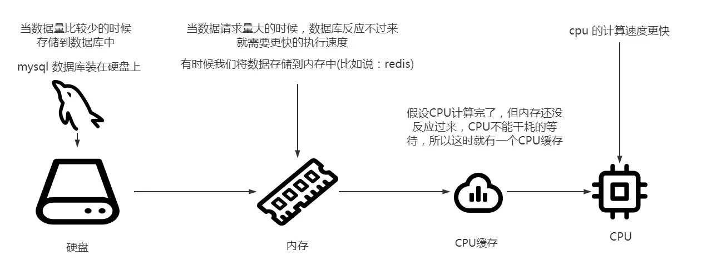
执行速度:硬盘<内存<CPU缓存
### 4. 一般进程:
线程从主内存拷贝变量,在私有的工作区域进行操作,再将变量写回主内存
### 5. volatile关键字的作用:(Happens-Before规则中的)
#### 5.1. 优点:保证可见性
1. 保证可见性:通过volatile对某个变量进行修饰,使得其在修改的第一时间就会**强制读写操作主内存,实现可见性**
2. 示例1:使用volatile防止指令重排序(单例模式的双重检查锁)
~~~
class Singleton {
   private static volatile Singleton instance;
   //singleton:单例模式,确保一个类只有一个实例(构造函数私有化),并用一个静态方法返回

   public static Singleton getInstance() {
      if (instance == null) { // 第一次检查
         synchronized (Singleton.class) {
            if (instance == null) { // 第二次检查
               instance = new Singleton();
            }
         }
      }
        return instance;
   }
}
~~~
2. 示例2:一次性发布(one-time safe publication)**确保对象初始化完成后才对其他线程可见**
~~~
class Singleton {
   private static volatile Singleton instance;
   //singleton:单例模式,确保一个类只有一个实例(构造函数私有化),并用一个静态方法返回

   public static Singleton getInstance() {
      if (instance == null) { // 第一次检查
         synchronized (Singleton.class) {
            if (instance == null) { // 第二次检查
               instance = new Singleton();
            }
         }
      }
        return instance;
   }
}
~~~
#### 5.2 缺点及解决方法:不保证原子性
1. 原因:
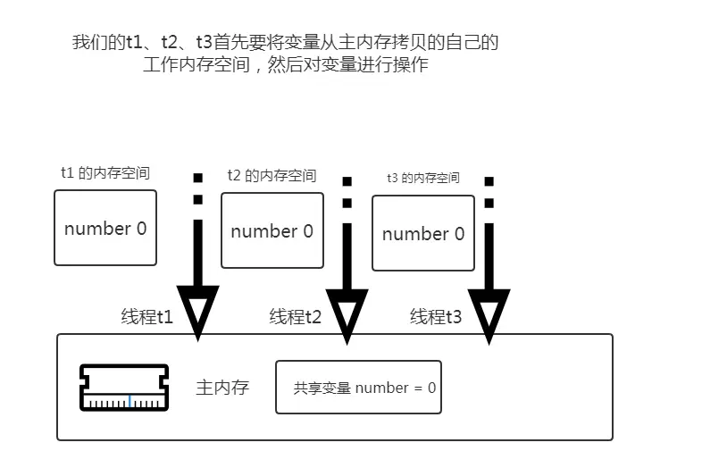
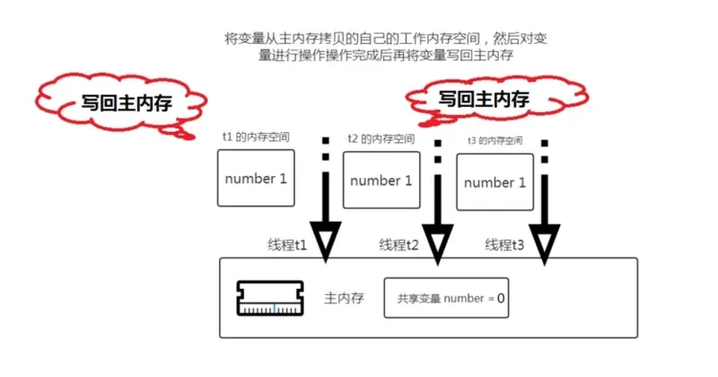
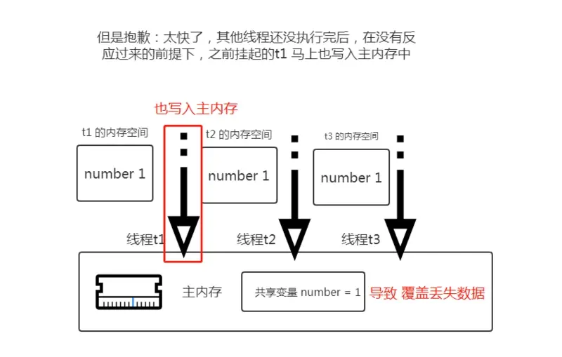
1. 原因例子:i++可分解为：
   1. 读取当前值 (read i)
   2. 计算新值 (i + 1)
   3. 写入新值 (write i)
   4. 多线程情况下,可能被打断(线程 A 读取 i=5 → 线程 B 读取 i=5 → 线程 A 写入 i=6 → 线程 B 写入 i=6,结果应为7,实际得到6),volatile仅保证单次读/写原子性和可见性,而无法保证多步骤复合操作的原子性
2. 解决方法:
   1. 使用AtomicInteger:(CAS(compare-and-swap)机制将复合操作合并为一条原子指令)
   2. CAS原理:
      ~~~
      public final int incrementAndGet() {
         int current;  // 当前值
         int next;     // 新值
         do {
            current = get();         // 读取当前值
            next = current + 1;       // 计算新值
         } while (!compareAndSet(current, next));  // CAS 尝试写入
         //如果当前值等于 expectedValue，则原子性地更新为 newValue，返回 true；否则不更新，返回 false

         return next;
      }
      ~~~
#### 5.3 缺点:不替代锁机制
无法解决多个变量间的复合条件竞争问题
#### 5.4 volatile,AtomicInteger,LongAdder选择
1. 简单状态标志 → volatile(内存屏障)
2. 计数器、累加器 → AtomicInteger(CAS依赖CPU指令+自旋(循环重试,无锁),依赖硬件,适合低竞争)
3. 高并发统计 → LongAdder(分段累加,适合高竞争)
## 1.7 Java8新特性:
### 1.总览:
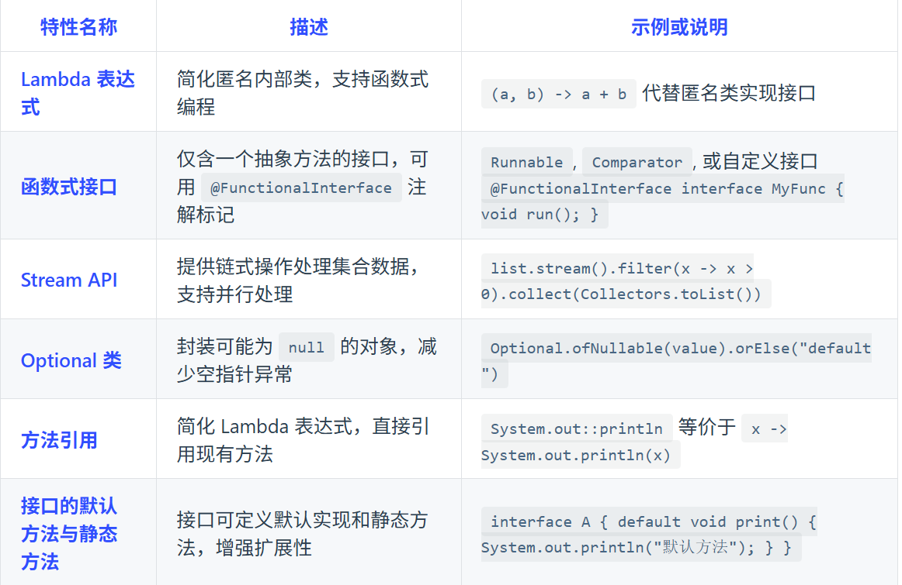

### 2.Lambda表达式:
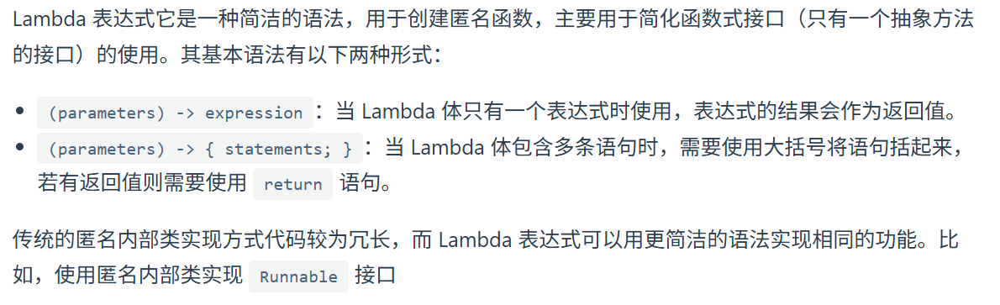
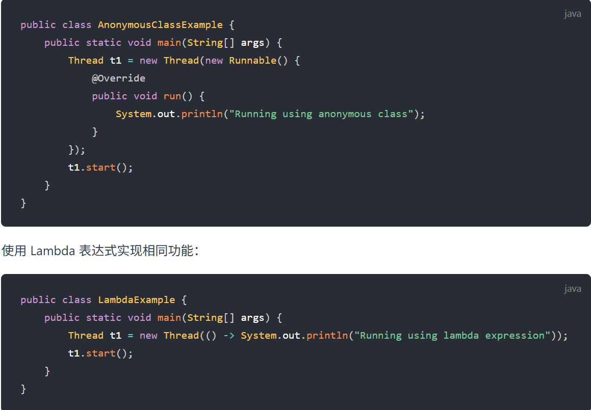
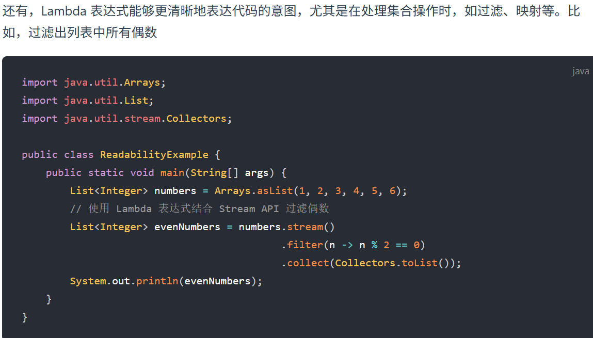

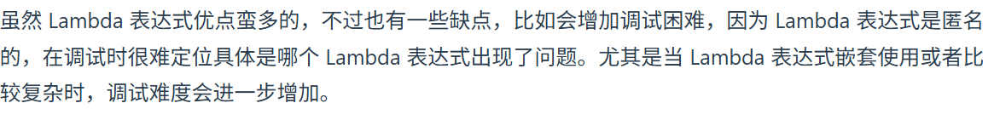
### 3.stream的API
1. 介绍:
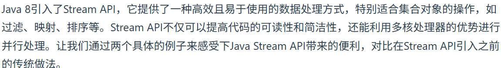
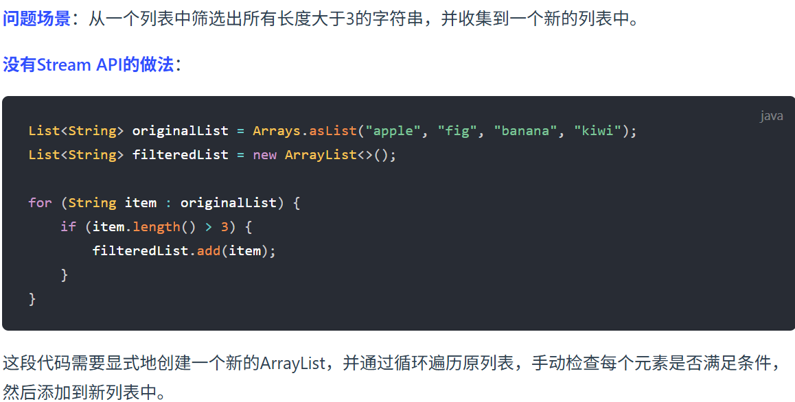
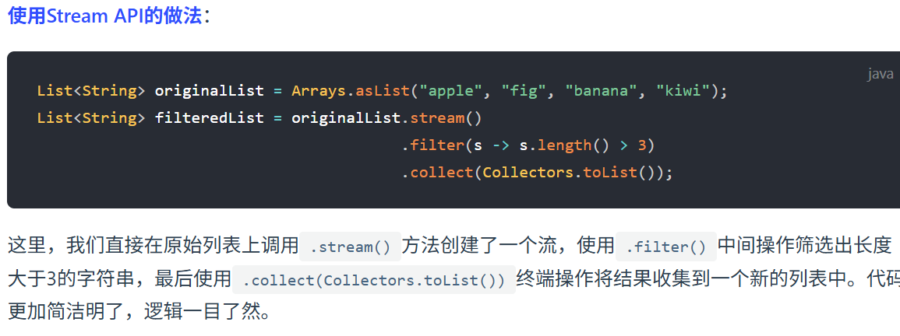
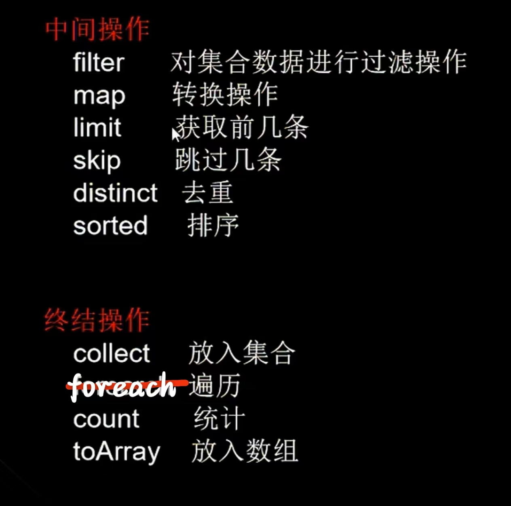


计算数字总和:

2.并行流:


### 4.completableFuture


## 1.8 Java21新特性:

## 1.9 序列化和反序列化:


如何实现序列化和反序列化:


## 1.10 跳表(数据结构)


优点:

## 1.11 JVM:
### 1. 八股:
1. 内存模型:


1. 类初始化与加载:


1. 垃圾回收:


# 二.面向对象编程(类与对象:(面向对象编程:OOP))
## (一).面向对象编程(基础部分)
### 1.1 创建示例:(**类比C++**)
      class Cat{
         String name; 
         int age;
         String color; 
         double weight; 
      } //自定义类
      new Cat();//没啥用,但是可以作为一次性的匿名对象来使用其成员函数(方法)
      Cat cat1 = new Cat();//声明cat1,并将自建类对象赋值给cat1
      //两者合一即为此处的直接创建
      cat1.name = "小白";//对自建类对象具体赋值属性
      cat1.age = 3;
      cat1.color = "白色";
      cat1.weight = 10;

   **//正确创建类的位置:**

**//应当在主类外面另外创建**

### 1.2 访问示例:(**与C++相似,类似于表达数组的长度 str.length**)
      System.out.println("第 1 只猫信息" + cat1.name+ " " + cat1.age + " " + cat1.color + " "+cat1.weight);
### 1.3 对象在内存中存在形式:
   
### 1.4 类的属性(**同C++**,属性=成员变量=field(字段))
### 1.5 类的成员方法(**同C++,相当于兹定于类中的自定义函数**)
~~~
      class Person{
			int age;
			String name;
              public void speak(){
               
               //public表示为公开函数
               //Java中将公开私密单独对每个函数赋予
               //其余与C++都一样

			System.out.println("我爱你");
		   } 
		}
		Person p1= new Person();//记得加括号
		p1.age=19;
		p1.name="胡欣琦";
		Person p2=p1;
		System.out.println(p2.name);
		p1.speak();
		p1.name="徐璟昊";
		System.out.println(p2.name);
		p2.speak();
~~~

   1. 关于参数与返回:
      1. **与C++一样,当然也有形参p3.hanshu(int a,int b)什么的可导入**,但是与C++不同的是:**不能给形参赋默认值**
      (也就是说,**不能写成(int a=xxx)的形式**)
      2. 当然,和C++一样,在**成员函数里面改变基本数据类型的形参的值不改变实参的值**
      (不过若是**引用类型(自定义类**(若要**使用另一自定义类的方法,见3.跨类调用**)**或者数组),则可改变**)
      (但是也仅限于其**属性可改变**,若试图**改变其整个如p=null;则不会改变其值**)
      3. **输入参数需要是设定参数类型的相同或者兼容类型**,**个数与顺序需一致**
      4. **当然也可以通过return x;来返回值,void可以单独写return;**
   2. **参数与方法体注意事项与细节:**
      
      
      //这里就是public,protected,private和默认的区别了,能否直接使用
   3. 跨类调用:
      
      
      //其实就是在**A类方法(成员函数)里面创建B类的对象b,然后通过该对象b来使用B类方法(函数)**

#### 1.6 类与对象的内存分配机制(直接 = ,代表p2指向p1的对象):
   
      1. 内存结构:
      **栈:一般存放基本数据类型(局部变量)**
      **堆:存放对象(Cat cat , 数组等,还要字符串池)**//字符串池案例可见错误及解决方案的6
      **方法区：常量池(常量，比如字符串)， 类加载信息**
      2. 创建对象流程:
         
         
      3. 示例: 

#### 1.7 方法递归(含示例):

示例:
##### 1. (迷宫找路):
   ~~~
      public boolean findWay(int[][] map,int i,int j){
		if(map[6][5]==2){//终点
			return true;
		}
		else{
			if(map[i][j]==0){//以下右上左顺序找路
				map[i][j]=2;
				if(findWay(map,i+1,j))
					return true;
				else if(findWay(map,i,j+1))
					return true;
				else if(findWay(map,i-1,j))
					return true;
				else if(findWay(map,i,j-1))
					return true;
				else{
					map[i][j]=3;
					return false;
				}
			}
			else{
				return false;
			}
		}
	}
   ~~~
   
##### 2. 八皇后问题(国际象棋放八个皇后,不能互相攻击):
   ~~~
   public class Helloworld{
	public static void main(String[] args) {
		//Scanner inp = new Scanner(System.in);
		int[][] map = new int[8][8];//创建棋盘
		Move alte = new Move();//创建自定义类
		for(int i=0;i<8;i++){
			for(int j=0;j<8;j++)
				System.out.print(map[i][j]+" ");
			System.out.println();
		}
		alte.findWay(map,0,0);
		System.out.println(cnt);
   }

   static int cnt=0;//创建静态统计数

	static class Move{		
		public boolean judge(int[][] map,int length,int n){
         //通过看上,左上,右上是否有皇后来判断皇后是否安全
			for(int i=0;i<=length;i++){
				if(map[i][n]==7)
					return false;
				if(n+i<8)
					if(map[length-i][n+i] == 7)
						return false;
				if(n-i>=0)
					if(map[length-i][n-i] == 7)
						return false;
			}
			return true;
		}
		public void findWay(int[][] map,int row,int col){
         //递归尝试放置皇后
			if(row==8){//成功放置八个皇后,row行,col列
				cnt += 1;
				for (int i = 0; i < 8; i++) {//打印
                    for (int j = 0; j < 8; j++)
                        System.out.print(map[i][j] + " ");
                    System.out.println();
                }
                System.out.println();
				return;
			}
			for(int i = col;i < 8; i++){
				if(judge(map, row, i)){
					map[row][i] = 7;
					findWay(map, row+1, 0);//递归放置下一个皇后
					map[row][i] = 0;//回溯,移除皇后
               //这有点让人茅塞顿开
               //通过递归来阻止回溯
               //通过不递归来回溯
		   		}
		   	}		
		   }
	   }
   } 
   ~~~
#### 1.8 方法重载(同C++)
1. 定义:
   **允许同一个类中，多个同名方法的存在**，**仅要求形参列表不一致**(**只包括类型**或者**个数**或者**顺序**,但是**参数名字**和**返回类型不算**)
   (也就是说参数名字不同或者仅仅是返回类型不同都不算,因为无法区分参数信息嘛,就不能重载)
2. 例:

#### 1.9 public和static类(与10.合并查看)
1. public:
   1. **一个Java文件中只能有一个公共类(如果有的话)**，并且**文件名必须与类名相同**
   2. **这个类是公共的，可以被任何包中的任何类访问**
   3. **非public类就只能在一个包中(的其他类)使用**,可以在**一个JAVA文件中存在多个**
2. static(**不依赖外部类的实例**):
   1. 是其外部类的一个静态成员,可**通过外部类的类名直接访问**
   2. 不依赖外部类的实例,所以**不能访问外部类的非静态成员**
   3. 同样的,可在**无外部类实例的情况下创建**
   4. 非static类是外部类的一个成员，**依赖于外部类的实例**,所以**需要一个外部类的实例来创建一个内部类的实例**,可以**直接访问外部类的所有成员**，**包括私有成员**,**与外部类的实例绑定**
#### 1.10 外部类和内部类(与9.合并查看)
1. 外部类:
   **不被包含在某一类之内的类,只有public class(最多存在一个)和class之分**,也就是说,**外部类除了public class外的类不能有修饰符**
2. 内部类:
   **在某一类之内的类**,**可以有public,protected,private,static,public/protected/private static等修饰符**或者默认的class
#### 1.11 可变参数
(JAVA允许将同一个类中多个同名同功能但参数个数不同的方法，封装成一个方法。
通过可变参数实现)
1. 本质:**数组**(通过数组大小变化改变参数数量,**接收实参可以是任意个,可以为数组**,但是**必须是同一类型**,可变参数再怎么可变,也还是有专一的地方的嘛)
2. 示例:
   ~~~
   public int sum(int... nums) {
      //System.out.println("接收的参数个数=" + nums.length);
      int res = 0;
      for(int i = 0; i < nums.length; i++) {
         res += nums[i];
      }
      return res;
   }
   ~~~
3. 注意事项
   1. 可以与普通参数一起在形参列表,但是**可变参数必须在最后**(因为可以接收任意数量实参嘛)
   2. 同理,**一个形参列表最多只能有一个可变参数**
#### 1.12 变量作用域(同C++)
class Darling{
   String name;
   String lover;
   public void love(){String live=...;}
}
1. 全局变量(属性):有默认值,可以不赋值,作用域为整个类,比如上面的name和lover,**可以加修饰符(public,protected,private,static)**
(随着对象创建而创建,随对象销毁而销毁)
2. 局部变量:没有默认值,必须赋值才能使用,除了全局变量(属性)以外的变量,作用域为其代码块中,比如上面的live,**不能加修饰符**
(随着代码块执行而创建,随代码块结束而销毁)
#### 1.13 自动构造器(与C++基本相同)
1. 基础使用示例(与C++语法相同):

~~~
class Person {
String name;
int age;
public Person(String pName, int pAge) {//这一段就是构造器
System.out.println("构造器被调用~~ 完成对象的属性初始化");
name = pName;
age = pAge;
}
~~~
//1. 构造器**没有返回值, 也不能写 void**
//2. **构造器的名称和类 Person 一样**
//3. **构造器形参列表规则和成员方法一样**

**注意!**也就是说,**若是使用了自建的构造器,就无法再进行Person p = new Person()的默认构造了**,**除非再写上Person(){};强调添加该构造方式**
2. 构造器重载(与C++和成员方法重载相同)
3. 案例流程分析:
   
#### 1.14 this关键字(同C++,也较为重要)
(**哪个对象调用,this就代表哪个对象**)
1. 使用示例:
   
2. 注意事项:
   1. this可以来访问本类的属性、方法、**构造器**,可用于区分当前类的属性和局部变量
   2. **访问成员方法的语法：this.方法名(参数列表)**
   3. **访问构造器的语法：this(参数列表)**
   (即**只能用于在构造器中访问另外一个构造器, 必须放在第一条语句**)
   示例:
   ~~~
   Person(int age,int x){...}
   Person(int age,int x,String name){
      this(age,x);//只能放在第一句,也就是说只能写一句并且要在第一行
      this.name=name;
   }
   ~~~
   4. **只能在类定义的方法中使用**
#### 1.15 关于类的对象赋值(为引用传递.即赋值地址)
示例:
~~~
Person p1 = new Person();
Person p2 = p1;
~~~
//此时p2与p1指向同一个对象,改变其一就会都改变
## (二).面向对象编程(中级部分)
### 2.1 Idea
1. 特点(以**项目**为概念管理源码)
2. 环境配置:
   
   
   直接设置路径即可
3. 快捷键:
   
   
### 2.2 包(本质接收不同的文件夹/目录保存类文件)
#### 1. 作用:
   1. 区分相同名字的类
   2. 类很多时,更好的管理类
   3. 控制访问范围
#### 2. 基本语法:
   1. package:关键字,表示打包
      (声明当前类所在的包,需要放在最上面,当然,一个类最多只有一句package)
   2. com.hxqlovexjh:表示包名
   3. 引用包:
      1. import java.util.*;  //引入整个包,不过一般不建议
      2. import java.util.Scanner;  //只引入一个类Scanner
#### 3. 命名规范:

### 2.3 常用包:

### 2.4 常用类:
1. java.util:
   1. Arrays:
      int[] arr = {-1,20,2,13,3};
      Arrays.sort(arr); //从小到大排序
   2. Object:(所有类的最高父类,自动导入)
      x.equals(y);
### 2.5 访问修饰符
1. 四种修饰符:
   1. public:公开级别,能在不同包中使用
   2. protected:受保护级别,能在子类和同一个包中使用
   
   3. 默认:只能在同一个包中使用
   4. private:私有级别,只能在同一个类中使用
   
2. 注意事项:
   1. 只有**默认和public能修饰类和接口**
   2. 四种都可以修饰类中的属性和成员方法
### 2.6 面向对象编程三大特征--封装,继承,多态
#### 1. 封装(同C++)
##### 1. 理解:
   将**抽象的数据(属性)**与**对数据的操作(方法)封装在一起**,**数据被保护在内部**,只有通过被授权的操作(方法),才能对数据进行操作
   (也就是说让数据不会被乱七八糟的东西改变,**只能通过指定方法改变**,将数据分存起来)
##### 2. 目的:
   **保护数据安全**,还可以**隐藏操作的实现细节**(因为是直接调用)
##### 3. 实现:
   1. 私有化属性
   2. 加入公共化方法用于**赋值属性**和**获取属性的值**
   3. 示例:
#### 2. 继承(同C++)(子类与父类)
##### 1. 理解:
   建立**查找的关系**,通过继承**像链表一样连结**
   示例:
##### 2. 目的:
   **增加代码复用性**,**增加代码拓展性和维护性**
##### 3. 实现:
   class 子类 extends 父类{
      ...
   }
   
##### 4. 注意事项:
   1. 非私有的属性和方法(**包括public,protected和默认**)可以在子类直接访问, 但私有属性和方法(**private**)**不能**在子类直接访问，需通过父类提供公共的方法去访问
   2. 子类必须**调用父类的构造器先对父类初始化**(显而易见),既然如此,若父类有无参构造器,则**会默认调用该无参构造器**,而若父类**只有有参构造器(未额外定义无参构造器)**,则**必须用super**去对父类初始化,示例:
   (**super必须在子类构造器的第一行**(要先初始化父类嘛))
   (又因为**super()和this()都要在第一行**,所以**不能同时在同一构造器使用**)
   
   //super();和什么都不写都指调用无参构造器(默认)
   3. java **所有类都是 Object 类的子类, Object 是所有类的基类(父类)**.而**父类构造器的调用不限于直接父类**,一直往上**追溯直到Object类都行**,但是**必须一个一个**按照父类的父类的父类的**顺序追溯**(坏了,我的附庸的附庸真是我的附庸了)
   4. 一个父类可以有许多个子类,但是**一个子类最多继承一个父类**(子类只能**直接调用** **直接父类**的 **非私有部分** ,但是可以**通过链条一样的方式可以调用**父类的父类...)
   5. 子类和父类是**is-a关系**
      
##### 5. super(关键字)详解
1. 含义:代表父类的引用,用于访问父类的**非private**属性,方法,构造器
2. 语法:
   1. 访问属性:super.属性名;
   2. 访问方法:super.方法名(参数列表);
   3. 访问构造器:super(参数列表);//**只能放在第一句,且只能出现一句**
3. 目的:
   1. 父类子类各自初始化各自的属性
   2. 区分子类父类重名的成员(属性/方法)
      
      //就像链表一样
4. 与this的区别:
   
##### 6.方法覆盖/重写(属性不行,不行,不行)
1. 理解:
   子类方法与父类方法名称,**返回类型(或者是父类方法的子类也行,比如子类String,父类Object**),参数数量类型顺序一样,就运行子类的类,把父类的类覆盖了(显而易见)
   //但是**不影响父类的修饰符的范围**
#### 3.多态(封装和继承基础之上)
##### 1. 理解:多态有多种表现形式:
   1. 方法:方法重写/重载
   2. 对象:一个对象的编译类型(定义时确定)和运行类型(看 = 的右边)可以不一致
##### 2. 示例:
   //Dog和Cat类继承Animal类
   
   
##### 3. 使用注意事项:
   1. 多态**前提**是**两个对象(类)存在继承关系**
   2. 向上转型:
      (子类用父类的new,需要遵守访问权限用)
   3. 向下转型:
      (父类用子类的new,全部都能用)
##### 4.JAVA动态绑定机制(very重要)
理解:
1. 调用**对象方法时,该方法与该对象的内存地址/运行类型绑定**
2. 调用**对象属性时,没有动态绑定机制,哪里声明,哪里使用**

//可以这么理解,此处new了B类,就相当于B为替身,用替身去操作,相当于此时a就占据了B类,所以此处用B的属性去进行操作,并且依据B作为优先查询的类,若无实现方法,则向上看看父类有没有
##### 5. 多态应用
1. 多态数组:
   示例:(Student和Teacher是Person的子类)
   ~~~
   Person[] persons = new Person[5];
        persons[0] = new Person("jack", 20);
        persons[1] = new Student("mary", 18, 100);
        persons[2] = new Student("smith", 19, 30.1);
        persons[3] = new Teacher("scott", 30, 20000);
        persons[4] = new Teacher("king", 50, 25000);
        //循环遍历多态数组，调用 say
        for (int i = 0; i < persons.length; i++) {
            //person[i] 编译类型是 Person ,运行类型是根据实际情况有 JVM 来判断
            System.out.println(persons[i].say());//动态绑定机制
            //下处使用 类型判断 + 向下转型.
            if (persons[i] instanceof Student) {
            //判断 person[i] 的运行类型是不是 Student
            //instanceof是判断对象是否是特点类的二元操作符
                Student student = (Student) persons[i];//向下转型
                student.study();
                //也可以使用一条语句 ((Student)persons[i]).study();
            } else if (persons[i] instanceof Teacher) {
                Teacher teacher = (Teacher) persons[i];
                teacher.teach();
            } else if (persons[i] instanceof Person) {
                System.out.println("你的类型有误, 请自己检查...");
            } else {
                System.out.println("你的类型有误, 请自己检查...");
            }
         //下面是私货,XD
        }
            String MyLover = "胡欣琦";
            System.out.println("I love " + MyLover + " forever~");
            System.out.println("Darling,I,forever~");
   ~~~
2. 多态参数(方法定义**形参类型是父类**,**实参类型允许是子类**--父类兼容子类):
### 2.7 Object类详解
#### 1. equals(与下一点的hashCode结合看)
1.  equals 和 ==
   ==可以判断基本类型(**比较的是值**)和引用类型(**类,接口,数组**,**看地址是否相等**)
   equals只能判断引用类型(**默认判断地址是否相等**,但是可以**重写去比较对象的属性/状态**,**重写后也只能是引用类型**)
2. 重写equals(就跟普通的重写一样,在自定义类里面设置就行)
   (**通常会一同重写hashCode方法**)
   示例:
   ~~~
   public boolean equals(Object obj){
        if(this == obj){
            return true;
        }
        if(obj instanceof Manager){
            Manager m = (Manager)obj;
            return this.bonus.equals(m.bonus)&&this.getName().equals(m.getName());
        }
        return false;
   }
   ~~~
#### 2.hashCode方法(作为哈希函数,提供哈希值,为了提高哈希表的性能)
##### 1. 哈希表(一种数据结构):提供**快速的数据插入和查找功能**
   **用一种哈希函数来计算数据的存储位置**，这个位置通常称为**哈希码**或**哈希值**,通过这种方式，哈希表能够以接近常数时间的性能进行数据的访问，这使得它非常**适合于需要快速查找、插入和删除的场景**
##### 2. hashCode方法与哈希表,equals的关系:
   1. 哈希表:调用hashCode()方法计算哈希值,**同一个对象返回同一个值**
   2. equals:若**两个对象通过equals方法比较是相同**的,那么**hashCode方法返回的哈希值也应相同**,通常**重写equals,hashCode也一起重写,确保相等对象有相同的哈希码**
##### 3. hashCode自身要求:应以**快速的计算**尽量**均匀分布哈希值,减少哈希冲突**
##### 4. hashCode示例


//此处aa与aa3是同一对象,返回同一哈希值
#### 3.toString方法(子类可重写来返回对象的属性信息)
##### 1. 基本介绍:
   默认返回: 全类名+@+哈希值的十六进制
##### 2. 重写示例:
~~~
Employee emp = new Employee("Tiga","光之巨人",123456789);
System.out.println(emp.toString()+"hashCode="+emp.hashCode());
System.out.println("==当直接输出一个对象时，toString 方法会被默认的调用==");
System.out.println(emp);
//输出emp等价于输出emp.toString()
...
...
public String toString(){
   return "Employee{"+"name="+name+","+"job="+job+","+"sal="+sal+"}";
   }
~~~

#### 4.finalize方法(释放非内存资源,实际开发几乎用不到,面试可能用)

1. 默认使用:
   对象被确认为垃圾时,调用对象的finalize方法回收内存,子类可重写来释放资源
2. 主动用法:
   
   
3. 不推荐使用原因:
### 2.8 断点调试(debug,一步一步查看源码执行过程找bug)
##### 1. 基本信息与使用:
   1. 断点调试过程是**运行状态**,过程中可以临时增删断点(反正是执行状态,诶嘿),**不能到达的断点就跳过**
   2. 是**指在程序某一行设置一个断点,调试到该行会停住**
   3. **一步一步执行:步过(F8)**
      
   4. **直接执行到下一断点:恢复程序(F9)**
      
##### 2.进入源码:

//**java* 和 javax* 取消勾选**
随后在调试时,选择步入↓(F7)即可

//可以不断步入直到根源
### 2.9 项目:房屋出租系统:
#### 1.工具类(别人写好的包当作工具用)Utility
1. 代码:
~~~
package ...;
import java.util.*;

public class Utility {
	//静态属性。。。
    private static Scanner scanner = new Scanner(System.in);

    
    /**
     * 功能：读取键盘输入的一个菜单选项，值：1——5的范围
     * @return 1——5
     */
	public static char readMenuSelection() {
        char c;
        for (; ; ) {
            String str = readKeyBoard(1, false);//包含一个字符的字符串
            c = str.charAt(0);//将字符串转换成字符char类型
            if (c != '1' && c != '2' && 
                c != '3' && c != '4' && c != '5') {
                System.out.print("选择错误，请重新输入：");
            } else break;
        }
        return c;
    }

	/**
	 * 功能：读取键盘输入的一个字符
	 * @return 一个字符
	 */
    public static char readChar() {
        String str = readKeyBoard(1, false);//就是一个字符
        return str.charAt(0);
    }
    /**
     * 功能：读取键盘输入的一个字符，如果直接按回车，则返回指定的默认值；否则返回输入的那个字符
     * @param defaultValue 指定的默认值
     * @return 默认值或输入的字符
     */
    
    public static char readChar(char defaultValue) {
        String str = readKeyBoard(1, true);//要么是空字符串，要么是一个字符
        return (str.length() == 0) ? defaultValue : str.charAt(0);
    }
	
    /**
     * 功能：读取键盘输入的整型，长度小于2位
     * @return 整数
     */
    public static int readInt() {
        int n;
        for (; ; ) {
            String str = readKeyBoard(10, false);//一个整数，长度<=10位
            try {
                n = Integer.parseInt(str);//将字符串转换成整数
                break;
            } catch (NumberFormatException e) {
                System.out.print("数字输入错误，请重新输入：");
            }
        }
        return n;
    }
    /**
     * 功能：读取键盘输入的 整数或默认值，如果直接回车，则返回默认值，否则返回输入的整数
     * @param defaultValue 指定的默认值
     * @return 整数或默认值
     */
    public static int readInt(int defaultValue) {
        int n;
        for (; ; ) {
            String str = readKeyBoard(10, true);
            if (str.equals("")) {
                return defaultValue;
            }
			
			//异常处理...
            try {
                n = Integer.parseInt(str);
                break;
            } catch (NumberFormatException e) {
                System.out.print("数字输入错误，请重新输入：");
            }
        }
        return n;
    }

    /**
     * 功能：读取键盘输入的指定长度的字符串
     * @param limit 限制的长度
     * @return 指定长度的字符串
     */

    public static String readString(int limit) {
        return readKeyBoard(limit, false);
    }

    /**
     * 功能：读取键盘输入的指定长度的字符串或默认值，如果直接回车，返回默认值，否则返回字符串
     * @param limit 限制的长度
     * @param defaultValue 指定的默认值
     * @return 指定长度的字符串
     */
	
    public static String readString(int limit, String defaultValue) {
        String str = readKeyBoard(limit, true);
        return str.equals("")? defaultValue : str;
    }

	/**
	 * 功能：读取键盘输入的确认选项，Y或N
	 * 将小的功能，封装到一个方法中.
	 * @return Y或N
	 */
    public static char readConfirmSelection() {
        System.out.println("请输入你的选择(Y/N): 请小心选择");
        char c;
        for (; ; ) {//无限循环
        	//在这里，将接受到字符，转成了大写字母
        	//y => Y n=>N
            String str = readKeyBoard(1, false).toUpperCase();
            c = str.charAt(0);
            if (c == 'Y' || c == 'N') {
                break;
            } else {
                System.out.print("选择错误，请重新输入：");
            }
        }
        return c;
    }

    /**
     * 功能： 读取一个字符串
     * @param limit 读取的长度
     * @param blankReturn 如果为true ,表示 可以读空字符串。 
     * 					  如果为false表示 不能读空字符串。
     * 			
	 *	如果输入为空，或者输入大于limit的长度，就会提示重新输入。
     * @return
     */
    private static String readKeyBoard(int limit, boolean blankReturn) {
        
		//定义了字符串
		String line = "";

		//scanner.hasNextLine() 判断有没有下一行
        while (scanner.hasNextLine()) {
            line = scanner.nextLine();//读取这一行
           
			//如果line.length=0, 即用户没有输入任何内容，直接回车
			if (line.length() == 0) {
                if (blankReturn) return line;//如果blankReturn=true,可以返回空串
                else continue; //如果blankReturn=false,不接受空串，必须输入内容
            }

			//如果用户输入的内容大于了 limit，就提示重写输入  
			//如果用户如的内容 >0 <= limit ,我就接受
            if (line.length() < 1 || line.length() > limit) {
                System.out.print("输入长度（不能大于" + limit + "）错误，请重新输入：");
                continue;
            }
            break;
        }

        return line;
    }
}
~~~
## (三).面向对象编程(高级部分)
### 3.1 main方法语法
#### 1. 理解语法:

#### 2. 注意事项:
1. 可以**直接调用 main 方法所在类**的**静态方法或静态属性**。
2. **不能直接访问该类中的非静态成员**，必须创建该类的一个实例对象后，才能通过这个对象去访问类中的非静态成员(毕竟main也是静态方法)
#### 3. main动态传值(在IDEA中传递参数给main)


### 3.2 类变量与类方法
#### 1.类变量(静态变量/静态属性,通过static的共享特性实现):
1. 示例:
//写成static private的顺序也不是不行
**//static变量是同一个类所有对象共享**
**//在类加载时初始化生成,随类消亡而销毁**
2. 访问(必须满足访问修饰符的权限与范围):
   **类名.类变量名**
   **对象名.类变量名**
#### 2.类方法(静态方法,类比类变量):
1. 特点:
   1. 类方法(静态方法)才能直接访问静态属性/变量(**都属于类本身,而非某一个实例**)
   2. 常用于工具类,不涉及任何和对象相关的成员(**不需要创建对象就可以直接作为工具使用**)
   3. 与普通方法一样都随类加载而加载,结构信息储存在方法区
   4. 类方法不能使用与对象有关(类方法**不绑定对象**而是**绑定类**)的关键字,例如this和super等会访问实例对象属性的关键字
   5. **普通成员方法可以**访问**非静态成员**和**静态成员**
   6. 可以通过**类名/对象名.类方法名**访问
//**静态绑定类,对象是类的一个实例,所以对象可以改变使用静态,但是静态不能访问非静态的对象**(在满足访问权限的基础上)
(1) 静态方法，只能访问静态成员 
(2) 非静态方法，可以访问所有的成员
(3) 在编写代码时，仍然要遵守访问权限规则
### 3.3 代码块
#### 1. 理解:
代码块(初始化块):
是类中的成员(类的一部分),类似于方法(但是没有方法名,没有返回,没有参数,不用通过对象或类调用,而是**在类加载/创建对象时自动调用**,**仅仅是一个方法体,一个字面意思的代码块**),将逻辑语句封装在方法体中,用{}包围起来
#### 2. 语法:
修饰符 {
   代码
};
//**修饰符只有static**(静态代码块和非静态代码块) , **;可以省略**
#### 3. 益处:
1. 相当于另一种形式的构造器(补充构造),可以做初始化操作
2. 提高代码重用性
#### 4. 注意事项(有关new的顺序):
1. static代码块既然是静态的,就也随类加载而初始化(**static绑定类**),且只会执行一次(普通代码块就随对象创建而执行),且只能直接调用静态属性/方法(**普通代码块可以调用任意成员,同静态方法与普通方法**)
2. 类的加载时候:
   1. 创建实例时(new)
   2. 创建子类对象实例时(父类也会加载)
   3. 使用类的静态成员时(绑定绑定)
3. 普通代码块在创建对象实例时创一次调用一次(**绑定对象实例**),仅仅**使用类的静态成员时不会执行**(这是加载类,又不是加载实例对象,当然不执行嘞)
4. 创建对象时(new),类的调用顺序:
   1. 调用静态代码块和静态属性初始化(按顺序调用)
   2. 调用普通代码块和普通属性的始化(按顺序使用)
   3. 调用构造方法
5. 构造器最前面隐含 **super() (加载父类)**和 **调用普通代码块** ,静态代码块与静态属性在类加载时就已经执行完毕,在构造器之前
6. **继承:**
   
### 特殊章节(个人总结之static,联系3.2与3.3)
1. 类中的静态是绑定类的,与类共生死
2. 非静态是绑定对象实例的,与实例共生死
3. 对象实例是按照类的基础创建的,所以**绑定对象实例的非静态可以访问绑定类的静态**
4. **注意**,就算是父类和子类,也是**先把父子的静态执行完了**再**进行父子的非静态和构造器执行**
//吐槽一下,就这些东西绕来绕去的
### 3.4 类的单例设计模式(饿汉式与懒汉式)
#### 1. 理解:
采取一定的方法在整个系统中,对**某个类只能存在一个对象实例,且该类只提供一个取得对象实例的方法**,整个系统可以通过一个全局访问点,**单例类的实例化过程线程安全**
(所以**不用new所想保留的对象,所以要用static**,因为只有单个实例,而且在外部使用该类时,**所创建的对象实际上是一种指向,借用该对象使用方法来返回实际保留的单例对象**)

#### 2.饿汉式与懒汉式
1. 饿汉式:类加载时就创建实例(适用于实例化耗时不多的情况)
   ~~~
   class Cat{
      private String name;
      public static int n1 = 100;
      private static Cat cat = new Cat("小白");
      //类加载时是单线程的,且类加载只发生一次,所以不会递归
      private Cat(String name) {
         System.out.println("构造器被调用");
         this.name = name;
      }
      public static Cat getInstance() {
         return cat;
      }     
   }
   ~~~
   在多线程环境中，如果多个线程同时访问 getInstance() 方法,可能会导致 cat 被多次创建。为了解决这个问题，可以使用synchronized 关键字或者静态内部类来实现线程安全的单例
   
2. 懒汉式:只有在需要时才创建实例(线程不安全)
   ~~~
   class Cat{
      private String name;
      public static int n1 = 100;
      private static Cat cat;
      private Cat(String name) {
         System.out.println("构造器被调用");
         this.name = name;
      }
      public static Cat getInstance() {
         if(cat == null) {
            cat = new Cat("小可愛");
         }
         return cat;
      }     
   }
   ~~~
### 3.5 final关键字
#### 1.理解:
字面意思,**被修饰的类/属性/方法/局部变量** **不会被继承/重写/修改**(final,指代最终所确定的值,所以不会被改变)
例如:
final class A{...}//不被继承(一般类是final就不用把方法也变成final)
public final void hi(...){...}//不被重写,但是不代表不能被继承(类不是final就行)
public final double welove = 1314.520;//不被修改
#### 2.注意事项:
1. 被final修饰的**基本数据属性不会变**,所以可以叫**常量(用xx_xx_xx命名)**,但是**引用类型数据可变**,如:

2. 因为不能修改,所以**必须要有初值**(定义赋值,代码块赋值,构造器赋值,**final的静态属性不能在构造器赋值/静态属性绑定类而不绑定对象的构造嘛**,而且因为静态的new在构造器之前,而且若在构造器里面可能会赋不同的值,就违反了其规则)
3.  final**不能修饰构造器**
4.  final往往与static搭配使用,不会导致类加载
5.  包装类(Integer,Double,Boolean等都是final),String是final类
6.  final类虽然不能继承,但是**可以实例化对象**(比如上面的String str = ...;)
### 3.6 抽象类(模板设计模式)
#### 1. 理解:
**有些方法需要声明,但是不确定如何实现时(比如需要继承作不同的用法,但是父类本身的方法没啥用)**,可以用抽象方法,整个类就是抽象类
(也就是说所谓抽象方法就是没有实现的方法,作为跳板**由子类继承实现**)
#### 2. 使用语法:
~~~
abstract class Animal{
   private String name;
   public Animal(String name) {
      this.name = name;
   }
   public abstract void eat();//就是这句
}
~~~

##### 3. 注意事项/细节:
1. **抽象类不能被实例化**(**因为不能执行所有的操作,实例对象是不完整的**)
2. 抽象类可以没有抽象方法(虽然这也太抽象了,感觉没啥用,不过这样子还可以用来封装抽象类里面的方法,还能让程序员被迫写继承来保存模板的一致性,因为没法实例化嘛),**有抽象方法的一定是抽象类(而且必须用abstract声明)**
3. 一个**类继承了抽象类,就必须实现其所有抽象方法**,不然因为继承的特性,会使得该子类依旧不完整(除非该子类也是抽象类)
4. **abstract只能修饰类和方法**
5. 抽象方法不能写大括号(主体),因为它不能实现
6. 抽象方法不能用private/final/static修饰(因为有了这几个就不能重写了呀,就一直不完整了)
7. 对于继承的子类中的继承抽象方法:
   
   
   //@Override便于阅读和查错
##### 4.获取任务完成时间(效率)
~~~
public abstract void job();//抽象方法
public void calculateTime() {//实现方法，调用 job 方法
long start = System.currentTimeMillis();//得到开始的时间
job(); //动态绑定机制
long end = System.currentTimeMillis();//得的结束的时间
System.out.println("任务执行时间 " + (end - start));
}
~~~
//用long让时间更精确
### 3.7 接口
#### 1. 理解:
接口就是ultra抽象的抽象类,所有方法都是抽象方法,即没有方法体
(特别说明:以上仅限于jdk8.0之前,jdk8.0及之后接口类可以有静态方法,默认方法,也就是说随时代更新,其实也不是不能有方法的具体实现)
#### 2. 接口创建/连接/使用过程示例:
###### 1. 创建接口(创建usb):
~~~
public interface Usb{ //接口
   public void start();
   public void stop();
}
~~~
###### 2. 连接接口(将数据传入usb中,类似于继承,但是语法不同):
~~~
public class Camera implements Usb{//实现接口,把接口方法实现
//其实需要的话,可以这么写class D extends C implements B,A {...}
   @Override
   public void start() {
      System.out.println("相机开始工作...");
   }
   @Override
   public void stop() {
      System.out.println("相机停止工作....");
   }
}
~~~
###### 3. 创建接收接口(接收usb数据)
~~~
public class Computer {
    public void work(Usb usb){
        usb.start();
        usb.stop();
    }
}
~~~
###### 4. 将作为接口的数据与接收端连接
~~~
//在主函数中
Camera camera = new Camera();
Computer computer = new Computer();
computer.work(camera);
~~~
#### 3. 使用注意事项和细节
1. 接口不能实例化(喵的连抽象类都不行,接口不是更不行吗,理由相同,类创建的对象不完整)
2. **接口中所有方法都是public**,其抽象方法可以不用abstract修饰(因为全是,所以省略了,不代表不存在)
3. 同抽象类,与接口相接,就必须将其所有方法实现(否则不完整,除非是同样不完整的抽象类与其相接)
4. **一个类可以和多个接口相接**(但是**抽象类一次只能继承一个**,还是有区别的),这样写就行:...}
5. 但是**接口不能继承其他类**,不过**可以继承多个别的接口**(套娃是吧)
6. **接口中的属性只能是常数**,也就是final,而且还得是**public static final**这么一串修饰符(当然**也就必须得初始化**),既然只能是这个,那也是**可以省略的**嘞
(不能实例化,所以要静态static)
7. **接口自身的修饰符只能是public 和 默认**,
8. **访问接口属性**语法:**接口名.属性名**
9. 
#### 4. 与继承比较:
1. 继承价值:解决代码复用性和可维护性
   接口价值:事先设计好规范(方法),用其它类实现
2. 接口比继承更灵活,继承是is-a(继承,一个是另一个的特例)关系,接口是like-a(接口,一个实现了另一个的规范,实现规范≠继承)关系
3. 一定程度实现代码解耦(减少各组件间的依赖关系,更容易理解测试重用)
#### 5. 多态特性:
1. 多态参数(与接口相接的数据都可以**以接口类型作为参数被接收**,反过来说,**接口类型的变量可以指向实现接口的类的对象**,类比父类和子类)
2. 多态数组(类比父类和子类)//依旧是动态绑定
3. 多态传递(接口继承另一个接口的体现)
### 3.内部类
#### 1. 理解:
字面意思,类中类,真套娃
#### 2. 语法(没有语法,直接写里面就行)
#### 3.分类(1) 局部内部类和匿名内部类(定义在局部位置上,方法内/方法参数/代码块中)
##### 1. 局部内部类(有类名)
特点:
1. 可以看成是**以类来当成局部变量**
2. **可以直接访问外部类的所有成员**,包括**私有!!**
3. **不能添加访问修饰符**(因为作为局面变量,所以不能用),不过**可以用final修饰**
4. **外部类与内部类重名时,遵循就近原则,**若访问外部类成员:**外部类名.this.成员**(访问语法为重点!)

##### 2. 匿名内部类(重点,字面意思,无类名)
1. 概述:
   
   //其实系统会自动分配名字
   //匿名内部类用来解决那些只想调用一次的类就不再调用的问题(不用繁琐的再创建一个新的类去调用)
   //**记得临时创建完对象的后面加分号,可看示例**
2. 示例(在方法里面):
   1. **基于接口**的匿名内部类:
   ~~~
   class Outer04{
      ...
      public void method(){
         ...
         IA tiger = new IA() {
            @Override
            public void cry() {
               System.out.println("老虎叫唤...");
            }
         };//记得加分号
         System.out.println("tiger 的运行类型=" + tiger.getClass());//Outer04$1
         tiger.cry();
         ...
      }
      ...
   }
   ~~~
   //此处IA为接口名,cry()为接口内所有方法
   //此处相当于通过匿名内部类的语法临时创建了该对象并调用方法
   //tiger的**编译类型为IA**,**运行类型为匿名内部类,Outer04$1(系统分配名)**
   //底层:
   使用示例:
   2. **基于类**的匿名内部类:
   ~~~
   class Outer04{
      ...
      public void method(){
         ...
         Father father = new Father("jack"){
            @Override
            public void test() {
               System.out.println("匿名内部类重写了 test 方法");
            }
         };//记得加分号
      System.out.println("father 对象的运行类型=" + father.getClass());//Outer04$2
      father.test();
         ...
      }
      ...
   }
   ~~~
   //底层:
   3. **基于抽象类**的匿名内部类:
   ~~~
   abstract class Animal { //抽象类
      abstract void eat();
   }
   ...
   class Outer04{//类
      ...
      public void test(){
         ...
         Animal animal = new Animal(){//匿名内部类基于抽象类实现
            @Override
            void eat() {
               System.out.println("小狗吃骨头...");
            }
         };//记得加分号
         animal.eat();
         ...
      }
      ...
   }
   ~~~
3. 特点:
   1. 匿名内部类**既是类的定义**,**本身又是一个对象(临时)**,所以语法比较特殊
   2. 同样不能添加访问修饰符,因为匿名内部类地位上作为一个**以类/抽象类/接口创建的临时对象**的**局部变量**
   (所以**可以直接访问外部类所有成员**,**包括私有的**)
   (所以外部类不能访问匿名内部类)
   3. **外部类与内部类重名时,遵循就近原则,**若访问外部类成员:**外部类名.this.成员**
4. 最佳实践(**当作实参直接传递**)
   ~~~
   interface IL {//接口
      void show();
   }
   ...
   public static void main(String[] args){//在主函数中使用时实现该匿名内部类
      f1(new IL() {
         @Override
         public void show() {
            System.out.println("I love you ~");
         }
      });//里面的实参就是匿名内部类,其实就是 f1(匿名内部类);
      public static void f1(IL il) {//形参是接口类型
         il.show();//也可以通过创建别的类的对象实现该函数
      }
   }
   ~~~
#### 3.分类(2) 成员内部类和静态内部类(定义在成员位置上,在方法外)
##### 1. 成员内部类(没有static修饰)
1. 特点:
   1. 同样**可以访问外部类所有成员**,**包括私有的**
   2. **可添加任意访问修饰符**(public,protected,private,默认)
      (因为其就可以当作是类的一个成员)
   3. 作用域:与外部类其他成员一样,在整个类体中
   4. 访问权限:
   5. **外部类与内部类重名时,遵循就近原则,**若访问外部类成员:**外部类名.this.成员**(这玩意怎么已经出现这么多次了,好像都是这样的)
2. 使用的三种方式:
   1. 直接当成外部类成员访问:
   ~~~
   public static void main(String[] args) {
      ...
      Outer outer = new Outer();
      Outer.Inner inner = outer.new Inner();
      ...
   }
   ~~~
   2. 在外部类编写方法返回内部类对象:
   ~~~
   public static void main(String[] args) {
      ...
      Outer outer = new Outer();
      Outer.Inner inner = outer.getInner();
      ...
   }
   class Outer{
      ...
      private int n1 = 10;//与成员内部类重名属性
      private String name = "张三";//不与内部类重名属性,内部类可以直接访问
      public class Inner{//成员内部类
         private int n1 = 66;//与外部类重名属性
         public void say() {
            System.out.println("n1 = " + n1 + " name = " + name + " 外部类的 n1=" + Outer.this.n1);
         hi();
         }
      }
      public Inner getInner(){
         return new Inner();
      }
      ...
   }
   ~~~
   3. 在外部类创建方法使用内部类的方法:
      在外部类的方法中new内部类的对象,通过该对象使用内部类的方法
##### 2. 静态内部类(有static修饰,名字都写着呢)
1. 特点:
   1. **可以直接访问外部类所有静态成员**,**包括私有的**,但是它是静态的,所以当然不能访问非静态的嘞
   2. **可添加任意访问修饰符**(public,protected,private,默认)
      (因为其就可以当作是类的一个成员)
   3. 作用域:与外部类其他成员一样,在整个类体中
   4. 访问权限:
   5. **外部类与内部类重名时,遵循就近原则,**若访问外部类成员:**外部类名.this.成员**(结果这么四个内部类全是这样的,无语了)
2. 使用:
   1. 满足访问权限的情况下,直接通过类名访问(同成员内部类)
   2. 在外部类编写方法返回内部类对象实例(同成员内部类)
   3. 在外部类创建方法使用内部类的方法(同成员内部类)
# 三.JAVA使用基础
## 3.1 枚举和注解
#### 1. 理解枚举(enum,enumeration):
1. 枚举是一组**常量**的集合
2. 可以把枚举当作一种特殊的类, **只包含一组 特定的 , 有限的** 对象
#### 2. 枚举的两种实现和
##### 1. 自定义类实现枚举(往类里面全塞常量)
1. 特点:
   1. 不需要提供改变属性的方法,因为**枚举对象通常只读**
   2. 枚举对象/属性用**final + static**共同修饰
   3. **枚举对象名通常大写**(常量的命名规范)
   4. 枚举对象**可以有多个属性**
   5. 
2. 示例:
   ~~~
   public static void main(String[] args) {
      ...
      System.out.println(Season.AUTUMN);//直接调用输出
      System.out.println(Season.SPRING);
      ...
   }
   ...
   class Season {//类
      private String name;
      private String desc;//描述
      public static final Season SPRING = new Season("春天", "温暖");
      public static final Season WINTER = new Season("冬天", "寒冷");
      public static final Season AUTUMN = new Season("秋天", "凉爽");
      public static final Season SUMMER = new Season("夏天", "炎热");
      private Season(String name, String desc) {//将构造器私有化,防止被new
         this.name = name;
         this.desc = desc;
      }
      public String toString() {
         return "name=" + name +", desc=" + desc;//改变输出格式,否则输出地址
      }
   }
   ~~~
   
   
##### 2. 使用enum关键字实现枚举
1. 示例:
   ~~~
   enum Season2 {
      SPRING("春","暖"),SUMMER("夏","热"),AUTUMN("秋","凉"),WINTER("冬","冷"),SEASON,SEASON();
      //可以直接用,等价于public static final SPRING = new Season("春","暖")
      //用逗号相隔
      //enum的枚举必须写在第一行
      //可以用以下定义的无参构造器构造常数,但是若改变了toString,会按其无参输出null
      private String name;
      private String desc;
      private Season2(){}
      private Season2(String name,String desc){
         this.name=name;
         this.desc=desc;
      }
      public String getName() {
         return name;
      }
      public String getDesc() {
         return desc;
      }
      public String toString() {//否则默认输出常量名
         return name + " " + desc;
      }
   }
   ~~~
2. 注意事项(还有部分在示例中):
   1. 用enum关键字开发枚举类时(该**枚举类还是final类**),会**默认继承Enum类**(所以不能继承其他类)(但是**可以实现接口**,如下面所提)
3. Enum类常用方法(语法:枚举对象.方法名()):
   1) toString:Enum类已重写过,返回当前对象名,子类可以重写该方法,返回对象的属性信息等
   2) name：返回当前对象名（常量名），**子类中不能重写**
   3) ordinal：返回当前对象的位置号，默认从 0 开始
   4) values：返回当前枚举类中所有的常量(返回**枚举类数组**)
   5) valueOf：将字符串转换成枚举对象，**字符串必须为已有的常量名，否则报异常**(更像是查找一样的感觉,看看有没有叫这个名字的value,但是没找到就会报错)
   6) compareTo：比较两个枚举常量(**比较编号是否相同**)
##### 3.用enum实现接口
1. 形式: enum 类名 implements 接口 1，接口 2{}
2. 示例:
   ~~~
   interface IPlaying {
      public void playing();
   }
   enum Music implements IPlaying {
      CLASSICMUSIC;
      @Override
      public void playing() {
         System.out.println("播放好听的音乐...");
   }
   ~~~
#### 3. 注解(元数据):
##### 1.理解:
比如前面的@Override,是一个类似于提示符一样的东西,就像是括号里面的补充说明一样(在个人使用情况下作用不是很明显,但是在大型项目中就很凸显作用)
##### 2.三种常见的注解:
1. @Override:**注解该方法为重写方法**,会**额外检查**一下
2. @Deprecated:表示**某元素(类,方法等)已过时**(就是不推荐用,但也不是不行,可以做版本升级兼容过渡使用),可以修饰方法/类/字段/包/参数...
   
3. @SuppressWarning:**抑制编译器警告**,抑制范围与放置位置(具体语句,方法,类,包括main类)相关
   1. 使用语法:
      @SuppressWarnings({"rawtypes", "unchecked", "unused"})
      public class SWarnings{...}
      //抑制范围就是整个SWarnings类
      //在{""}中写入想抑制的警告信息
   2. 警告信息:
      
      
   3. 常用:
      
##### 3.四种元注解(修饰注解的注解)与定义注解的关键字(@interface):
1. @Target:**(元注解)**指定注解的**使用范围**(在哪)
   
   
2. @Retention:**(元注解)**指定注解的**作用范围**(能影响哪)
      1. 使用语法:@Retention(RetentionPolicy.SOURCE)
      2. 三种范围:SOURCE(编译器使用后就丢弃),CLASS(JVM不保留注解,编译器把注解记录在class文件中),RUNTIME(JVM会保留注解,编译器把注解记录在class文件中,本身意为运行时)
3. @Documented:**(元注解)**指定注解**是在javadoc体现(就是生成文档时能看到这个注解)**,定义为Documented的注解必须**设置Retention值为RUNTIME**
   
4. @Inherited:**(元注解)子类会继承父类注解**,就是将注解给继承到子类去
5. @interface:**定义注解**的**关键字**
   例如@Override源码为:
   public @interface Override {
   }
   
##### 4. 常用开发注解:
1. 自带:
@Override:检查重写
@NotNull: 确保值不为null
@NotEmpty: 确保字符串、集合不为空
@Size: 限制字符串长度或集合大小
@Min/@Max: 限制数值范围
@Email: 验证邮箱格式
@Pattern: 使用正则表达式验证
@Validated: 数据校验
@RequestBody: 接收入参
@Cacheable: 用于将方法的返回结果缓存起来
@CacheEvict: 用于从缓存中移除一个或多个缓存项

2. lambok库:
@Getter/@Setter: 自动生成getter和setter方法
@ToString: 自动生成toString方法
@EqualsAndHashCode: 自动生成equals和hashCode方法
@Data: 包含@Getter, @Setter, @ToString, @EqualsAndHashCode
@Builder: 生成建造者模式代码
~~~
//数据更新操作
Models build = Models.builder()
         .roleId(roleId)
         .isMasterWork(status)
         .build();
return modelsService.updateModels(build);
~~~
@NoArgsConstructor/@AllArgsConstructor: 生成构造函数
## 3.2 异常
#### 1. 理解(这还要介绍?)
#### 2. 异常总体系分类:


#### 3. 常见运行异常(编译没错,运行出错,就是字没写错,但是有语病):
1) NullPointerException 空指针异常
   例:
   
   
2) ArithmeticException 数学运算异常
   例:
   
   
3) ArrayIndexOutOfBoundsException 数组下标越界异常
   例:
   
   
4) ClassCastException 类型转换异常
   例:
   
   
   
5) NumberFormatException 数字格式不正确异常
   例:
   
   
#### 4. 常见编译异常(直接就是字本身都写错了)

//大多为SQL和文件编程
#### 5. 异常处理机制语法:
##### 1. try-catch-finally(捕获异常,需要人工处理)
~~~
try{
   ...
   //可能错误的语句,异常对象传递给catch
   //出现异常语句就直接跳过剩下的语句到catch或者finally
   ...
}catch (ArithmeticException e) {//若有异常,则捕获错误信息
System.out.println("算术异常=" + e.getMessage());//可以有多个catch捕获不同异常,但是如果发生异常,只会匹配一个catch(要求子类异常在前,父类异常在后,但是代码运行顺序依旧是从上往下,所以先遇到哪个异常就会先catch哪个)
}catch(Exception e){//这一句包含所有的异常
   e.printStackTrace;
}
finally{
   ...//不论try是否有异常都会执行(所以通常为释放资源的代码)
   //finally可以没有,但是try-catch必须有
   //如果finally里面会return xxx,那么会因为强制执行finally语句而return该语句里面的东西
   //就算上面已经return了,finally里面没return,也要强制执行finally的语句
}
~~~
示例:


##### 2. throws(将异常抛出,交给调用者(方法)处理,最顶级的就是JVM)
   //异常可能显示其父类
   流程图:
   
   示例:
   
   
##### 3.注意事项和使用细节:
1. 编译异常,程序必须处理(try-catch或throws)
2. 运行异常,若没有处理,默认为throws方式处理
3. 子类重写父类异常时:子类的异常要么与父类一致,要么为父类异常的子类
4. throws过程若有try-catch(处理异常),就可以不throws
5. finally和try冲突时,finally的优先级更高:

#### 6. 自定义异常:
1. 理解:
   当程序错误并未在Throwable子类描述处理,可自己设计异常类来描述
2. 步骤:
   
3. 示例:
   ~~~
   public class Main{
      public static void main(String[] args){
         int age = 520;
         if(!(age>=18&&age<=120)){
            throw new AgeException("你个小猪");
         }
         System.out.println(age);
         ...
      }
      ...
   }
   class AgeException extends RuntimeException{
      public AgeException(String message){
         super(message);
      }
   }
   ~~~

#### 7. throw和throws区别:

示例:

#### 8. 使用案例:
~~~
public class Main{
    public static void main(String[] args){
        String s = "1314520";
        try{
        s = reverse(s,6,5);//此处发生异常,在方法体里面有主动throw
        }catch(Exception e){
            System.out.println(e);
            //java.lang.RuntimeException: 参数不正确
            System.out.println(e.getMessage());
            //参数不正确
            return;//退出函数,使得不再进行
        }
        System.out.println(s);
    }
    public static String reverse(String str,int start,int end){
        if(end >= str.length() || start >= end || str == null){
            throw new RuntimeException("参数不正确");
            //如发生以上情况,则主动throw一个RuntimeException异常并给予信息"参数不正确""
        }
        char[] chars = str.toCharArray();
        for(int i = start,j = end;i<j;i++,j--){
            char temp = chars[i];
            chars[i] = chars[j];
            chars[j] = temp;
        }
        return new String(chars);
    }
}
~~~
## 3.3 真-常用类
### 1. 包装类(八种基本数据类型):
#### 1. 分类:
1. 大致:

1. 具体父子类:
   1. Boolean:
   2. Character:
   3. 其余六种:
#### 2. 包装类与基本数据类型转换:
1. 运行逻辑:

1. 以int和Integer示例:
   1. 自动装箱/拆箱(jdk5后,直接大胆等号写就行):
   ~~~
   int n2 = 200;
   Integer integer2 = n2; 
   //自动装箱 int->Integer
   //底层使用的是 Integer.valueOf(n2)
   int n3 = integer2;
   //自动拆箱 Integer->int
   //底层仍然使用的是 intValue()方法
   ~~~
   2. 手动装箱/拆箱(jdk5前,了解):
   ~~~
   int n1 = 100;
   Integer integer = new Integer(n1);
   Integer integer1 = Integer.valueOf(n1);
   ~~~
2. 强制数据转换(依旧存在):
   
   //为一个整体,Double精度大于Integer,所以(运行类型)结果转换为Double
#### 3. 包装类和String类型相互转换
以Integer和String示例:
1. Integer到String:
   ~~~
   Integer i = 100;
   String str1 = i + "";//方式 1
   String str2 = i.toString();//方式 2 
   String str3 = String.valueOf(i);//方式 3
   ~~~
2. String到Integer:
   ~~~
   String str4 = "12345";
   Integer i2 = Integer.parseInt(str4);//方法1 使用到自动装箱
   Integer i3 = new Integer(str4);//方法2 构造器
   ~~~
#### 4. Integer类常用方法:
System.out.println(Integer.MIN_VALUE);//返回最小值
System.out.println(Integer.MAX_VALUE);//返回最大值
#### 5. Character类常用方法:
System.out.println(Character.isDigit('a'));//判断是不是数字
System.out.println(Character.isLetter('a'));//判断是不是字母
System.out.println(Character.isUpperCase('a'));//判断是不是大写
System.out.println(Character.isLowerCase('a'));//判断是不是小写
System.out.println(Character.isWhitespace('a'));//判断是不是空格
System.out.println(Character.toUpperCase('a'));//转成大写
System.out.println(Character.toLowerCase('A'));//转成小写
#### 6. 特别提醒包装类与基本数据类型区别:
1. 本质区别:
   1) 
例int n1 = 1314;
int n2 = 1314;
System.out.println(n1 == n2);//true
//n1和n2**在栈上,比较值是否相等**
   1) 
Integer n3 = 1314;
Integer n4 = 1314;
System.out.println(n3 == n4);//false
//n3和n4是对象的引用,**在堆上,比较引用地址**,Integer已经缓存好了-128到127的整数值,所以如果数值在其中,本质上会是获取一个已经创建好的实例,所以此时会相等
//但是若数值不在范围中,则会创建新的不同的对象,也就是会出现下面这种情况
   1) 
Integer n5 = 14;
Integer n6 = 14;
System.out.println(n5 == n6);//true
//int本质上只是一种数据类型,而**Integer本质上是一种类**,所以会**创建对象**(在超出已缓存范围时),n3和n4依旧是**两个不同的对象**,所以**实际上比较的是内存中的地址**,为false
   1) 
Integer n7 = new Integer(14);
Integer n8 = new Integer(14);
Integer n9 = 14;
System.out.println(n7 == n8);//false
System.out.println(n8 == n9);//false
//这里就是直接创建俩Integer的对象了,自然是不相等的
//当然,拿n9的值跟对象的地址比也不相等

1. 上述示例总结:
   1. Integer有两种方式,一种为直接Integer n1 = 1314;另一种为Integer n1 = new Integer(1314);
   2. 第一种方式会考察**赋值范围是否在-128到127**之间,在此期间的对象都已在Integer缓存完毕,所以会直接赋予同一对象的地址值,而**超出范围的才会额外单独创建对象(独立分配空间),跟第二种方式类似**
   3. 第二种方式会直接创建新对象(独立分配空间)
   4. 两种方式无论如何依旧是**类的对象**(在**堆**中),所以在 == 中**比较的是地址值**,而int不一样,**int数据类型的对象**储存在**栈**中,在 == 中**比较的是指向值**,所以**Integer怎么赋值都不能跟int相等**
### 2. String类(保存字符串,有双引号,用Unicode字符编码,一个字符(部分字母和汉字)占俩字节)
#### 1. 构造与说明:


//串行化:指的是一个类可以被转换成一系列字节，这些字节可以在网络上传输或者保存到文件中，之后又可以被重新组合和转换成原来的对象。这个过程称为对象的序列化（Serialization）和反序列化（Deserialization）
#### 2. 创建对象的两种方法不同:

(内存图不同:)

#### 3. String的特别(有关new分配指向空间和equals,在3.):
1. 可以串行化:实现**网络传输**
2. 实现了接口:**对象可以比较大小**
3. 是**final类,不能被继承**也代表**不可变的字符序列**(对象一旦被分配,内容不可变)
   //但是对于String str = new String("love");使用 new String() 创建了一个新实例，后续对变量赋新的字符串字面量的值也不会修改原有对象(**原有对象等待回收或者被其他引用**)，而是让变量引用一个新的对象,也就是说**str可以改变指向的值**
   例:
   
   
   (但是**String we = "love"+"forever";只算一句**,所以这里**只创建一个**)
   
   //**只要没有new就不会额外分配指向内容的空间**,所以在类里面的非 new 的String反而也会指向常量池
   //多看源码
4. String存在属性private final char value[];(用于存放字符串内容)
   //此处的value为final类型,**不能被修改地址,不过单个字符内容可修改**
   
5. String的equals重写(导致equals会比较String的值而非地址):
   
   
#### 4. 特别关于intern方法:

//**一回生二回熟**,用**equals**判断常量池中有没有该字符串,**没有就加进去,并返回地址(第一次)**,**否则就会返回这个字符串本身**
#### 5. String常见方法:
##### 1. equals:比较内容是否相同(区分大小写)
   例:System.out.println(str1.equals(str2));
##### 2. equalsIgnoreCase:比较内容是否相同(**忽略大小写**)
   例:System.out.println(str1.equals(str2));
##### 3. 字符串.length():获取字符个数/字符串长度
##### 4. indexOf:获取字符(char)在字符串对象中第一次出现的索引(找不到返回-1)
   例:
   String s1 = "wer@terwe@g@";
   int index = s1.indexOf('@');//3
###### 5. lastIndexOf:获取字符(char)在字符串对象中最后一次出现的索引(找不到返回-1)
   例:
   String s1 = "wer@terwe@g@";
   int index = s1.lastIndexOf('@');//11
###### 6. substring:截取指定范围的子串
   例:
   String name = "hello,张三";
   System.out.println(name.substring(6));//从索引 6 开始截取后面所有的内容  张三
   System.out.println(name.substring(2,5));//从索引2取到索引5(**前闭后开**)llo
###### 7. toUpperCase:全部转换成大写
   例:
   String s1 = s2.toUpperCase():
###### 8. toLowerCase:全部转换成小写
   例:
   String s1 = s2.toLowerCase():
###### 9. concat:拼接字符串
   例:
   String s1 = "xjh";
   s1 = s1.concat(" love").concat(" hxq").concat(" forever~");//xjh love hxq forever~
###### 10. replace:替换字符串中的字符(产生新串,不改变原串)
   例:
   s1 = "I love hxq forever~";
   String s11 = s1.replace("I", "xjh");
   System.out.println(s1);//I love hxq forever~
   System.out.println(s11);//xjh love hxq forever~
###### 11. split:分割字符串(分为数组元素,如有特殊字符,需要加入转义符\)
   例:
   String poem = "锄禾日当午,汗滴禾下土,谁知盘中餐,粒粒皆辛苦";
   String[] split = poem.split(",");
   poem = "E:\\aaa\\bbb";
   split = poem.split("\\\\");//意为按"\\"分割,{"E:","aaa","bbb"};
###### 12. toCharArray:转为字符(char)数组
   例:
   char[] char = str.toCharArray():
###### 13. compareTo:比较两字符串大小(前大正数,后大负数,相等出0)
   例:
   String a = "jcck";// len = 3
   String b = "jack";// len = 4
   System.out.println(a.compareTo(b)); //返回'c'-'a'的值
   //if (c1 != c2) {
   // return c1 - c2;
   // }返回第一个不同字符的大小之差
   //若长度不同,但是前面都相同,返回str1.length-str2.length(长度之差)
###### 14. format:格式占位符
1. 占位符:
   1. %s :字符串
   2. %c :字符
   3. %d :整型
   4. %.2f :浮点型
      //后面有个 **.** 再加上 **2f**
      //用小数替换,四舍五入保留两位
2. 示例:
   String formatStr = "我的姓名是%s 年龄是%d，成绩是%.2f 性别是%c.希望大家喜欢我！";
   String info = String.format(formatStr, name, age, score, gender);
### 3. StringBuffer类(可以理解为可变长度的String,可以对字符串增删)
#### 1. StringBuffer类自身(源码):

1. 直接父类是 AbstractStringBuilder
2. 实现了 Serializable, 即StringBuffer的**对象可以串行化**
3. 在父类中 AbstractStringBuilder **有属性 char[] value**存放字符串内容,**不是 final**,所以才能**改变字符串**(而**String是final,所以String不可变**)
   //value 数组存放字符串内容，**引出存放在堆中**
   //改变字符串不用每次都更换地址(即**不是每次创建新对象**)， 所以**效率高于 String**
4. StringBuffer 是一个 final 类，**不能被继承**
#### 2. 构造对象(同String)
StringBuffer sBuffer = new StringBuffer("love");
//当然也不能new StringBuffer(null);
//因为源码中会创建大小,调用length,但是null没有length,会变成空指针异常NullPointerException
#### 3. 与String比较:

#### 4. String与StringBuffer相互转换:
1. String到StringBuffer:
   1. 方法一(构造器):
      String str = "love";
      StringBuffer sBuffer = new StringBuffer(str);
   2. 方法二(append方法):
      StringBuffer sBuffer1 = new StringBuffer();
      sBuffer1 = stringBuffer1.append(str);
2. StringBuffer到String:
   1. 方法一(构造器):
      StringBuffer sBuffer = new StringBuffer("love");
      String s1 = new String(sBuffer);
   2. 方法二(toString)
      String s2 = sBuffer.toSring();
#### 5. StringBuffer常见方法:
##### 1. append:在末尾增加字符串(包括null,特殊)
   例:
   StringBuffer s = new StringBuffer("xjh");
   s.append(" love hxq");//xjh love hxq
   s.append(" forever").append('~').append(true).append(1314.1314);//xjh love hxq forever~true1314.1314
   //此时1314.1314部分长度为8,变成**单独的字符**了
   //如果**append(null),会真的在末尾加上"null"的字符串**
##### 2. delete:删除指定索引范围的字符串(**前闭后开**)
   例:
   s.delete(22,26);//xjh love hxq forever~1314.1314
##### 3. replace:修改指定索引范围的字符串(**前闭后开**)
   例:
   s.replace(22,26,"520");//xjh love hxq forever~520.1314
   //替换字符串**长度可以与原串不同**
##### 4. insert:将字符串插入字符串
   例:
   s.insert(22,"!!")//xjh love hxq forever~!!520.1314
   //将**包括索引为22的字符**以后全部后移
##### 5. indexOf(查索引,同String)
##### 6. length(长度,同String)
### 4. StringBuilder类(被设计为StringBuffer的简易上位,大多数情况下比它快)
#### 1. 介绍:

1. 提供一个与StringBuffer兼容的API,但**不保证同步**(**StringBuffer不是线程安全**)
2. 直接父类为AbstractStringBuilder,有属性char[] value存放字符串(不是final所以才能修改)(所以**字符序列是堆中**)
3. 实现了Serializable接口,即StringBuilder的**对象可以串行化(可网络传输/保存在文件)**
4. 为final类,**不能被继承**
5. 用在**字符串缓冲区被单个线程使用的时候**(因为没有作互斥处理/没有synchronized关键字)
6. 主要操作为append和insert方法(可重载接收任意类型的数据)
#### 2. 方法(与StringBuilder相同)
### 5. String,StringBuffer,StringBuilder区别
String:不可变字符串(是final),效率低,复用率高

StringBuffer:可变字符串(不是final),效率较高,线程安全,使用了synchronized实现同步
StringBuilder:可变字符串(不是final),效率最高,线程不安全

### 5. Math类(基本作为工具类使用,含有大量静态方法)
#### 1.abs:绝对值
int abs = Math.abs(-9);
//int,double,float,long都行
#### 2.pow:求幂
double pow = Math.pow(2, 4);
//2的4次方
#### 3.ceil:向上取整(转成double)
double ceil = Math.ceil(3.9);//4.0
#### 4.floor:向下取整(转成double)
double ceil = Math.floor(4.001);//4.0
#### 5.round:四舍五入(float返回int,double返回long)
long round = Math.round(5.51);//6
#### 6.sqrt:开方
double sqrt = Math.sqrt(9.0);//3.0
#### 7.rondom:随机数(返回[0,1)的随机小数)
//Math.random()*(b-a) 返回的就是 0<= 数 <=b-a
//(int)(a) <= x <= (int)(a + Math.random()*(b-a+1))
#### 8.max/min:返回最大值/最小值
int min = Math.min(520,1314);//只能比较两个数的大小并返回
System.out.println(min);//520
### 6. Array类(基本作为工具类使用,含有大量静态方法)
#### 1. toString:返回数组的字符串形式
Integer[] integers = {1, 20, 90};
System.out.println(Arrays.toString(integers));
//输出内容:[1, 20, 90]
#### 2. sort:排序(自然和定制-匿名内部类+动态绑定)
//数组是引用类型，所以通过sort排序后，会**直接影响到实参arr**
1. sort默认的排序(由小到大):
Integer arr[] = {1, -1, 7, 0, 89};
Arrays.sort(arr);
//arr = {-1, 0, 1, 7, 89}
1. 通过接口实现的自定义排序规则:

//此处示例变为由大到小排序

#### 3. binarySearch:二分查找(前提是排好序)
int index = Arrays.binarySearch(arr,3);//返回3的索引
如果不存在该元素，就返回 return -(low + 1); // key not found
#### 4. copyOf:复制数组元素
Integer[] arr = {...};
Integer[] newArr = Arrays.copyOf(arr,arr.length);
#### 5. fill:数组元素的填充
Integer[] num = new Integer[]{13,14,520};
Array.fill(num,1314);
//num = {1314,1314,1314}
#### 6. equals:比较两个数组元素内容是否完全一致(顺序和内容)
boolean equals = Arrays.equals(arr1,arr2);
#### 7. asList:将一组值转换为list
List<Integer> asList = Arrays.asList(2,3,4,5,6,1);
System.out.println("asList=" + asList);
System.out.println("asList 的运行类型" +asList.getClass());

//运行类型(为**静态内部类**)java.util.Arrays#ArrayList是Arrays类中的
### 7. System类(的常见方法)
#### 1. exit:退出当前程序
System.exit(0);//0是一种状态,exit(0)表示程序退出
#### 2. arraycopy:复制数组元素(适合底层调用,一般还是用Arrays.copyOf)
System.arraycopy(src, 0, dest, 0, src.length);
//src:源数组
//第一个0:从源数组的哪个索引位置copy
//dest:目标数组,要接收拷贝数据的数组
//第二个0:接收数组的哪个索引
//src.length:从源数组拷贝多少数据到目标数组
#### 3. currentTimeMillens:返回当前时间距离1970-1-1的毫秒数(数据类型为long)
long startTime = System.currentTimeMillens();
#### 4. gc:运行垃圾回收机制
System.gc();
### 8. BigInteger类和BigDecimal类(分别保存较大的整型和精度更高的浮点型)
#### 1. 使用场景:
1. BigInteger:
//需**导入import java.math.BigDecimal;**
BigInteger bI = new BigInteger("131452013145201314520");
BigInteger("10099999999999999999999999999999999999999999999999999999999999999999999999999999999");
//BigInteger用于**超级大的整数**(long都不够用的那种)
1. BigDecimal:
//需**导入import java.math.BigInteger;**
BigDecimal bD = new BigDecimal("1999.11111111111999999999999977788");
System.out.println(bD)
//BigDecimal用于**超级大精度的浮点数**(double都不够用的那种)
#### 2. 加减乘除方法:
##### 1. add:加
System.out.println(bigInteger.add(bigInteger2));
System.out.println(bigDecimal.add(bigDecimal2));
##### 2. subtract:
System.out.println(bigInteger.subtract(bigInteger2));
System.out.println(bigDecimal.subtract(bigDecimal2));
##### 3. multiply:
System.out.println(bigInteger.multiply(bigInteger2));
System.out.println(bigDecimal.multiply(bigDecimal2));
##### 4. divide:
System.out.println(bigInteger.divide(bigInteger2));
System.out.println(bigDecimal.divide(bigDecimal2));
//可能抛出异常 ArithmeticException(除数为0)
### 9.日期类
#### 1. Date类(第一代日期类,精确到毫秒,表示特定的瞬间,java.util.Date)
###### 1. 特别之处:
默认输出格式为国外的方式,需要对格式进行转换
###### 2. 使用:
1. 获取系统时间:
Date d1 = new Date(); //获取当前系统时间
System.out.println("当前日期=" + d1);
//Thu Oct 17 23:14:54 CST 2024
//美国中部标准时间2024.10.17.星期四.23:14:54
1. 通过指定毫秒数得到时间:
Date d1 = new Date(1314520);//对比1970.1.1过去了多少毫秒
System.out.println(d1);
//Thu Jan 01 08:21:54 CST 1970
#### 2. SimpleDateFormat(第一代日期类,格式和解析日期的类,java.text.SimpleDateFormat)
示例:
~~~
Date d1 = new Date();//通过Date类获取系统时间
SimpleDateFormat sdf = new SimpleDateFormat("yyyy 年 MM 月 dd 日 hh:mm:ss E");//自定义格式
String format = sdf.format(d1); 
System.out.println("当前日期=" + format);
//format:将日期转换成指定格式的字符串String
String s = "1996 年 01 月 01 日 10:20:30 星期一";
Date parse = null;
try {
   parse = sdf.parse(s);
} catch (ParseException e) {
   System.out.println("出错了");
   throw new RuntimeException(e);
}
System.out.println("parse=" + sdf.format(parse));
//可以将字符串String转换成Date格式,但是sdf必须与输入所想转换的格式一样,否则出错
~~~
#### 3. Calendar(第二代日期类,日历抽象类,java.util.Calendar)
##### 1. 特别之处:
1. Calendar是一个**抽象类**,**构造器为private**.提供大量的方法与字段,没有提供格式化的类,**可自行组合**
2. 改为24小时制:Calendar.HOUR ==改成=> Calendar.HOUR_OF_DAY
##### 2. 使用:
~~~
Calendar calendar = Calendar.getInstance();//构造器为private,必须通过getInstance方法创建实例
System.out.println(calendar);
System.out.println(calendar.get(Calendar.YEAR));//年
System.out.println(calendar.get(Calendar.MONTH)+1);//月,但是从0 编号,需+1
System.out.println(calendar.get(Calendar.DAY_OF_MONTH));//日
System.out.println(calendar.get(Calendar.HOUR_OF_DAY));//小时
System.out.println(calendar.get(Calendar.MINUTE));//分钟
System.out.println(calendar.get(Calendar.SECOND));//秒
System.out.println(calendar.get(Calendar.MILLISECOND));//毫秒
System.out.println(calendar.get(Calendar.DAY_OF_WEEK));//星期几,但是以星期天为一星期的起点
System.out.println(calendar.get(Calendar.DAY_OF_WEEK_IN_MONTH));//该月份第几个星期
~~~
#### 4. 第三代日期类
##### 1. LocalDate(日期-年月日),LocalTime(时间-时分秒),LocalDateTime(年月日时分秒)
~~~
import java.time.LocalDate;
import java.time.LocalDateTime;
import java.time.LocalTime;
import java.time.DateTimeFormatter
...
LocalDateTime ldt = LocalDateTime.now();
//返回当前时间,三种类同语法
System.out.println(ldt);
System.out.println("年=" + ldt.getYear());//年
System.out.println("月=" + ldt.getMonth());//英文月
System.out.println("月=" + ldt.getMonthValue());//数字月
System.out.println("日=" + ldt.getDayOfMonth());//日
System.out.println("时=" + ldt.getHour());//时
System.out.println("分=" + ldt.getMinute());//分
System.out.println("秒=" + ldt.getSecond());//秒
LocalDateTime localDateTime = ldt.plusDays(1314);
System.out.println("1314 天后=" + dateTimeFormatter.format(localDateTime));//时间增加
LocalDateTime localDateTime2 = ldt.minusMinutes(520);
System.out.println("520 分钟前 日期=" + dateTimeFormatter.format(localDateTime2));//时间减少
...
~~~


##### 2. DateTimeFormatter(格式日期类,与第一代日期类的SimpleDateFormat类似)
~~~
//接上文
DateTimeFormatter dateTimeFormatter = DateTimeFormatter.ofPattern("yyyy-MM-dd HH:mm:ss");
//自定义输出的日期格式
String format = dateTimeFormatter.format(ldt);
//依旧使用format转换
System.out.println("格式化的日期=" + format);
~~~

#### 5. Instant(时间戳,可与Date转换)
1. 使用语法:
Instant now = Instant.now();//通过静态方法 now() 获取表示当前时间戳的对象
Date date = Date.from(now);//Instant到Date
Instant instant = date.toInstant();//Date到Instant
System.out.println(now);
System.out.println(date);
System.out.println(instant);

### 10. 关于重写compareTo:
需要将对应的类实现接口Comparable,示例:
~~~
public class MyDate implements Comparable<MyDate>{
   ...
   public int compareTo(MyDate o) {
      ...
   }
}
~~~
## 3.4 集合
### 特殊章节:八股
1. 总览:


2. 集合遍历:

list:


3. map:


HashMap初始大小为16


4. Set：

### 1. 理解集合
#### 1. 集合与数组对比:
数组:
集合:
#### 2. 集合的整体总览框架体系(重点!):
集合主要有**单列集合**和**双列集合**
1. Iterable
   1. Collection接口(**都是单列集合**)(单单储存值)
   
      1. List接口
         1. Vector
         2. ArrayList
         3. LinkedList
      2. Set接口
         1. TreeSet
         2. HashSet
2. Map接口(**都是双列集合**)(K-V存储,键key和值value一一对应)
   
   1. HashMap
      1. LinkedHashMap
   2. TreeMap
   3. Hashtable
      1. Properties
3. 总览图
   
   
### 2. 具体接口及常用方法
#### 1. Collection接口
##### 1. 特点:
1. Collection实现子类**可以存放多个元素**,**每个元素可以是Object**
2. 有些Collention实现类可以存放重复元素,有些不行
3. 有些Collention实现**类有序(List)**,有些**不有序(Set)**
4. Collection接口**没有直接的实现子类**,而是**通过子接口Set和List实现**
##### 2. Collection常用方法(以List示例,其实都有这些方法):
###### 1. add:添加单个元素
//import java.util.ArrayList;
//import java.util.List;
List list = new ArrayList();
list.add("lover");
list.add(520);
list.add(true);
list.add(1314.0)
list.add(2);
list.add(4);//集合可以动态保存任意类型数据
System.out.println(list);
//[lover, 520, true, 1314.0, 2, 4]
###### 2. remove:删除指定元素
list.remove(2);
//[lover, 520, 1314.0, 2, 4]
//可在括号内输入想删除的元素/索引
//如有冲突,优先以索引为标准
###### 3. contains:查找元素是否存在(返回boolean类型)
System.out.println(list.contains("lover"));//true
###### 4. size:获取元素个数
System.out.println(list.size());//5
###### 5. isEmpty:判断是否为空
System.out.println(list.isEmpty());//false
###### 6. clear:清空list
list.clear();//list变成了[]
//假装这句语句不算数
###### 7. addAll:添加多个元素
ArrayList list2 = new ArrayList();
list2.add("xjh");
list2.add("hxq");
list.addAll(6,list2);
//前面的6表示**在哪个索引位置插入**(将该索引位置及之后的元素后移)
//但是添加索引最大值为list.size(),即**最后一个元素的下一个位置**
//索引可以没有,默认加到末尾
//[lover, 520, 1314.0, 2, 4, xjh, hxq]
###### 8. containsAll:查找每个元素是否都存在
ArrayList list2 = new ArrayList();
list2.add("lover");
list2.add(1314.0);
System.out.println(list.containsAll(list2));//true
//不考虑元素顺序排列,仅看是否都存在
###### 9. removeAll:删除多个元素
ArrayList list3 = new ArrayList();
list3.add(2);
list3.add(4);
list.removeAll(list3);
System.out.println(list);
//[lover, 520, 1314.0, xjh, hxq]
##### 3.1 遍历元素的方式1:Iterator(迭代器)
###### 1. 介绍Iterator(迭代器)
1. Iterator对象称为迭代器,主要**用于遍历Collection集合的元素**,**本身不存放对象**(负责遍历,不负责储存)
2. **所有实现Collection接口的集合类都有一个iterator()方法**,用于**返回一个实现Iterator接口的对象(返回迭代器)**
3. 原理如图:
###### 2. Iterator接口方法
1. 方法:
   1. hasNext():判断是否还有下一个元素
   2. next():下移并将下移后集合位置的元素返回,但是**必须先调用hasNext()**
   //先判断有next才能到next
   3. remove():
2. 使用示例:
//import.java.util.Iterator;
Collection col = new ArrayList();
col.add(new Book("三国演义", "罗贯中", 10.1));
col.add(new Book("小李飞刀", "古龙", 5.1));
col.add(new Book("红楼梦", "曹雪芹", 34.6));
Iterator iterator = col.iterator();//先得到对应的迭代器
//每次遍历都需要重置迭代器
while (iterator.hasNext()) {
   Object obj = iterator.next();
   System.out.println("obj=" + obj);
}
//退出循环时iterator迭代器指向最后的元素
##### 3.2 遍历元素的方式2:for循环增强(就是简化版的迭代器)
###### 1. 基本语法:
for(元素类型 元素名:集合名/数组名){
   访问元素
}
###### 2. 使用示例:
ArrayList list = new ArrayList();
Dog dog1 = new Dog("大黄",3984);
Dog dog2 = new Dog("无上尊狗",9999999);
list.add(dog1);
list.add(dog2);
for(Object i:list){//Object类型多好用嘛
   System.out.println(i);
}

while(iterator.hasNext()){//迭代器使用示例
   Dog d = (Dog)iterator.next();
   System.out.println(d);
}

##### 4. List(是Collextion接口的子接口)

###### 1. 介绍:
1. List接口是Collection接口的子接口
2. List中的**元素有序(添加与取出顺序一致)**,且**可重复**
3. 因为有序,所以**支持索引**的存在
4. 
###### 2. List接口的常用方法
1. list.add(index,Object obj);
//index作用同addAll
2. list.addAll(index,list2);
//在index的位置插入多个元素,原index及后面的元素集体后移,若无index,默认加在末尾
//index的值最大为list.size(),即最后一个元素的下一个位置
3. String str = list.get(int index);//获得指定index位置的元素
4. int index = list.indexOf(Object obj);//返回obj首次出现的位置
5. int lastindex = list.lastIndexOf(Object obj);//返回obj最后出现的位置
6. String back = list.remove(index);//移除index索引处的元素并返回
7. list.set(int index,Object obj);//将obj替换index位置的元素
8. List listSub = list.subList(start,end);//返回list索引start到end的子集合(**前闭后开**)
###### 3. List的三种遍历方式:(ArrayList和LinkedList用法相同)
1. iterator(迭代器,同Collection演示)
   Iterator it = list.iterator();
   while(it.hasNext()){
      Object o = it.next();
      System.out.println(o);
      //直接System.out.println(it.next());也行
   }
2. 增强for:
   for(Object i:list){
      System.out.println(i);
   }
3. 普通for
   for(int i = 0 ;i<list.size() ;i++){
      Object o = list.get(i);
      System.out.println(o);
   }

##### 4.1 ArrayList(基本等同于Vector,线程不安全/执行效率高,建议单线程使用)
1. 用**一个Object类型的数组**
   //transient Object[] elementData; transient表示短暂的,该属性不会被序列化
2. 创建ArrayList对象时,**无参构造器,数组初始容量为0**,第一次添加扩容为10,再次扩容为1.5倍(只要有容量,均扩大为1.5倍),扩容用的是Arrays.copyOf()
##### 额外介绍:线程同步安全:
线程同步安全:在多线程环境中，当多个线程访问共享资源时，保证各个线程对共享资源的访问互不干扰，且最终的结果与预期一致
//当多个线程并发执行时，每个线程都能正确地获得资源的访问权，能正确地执行所需的操作，而不会因为资源冲突或其他线程的干扰而产生错误或不一致的结果


##### 4.2 Vector(基本等同于ArrayList,需要线程同步安全时使用,但效率不高,安全跟效率不可兼得)
###### 1. 基本介绍:
1. 用**一个Object类型的数组**
2. **线程同步(线程安全)**,其操作方法带有**synchronized**(确保任意时刻只有一个线程可以执行某个特定代码块)
3. 创建Vector对象时,**无参构造器,数组初始容量为10**,有参构造器可指定初始容量,再次扩容为2倍(只要有容量,均扩大为2倍),扩容用的是Arrays.copyOf()
###### 2. 与ArrayList对比:

##### 4.3 LinkedList(线程不安全,没有实现线程同步安全,效率较高,双向链表和双向队列)
###### 1. 底层操作:
1. 底层使用一个**双向链表**,有**first首节点**和**last尾节点**,可添加**任意元素(包括null)**
2. 每个节点(Node对象)有prev,next,item三属性(双向链表嘛)
###### 2. 使用示例:
1. LinkedList linkedList = new LinkedList();//此时first=last=null
2. remove();//默认删除第一个节点,也可输入索引/要删除的对象(若重名,则优先删除索引对应的对象)
3. add,addAll,set,get(同List)
4. Iterator(迭代器遍历,同List)/for增强/for普通
   1. 使用示例:
      Iterator iterator = linkedList.iterator();
      while (iterator.hasNext()) {
         Object next = iterator.next();
         System.out.println("next=" + next);
      }
      System.out.println("===LinkeList 遍历增强 for====");
      for (Object o1 : linkedList) {
         System.out.println("o1=" + o1);
      }
      System.out.println("===LinkeList 遍历普通 for====");
      for (int i = 0; i < linkedList.size(); i++) {
         System.out.println(linkedList.get(i));
      }
5. addFirst,addLast,removeFirst,removeLast//字面意思
###### 3. 与ArrayList对比(数组与链表各自的优势):
ArrayList:改查多时用
LinkedList:增删多时用

##### 5 Set接口
###### 1. 特点:
1. **无序**(添加与取出顺序不一致,不过**取出有自己的固定顺序**),无索引
2. 因为无序,所以**不能重复元素**(更准确的说,**同一个元素最多储存一个**),最多只能有一个null(类比数学意义上的集合)
###### 2. Set常用方法与遍历方法(是Collection子接口,当然也有Collection的方法)
1. 常用方法:add等与Collection一致
2. 遍历方法(**没有索引**,自然不能用索引遍历):
   1. 迭代器:
      Iterator iterator = setexample.iterator();
      while (iterator.hasNext()) {
         Object obj = iterator.next();
         System.out.println("obj=" + obj);
      }
   2. 增强for(**普通for不行**,因为**没有索引**):
      for (Object o : setexample) {
         System.out.println("o=" + o);
      }
##### 5.1 HashSet
###### 1. 基本介绍:
1. **实现了set接口**,而且HashSet**实际上是HashMap**
   源码:
   transient HashMap<E,Object> map;
   public HashSet(){
      map = new HashMap<>();
   }
2. 无序,**不能重复元素**(更准确的说,**同一个元素最多储存一个**),**可以存放有且只有一个null**(毕竟是Set的子接口嘛)
###### 2. 基本方法实现(特别之处):
remove(Object o),add(Object o);//会返回boolean,以示是否添加/删除成功,当然,new的对象每一个都是不同的
###### 3. (add函数)底层(HashMap--数组+链表+红黑树)
1. 添加元素时,得到其hash值,转为索引值
2. 在储存数据表table中,看该索引值是否已有存放元素,若没有则直接加入,若有,则调用**equals函数比较**,相同则放弃添加,不相同则添加到最后(以**链表方式添加**)
   //String的**equals重写**(导致**equals会比较String的值**而非地址):
   
   
   于是导致(**new的String只要值一样就判定为同一个**):
   
   
3. Java8中,若一条链表元素数达到TREEIFY_THRESHOLD(默认8),且table大小>=MIN_TREEIFY_CAPACITY(默认64),则会树化(红黑树)
(但是Java9之后就没有这种"树化"机制了)
4. 重点的add底层:
   
   ~~~
   4.执行putVal:
   final V putVal(int hash, K key, V value, boolean onlyIfAbsent, boolean evict) {
      Node<K,V>[] tab; Node<K,V> p; int n, i; 
         //定义了辅助变量
         //table 就是 HashMap 的一个数组，类型是 Node[]
      if ((tab = table) == null || (n = tab.length) == 0)
         n = (tab = resize()).length;
         //若table为null或大小为0,则进行第一次扩容，扩到16个空间
      if ((p = tab[i = (n - 1) & hash]) == null)
         //根据 key得到 hash,得到该key应存放到 table 表的哪个位置,并把这个位置的对象，赋给 p
         //如果 p 为 null, 表示还没有存放元素, 创建一个 Node (key="520",value=PRESENT)
         tab[i] = newNode(hash, key, value, null);
      else {
         Node<K,V> e; K k; 
            //辅助变量
         if (p.hash == hash &&((k = p.key) == key || (key != null && key.equals(k))))
            e = p;
            //若当前索引位置对应的链表的第一个元素和准备添加的 key 的 hash 值一样
            //并且满足 下面两个条件之一:
            //(1) 准备加入的 key 和 p 指向的 Node 结点的 key 是同一个对象
            //(2) p 指向的 Node 结点的 key 的 equals() 和准备加入的 key 比较后相同
            //就不能加入
            //其实就是节点p是否有相同的哈希值和键
         else if (p instanceof TreeNode)
            //判断p是不是一颗红黑树
            e = ((TreeNode<K,V>)p).putTreeVal(this, tab, hash, key, value);
               //如果是红黑树的话,调用红黑树的putTreeVal方法来添加/更新值
         else {
            //p不是红黑树
            for (int binCount = 0; ; ++binCount) {
               //遍历查找哈希值和键相同的节点
               if ((e = p.next) == null) {
                  //到达末尾,新建新节点并加到末尾,并检查是否达到了树化的阈值TREEIFY_THRESHOLD
                  p.next = newNode(hash, key, value, null);
                  if (binCount >= TREEIFY_THRESHOLD - 1)
                     treeifyBin(tab, hash);
                     //达到树化阈值,进行树化
                  break;
               }
               if (e.hash == hash &&((k = e.key) == key || (key != null && key.equals(k))))
                  //找到具有相同哈希值和键的节点，退出循环
                  break;
               p = e;//更新为下一节点,继续循环
               }
            }
         if (e != null) {//找到了节点e(存在键),进行更新
            V oldValue = e.value;
            if (!onlyIfAbsent || oldValue == null)
               e.value = value;
               //若onlyIfAbsent为false或原值为null，则更新该节点的值
            afterNodeAccess(e);
            return oldValue;
               //返回旧值,表示操作失败
         }
      }
      ++modCount;//记录HashMap修改次数的计数器
      if (++size > threshold)
         resize();//扩容
      afterNodeInsertion(evict);//此处为空方法,留给子类实现操作的
      return null;//表示插入操作完成,没有旧值需要返回
   }
   ~~~
###### 4. 扩容机制:
1. 第一次添加时table数组扩容到16,临界值(threshold)是16*加载因子(loadFactor),即临界值为12
2. table到临界值就会2倍扩容到32,并产生新的临界值32*0.75 = 24,以此类推
3. Java8中,若一条链表元素数达到TREEIFY_THRESHOLD(默认8),且table大小>=MIN_TREEIFY_CAPACITY(默认64),则会树化(红黑树),否则依旧为**数组扩容机制**
(但是Java9之后就没有这种"树化"机制了)
###### 5.1 特别案例(add(类的对象)所需修改)
1. equals(**一般与hashcode一起重写,确保同一对象有相同的哈希码**):
   ~~~
   //前缀必须为public boolean equals(Object o),因为原方法就是这样的,**重写需要方法名与参数列表都相同**
   public boolean equals(Object o) {
      if(this == o) {
         //若对象地址一模一样,返回true
         return true;
      }
      if(o == null ||getClass()!=o.getClass())
         //若o为null或者类型不一样,返回false
         return false;
      Employee employee = (Employee) o;
         //将其同一类型化
      return this.name.equals(employee.getName()) && this.age == employee.getAge();
         //重写判断条件,因为add判断也用equals函数,所以需要修改equals
   }
   ~~~
2. hashcode(**一般与equals一起重写,确保同一对象有相同的哈希码**):
   ~~~
   public int hashCode() {
      return Objects.hash(name,age);
   }
   ~~~
3. toString:
   ~~~
   public String toString() {
      return "Employee [name=" + name + ", age=" + age + "]";
   }
   ~~~
重写前println(hashset):
//会输出地址
重写后println(hashset):
//会输出自定义模板
###### 5.2 特别案例之remove(哈希位置不变但是储存变了)
若**重写了hashCode和equals方法**,则会导致**哈希值计算出错**,在HashSet中remove的时候**remove不掉原先的对象**
~~~
class Lover{
    public String name;
    public Lover(String name){
        this.name = name;
    }
    public String getName(){
        return name;
    }
    public void setName(String name){
        this.name = name;
    }
    public String toString(){
        return name;
    }

    @Override
    public boolean equals(Object o){
        if(o instanceof Lover){
            return name.equals(((Lover)o).name);
        }
        return false;
    }
    public int hashCode(){
        return name.hashCode();
    }
}
...
 Lover l1 = new Lover("hxq");
        Lover l2 = new Lover("xjh");
        HashSet set = new HashSet();
        set.add(l1);
        set.add(l2);
        System.out.println(set);
        l1.name="胡欣琦";
        System.out.println(set);
        set.remove(l1);
        System.out.println(set);
~~~

##### 5.2 LinkedHashSet(HashSet的子类,数组+双向链表)
1. 是**HashSet的子类**,底层是**LinkedHashMap**(数组+双向链表)
2. 根据**hashCode值决定元素储存位置**,又**以链表维护元素次序**(使得元素**看起来是以插入顺序保存**的)
//也就是先求**hash值确定元素在table的位置**,再将元素加入到双向链表中(**添加原则与HashSet一致**),所以可以**保证插入顺序与遍历顺序一致**
3. 当然,作为HashSet的子类,Set的子类的子类,LinkedHashSet也**不允许重复元素**

#### 2. Map接口(以下均为JDK8的Map接口特点):
##### 1. Map特点(以JDK8的Map接口特点):
1. Map和Collection并列存在,保存**有映射关系的数据**(Key-Value**一一对应**)
2. key和value可以是**任何引用类型**的数据,会封装到HashMao$Node对象中,**常用String类作为key**(**key不能重复**,value可以)
3. **key和value可以是null**(但是key有唯一性,所以就算是null的key也只能有一个)
4. key-value示意图:
##### 2. 常用方法:
###### 1. put:增加元素/修改元素值
Map map = new HashMap();
map.put("myLover","hxq");
map.put("myLover","胡欣琦");//改变myLover对应的value
map.put("111",1);
map.put("222",2);
map.put("333",3);
map.put("444",4);
//{myLover=胡欣琦, 111=1, 222=2, 333=3, 444=4}
###### 2. remove:删除映射关系
map.remove("444");//输入key删除
//{myLover=胡欣琦, 111=1, 222=2, 333=3}
###### 3. get:根据键获取值
Object lover = map.get("myLover");
System.out.println("lover=" + lover);
//lover=胡欣琦
###### 4. size:获取元素个数
System.out.println(map.size());//4
###### 5. isEmpty:判断个数是否为0
System.out.println(map.isEmpty());//false
###### 6. clear:清除key和value
//map.clear();
//System.out.println("map=" + map);//map={}
###### 7. containsKey:查找key是否存在
System.out.println(map.containsKey("myLover"));//true
##### 3. 遍历方法(与List和Set基本原理一样):
1. 先用Set取出所有的key,再通过value取出对应value:
   ~~~
   //增强for:
   Set keyset = map.keySet();
      for (Object key : keyset) {
         System.out.println(key + "-" + map.get(key));
   }
   //迭代器:
   Iterator iterator = keyset.iterator();
      while (iterator.hasNext()) {
         Object key = iterator.next();
         System.out.println(key + "-" + map.get(key));
      }
   ~~~
2. 直接取出所有value:
   ~~~
   Collection values = map.values();
   //增强for:
      for (Object value : values) {
         System.out.println(value);
      }
   //迭代器:
   Iterator iterator = values.iterator();
   while (iterator.hasNext()) {
      Object value = iterator.next();
      System.out.println(value);
   }
   ~~~
3. 通过EntrySet获取key和value:
   ~~~
   Set entrySet = map.entrySet();// EntrySet<Map.Entry<K,V>>
   //增强for:
   for (Object entry : entrySet) {
   //将 entry 转成 Map.Entry
      Map.Entry m = (Map.Entry) entry;
      System.out.println(m.getKey() + "-" + m.getValue());
   }
   //迭代器:
   Iterator iterator = entrySet.iterator();
   while (iterator.hasNext()) {
      Object entry = iterator.next();
      Map.Entry m = (Map.Entry) entry;
      System.out.println(m.getKey() + "-" + m.getValue());
   }
   ~~~
##### 4.1 HashMap(线程不安全,效率高):
1. 小结:

2. 机制及源码:

##### 4.2 Hashtable(线程安全.效率较低):
1. 除了不让null键null值(**不能有null**)以外,与HashMap语法一样
2. 对比:
##### 4.3 Properties(继承Hashtable类):
1. 基本介绍:
   1. 继承Hashtable类,键对值,与Hashtable使用类似(无null)
   2. 可以**从xx.properties文件加载数据**到该类对象来读取和修改
   3. xx.properties文件通常作为配置文件
#### 3.1 如何选择实现类:

关于TreeSet排序:
~~~
TreeSet treeSet = new TreeSet();
TreeSet treeSet = new TreeSet(new Comparator() {
   @Override
   public int compare(Object o1, Object o2) {
   //若要求加入的元素，按照长度大小排序
   return ((String) o1).length()- ((String) o2).length();
   //也可调用String的 compareTo方法进行字符串大小比较
   }
})
~~~
关于TreeMap排序(键排序):
~~~
TreeMap treeMap = new TreeMap();
   TreeMap treeMap = new TreeMap(new Comparator() {
   @Override
   public int compare(Object o1, Object o2) {
   //按照传入的 key(String) 的大小进行排序
   //return ((String) o2).compareTo((String) o1);
   //按照key(String) 的长度大小排序
   return ((String) o2).length()- ((String) o1).length();
   }
 });
~~~
#### 3.2 关于HashSet与TreeSet的去重区别
##### 1. HashSet:
hashCode()+equals(),先看索引,再看equals遍历比较
##### 2. TreeSet(底层基于红黑树实现)
看Comparator()可自定义来比较,具体比较规范为Comparable接口的conpareTo(**默认会将键Key类型转为Comparable的实现类,从而使用Key类型的compareTo**)(**所以要求元素必须实现Comparable接口!**)
所以未实现Comparable接口的对象就add不了(**也就是说类什么的,int什么的不行,String可以**)
自定义写法:
~~~
class Lover implements Comparable{
   ...
   @Override
   public int compareTo(...){
      ...
   }
}
~~~
//String的compareTo:以字节数组的形式,先看编码器,再比较字节数组(**能比较不同编码**)
### 3. Collections工具类(操作集合的工具类)
#### 1. 介绍:
1. 是一个操作Set,List,Map等集合的工具类
2. 提供了一系列**静态方法**对集合元素进行排序,查询,修改
#### 2. 排序,查找,替换(static):
##### 1. reverse(List):反转List中元素顺序
//import java.util.Collections;导入工具类
List list = new ArrayList();
list.add(0,"hxq");
list.add(1,"大荒");
list.add(2,"大江");
list.add(3,"小灯");
//[hxq, 大荒, 大江, 小灯]
Collections.reverse(list);
//必须要有整个Collections.静态方法
//[小灯, 大江, 大荒, hxq]
##### 2. shuffle(List):对List集合元素随机排序
//Collections.shuffle(list);
##### 3. sort(List):根据元素自然顺序对其升序排列
Collections.sort(list);
//[hxq, 大江, 大荒, 小灯]
##### 4. sort(List,Comparator):根据指定Comparator顺序对其排序(max,min方法同理)
//import java.util.Comparator;
Collections.sort(list, new Comparator() {
   @Override
   public int compare(Object o1, Object o2) {
   //可以加入校验代码.
   return ((String) o2).length()- ((String) o1).length();
   }
   //按字符串长度排序
});
//[hxq, 小灯, 大江, 大荒]
##### 5. swap(List, int,int):将List集合索引i与j元素互换
Collections.swap(list,2,3);
System.out.println("list=" + list);
//[hxq, 小灯, 大荒, 大江]
##### 6. frequency(Collection,Object):返回集合中指定元素出现次数
//int i =  Collections.frequency(list, "hxq");
##### 7. copy(list2,list):把list复制到list2
ArrayList list2 = new ArrayList();
##### 8. replaceAll(List,oldValue,newValue):用新值替换List所有旧值
Collections.replaceAll(list, "小灯", "老灯");
//[hxq, 老灯, 大荒, 大江]
## 3.5 泛型(参数化类型)
### 1. 特点:
1. 编译时,**检查添加元素的类型**,并且**不提示编译警告(ClassCastException)**,提高安全性
2. **减少类型转换的次数**(否则,以下面为例,要转为Object储存作媒介),提高效率
3. 可在**类声明时**,通过一个**标识表示类中属性/返回值/参数的类型**
4. 泛型类的特别:在类定义时有几个<泛型参数>,创建对象就**必须提供相同数量的<泛型参数>**(要么不用泛型,要么用同样数量的泛型)
5. 示例:
~~~
Lover<String> l1 = new Lover<String>("hxq");
Lover<String> l2 = new Lover<String>("xjh");
ArrayList<Lover> Lovers = new ArrayList<Lover>();
Lovers.add(l1);
Lovers.add(l2);
System.out.println(Lovers);
for(Lover lover :Lovers){
   System.out.println(lover.getName());
}
...
class Lover<S>{
   public String name;
   public Lover(String name){
      this.name = name;
   }
   public String getName(){
      return name;
   }
   public void setName(String name){
      this.name = name;
   }
   public String toString(){
      return name;
   }
}
~~~
### 2. 泛型的使用(接口,类等)
#### 1. 声明(任何字母都行,常用T,即type):
1. 接口:interface 接口名<T...>{...}
2. 类:class 类名<K,V...>{...}
#### 2. 实例化(对象,遍历器也得加泛型):
1. 对象:List<String> lovers = new ArrayList<String>(...);
2. 遍历器:Iterator<Lover> iterator = Lover.iterator();
#### 3. 注意事项:
1. 泛型只能是引用类型,不能是基本数据类型(但是**可以用Integer等类**)
2. 给泛型指定具体类型后,可传入该类型及子类型:
   
3. 关于泛型对象的使用示例:
   1. List<Lover> Lovers = new ArrayList<>();//默认为Lover
   2. Lover l1 = new Lover("hxq");//默认为Object
   3. Lover<Object> l1 = new Lover<>("hxq");//默认为Object
   4. Lover<Lover> l1 = new Lover<>("hxq");//默认为Lover
   5. Lover<Object> l1 = new Lover<Object>("hxq");
4. 关于泛型对象的使用小结:没有指定类型时,**默认Object**,**后面的<>内的泛型参数可以省略,默认与前面一致**(必须一致)(相当于对对碰//?)
#### 4. 自定义泛型类:
1. 声明:class 类名<T,V...>{...}
2. 在类里面,**属性/方法/返回值都能用泛型**
3. 泛型类的类型**在创建对象时确定**(创建对象时需要指定类型)
4. **静态方法不能用泛型**(都不用导入还怎么用嘛)
5. 使用**泛型的数组不能初始化**
#### 5. 自定义泛型接口:
1. 声明:interface 接口名<T,V...>{}
2. **静态成员同样不能用泛型**(都不用导入还怎么用嘛)
3. 接口的**类型**在**继承接口**或**实现接口**时确定,**默认Object**
#### 6. 自定义泛型方法:
1. 声明:(访问+static+final)修饰符 <T,V...> 返回类型 方法名(参数列表){...} 
   //<T,V...>跟泛型类一样,是定义泛型参数(**在类的基础上额外添加新的泛型**)
   //若类已有所需泛型,则可省略<...>
2. 可以用在**普通类/泛型类**中
3. 泛型方法**类型在调用时确定**(而非创建对象时)
#### 7. 关于继承和通配符(就是这个 ? ,可以方便使用泛型,而不用一个一个列出来):
1. 泛型**不具备继承性**
2. <?>:支持任意泛型类型
3. <?extends A>:支持A及其所有子类
4. <?super A>:支持A及所有父类
## 3.6 JUnit(单元测试类,需在Maven的pom.xml依赖项里面配置)
@Test:标记测试方法
@BeforeClass:在所有测试方法执行前执行一次,通常用于静态资源的初始化
@AfterClass:在所有测试方法执行后执行一次,通常用于清理静态资源
@Before:在每个测试方法执行前执行，用于设置测试环境
@After:在每个测试方法执行后执行，用于清理测试环境
@Ignore:标记一个测试方法或测试类，使其在当前测试执行中被忽略
~~~
import org.junit.Test;
import static org.junit.Assert.assertEquals;

public class Calculator {

   @Test
   public void testAddition() {
      // 测试加法方法
      //当然,一般会把一个类的所有测试方法放在另一个类方便管理
      assertEquals("2 + 3 应该等于 5", 5, Calculator.add(2, 3));
   }
    
   public static int add(int a, int b) {
      return a + b;
   }
}
~~~
## 3.7 Assert(断言)
测试方法通常包含**断言**,用来检查代码是否按预期工作
1. assertEquals(expected, actual):用于检查两个值是否相等
2. assertNotEquals(expected, actual): 检查两个值是否不相等
3. assertTrue(condition): 检查条件是否为true
4. assertFalse(condition): 检查条件是否为false
5. assertNull(object): 检查对象是否为null
6. assertNotNull(object): 检查对象是否不为null
7. assertThrows(type, executable): 检查可执行代码块是否抛出了指定类型的异常
## 3.8 画图(暂时没看,JFrame画板/事件处理)
## 3.9.多线程
### 特殊章节：八股：
1. 多线程：


一个是线程，一个是对象


2. 并发安全：


3. 并发工具：ConcurrentHashMap,Semaphore,CyclicBarrier,CountDownLatch,Future和Callable

4. synchronized:


5. CAS和AQS:


6. 线程池:


7. 场景:


### 1. 几个概念:
#### 1. 线程与进程:
进程:程序的一次执行过程,产生,存在,消亡,是动态过程
线程:**由进程创造,是其一个实体**(一个进程可以有多个线程)
#### 2. 单线程与多线程:
单线程:顾名思义,同一时刻只允许执行一个线程
多线程:同理,同一时间可执行多线程(例如同时下载文件)
#### 3. 并发与并行:
并发:同一时刻多个任务交替执行
并行:同一时刻多个任务同时执行
### 2. 创建线程(继承Thread类或实现Runnable接口):
1. Thread:
~~~
public static void main(String[] args) {
   Darling lover = new Darling();
   lover.start();//创建新线程,此时有一个lover线程和主线程
   System.out.println("主线程继续执行" + Thread.currentThread().getName());//名字 main
   for(int i = 0; i < 60; i++) {
      System.out.println("主线程 i=" + i);
      try {
         //这里都需要try检查一下
         Thread.sleep(1000);
      }catch (InterruptedException e) {
         e.printStackTrace();
      }
   }
}
class Darling extends Thread {
   int times = 0;
   public void run(){
      while(true){
         try{
            Thread.sleep(1000);
         }catch(InterruptedException e){
            e.printStackTrace();
         }
         System.out.println("I love hxq ~"+(++times));
         if(times == 65){
            break;
         }
      }
   }
}
~~~
1. Runnable(多线程共享资源):
~~~
public static void main(String[] args) {
   T t = new T();
   Thread t1 = new Thread(t);
   Thread t2 = new Thread(t);
   t1.start();
   t2.start();
}
class T implements Runnable {
   private static double rest = 10000;
   @Override
   public void run(){
      while(true) {
         //一次只能有一个线程持有该锁
         synchronized (this) {
            if(rest<1000){
               System.out.println("余额不足");
               break;
            }
            rest -= 1000;
            System.out.println(rest+" -1000");
            try {
               Thread.sleep(2000);
            } catch (InterruptedException e) {
               e.printStackTrace();
            }
         }
      }
   }
}
~~~
### 3. 继承Thread类/实现Runnable接口区别
1. 本质上没有区别,Thread类实现了Runnable接口
2. 实现Runnable接口**适合多个线程共享同一资源**(且避免的单线程的限制)
### 特殊章节: 为什么是start():
start()是**启动一个新的线程**运行run()
run()只是一个普通的方法
### 4. 线程方法:
#### 1. setName:设置线程名称
#### 2. getName:返回线程名称
#### 3. start:执行线程(Java虚拟机底层调用线程的start0方法)
#### 4. run:调用线程对象run方法
#### 5. setPriority:更改线程优先级
#### 6. getPriority:获取线程优先级
#### 7. sleep:让正在执行的线程暂停执行一段时间
#### 8. interrupt:中断线程
(没有结束进程,所以一般用于中断正在休眠的线程)
#### 9. yield:线程礼让cpu,让其他线程执行(时间不定,所以不一定成功)
不会释放锁或同步资源
#### 10. join:线程的插队,优先完成插入线程任务
会释放当前进程的锁
### 5. 用户线程和守护线程:
用户线程(工作线程):由用户程序创建的线程,任务执行完或通知方式结束
守护线程:一般为工作线程服务,**所有用户线程结束,守护线程自动结束**(比如垃圾回收机制也是一种守护线程)
#### 使用守护线程:
~~~
Thread daemonThread = new Thread(new Runnable() {
   @Override
   public void run() {
      ...//守护线程执行的代码
   }
});
daemonThread.setDaemon(true);// 将线程设置为守护线程
daemonThread.start();
try {
   Thread.sleep(5000); // 主线程暂停5秒,即空转运行5秒主程序
} catch (InterruptedException e) {
   e.printStackTrace();
}
// 主线程结束,守护线程结束
System.out.println("主线程结束，守护线程结束");
~~~
### 6. 线程的生命周期:
#### 1. 线程状态总览图:

#### 2. 线程状态转换图:

#### 3. 查看线程状态:
System.out.println("状态:"+t.getState());
### 7. 线程的同步(多线程与锁):
#### 1. 线程的同步机制:
保证**数据在同一时刻最多只有一个线程访问**,保护数据完整性
#### 2. 具体同步方法(Synchronized):
由**Synchronized修饰的对象,任意时刻只能由一个线程访问**
1. 同步代码块:
   synchronized(对象){
      //获得对象的锁才能操作同步代码
      //需要被同步的代码
   }
2. 同步方法:
   public synchronized void m (String name){
      //需要被同步的代码
   }
#### 3. 同步原理:

#### 4. 互斥锁:
1. Synchronized与互斥锁联系,由**Synchronized修饰的对象,任意时刻只能由一个线程访问**
2. 同步的局限性:程序执行效率降低
3. 同步方法(**非静态**)的锁默认是**this(当前对象,用于同一对象的不同线程,需要同一个锁)**,也可以是**其他对象(同一对象**)(也跟对象与非静态方法对应相联系,**每个使用这个方法的实例对象都有自己的锁**)
4. 同步方法(**静态**)的锁对象默认是**当前类本身**(还是跟类与静态方法的联系相关,类对应静态方法,所以**所有使用该静态方法的对象都会使用/竞争同一个锁**)
5. 使用示例:
~~~
class T implements Runnable{
   private int ticketNum = 100;//让多个线程共享 ticketNum
   private boolean loop = true;//控制 run 方法变量
   Object object = new Object();
   //静态方法在方法上修饰
   public synchronized static void r1() {
      System.out.println("m1");
   }
   //静态方法在代码块上修饰
   public static void r2() {
      synchronized (T.class) {
         System.out.println("m2");
      }
   }
   //非静态方法在方法上修饰
   public synchronized void r3() {
      if (ticketNum <= 0) {
         System.out.println("结束...");
         loop = false;
         return;
      }
      try {
         Thread.sleep(50);
      } catch (InterruptedException e) {
         e.printStackTrace();
      }
   }
   //非静态方法在代码块上修饰
   public void r4() {
      //此处object为类内定义的Object属性
      synchronized (object) {
         if (ticketNum <= 0) {
            System.out.println("结束...");
            loop = false;
            return;
         }
         try {
            Thread.sleep(50);
         } catch (InterruptedException e) {
            e.printStackTrace();
         }
      }
   }

   @Override
   public void run() {
      while (loop) {
         r4();
      }
   }
}
~~~
#### 5. 死锁(需避免,多线程互相占对方的锁资源且不相让导致的死结):
1. 线程可以**按任意顺序获得多个锁**
2. 获得下一个锁需要**先释放之前持有的所有锁**
   1. **尝试获取锁**
   2. 若**被阻塞,会进入等待队列**
   3. **持有该锁的线程释放锁**
   4. 等待队列中的一个线程唤醒锁
   5. 该线程重新尝试获取锁
   6. 执行同步代码
   7. 执行完毕,释放锁
3. 一个锁在任意时刻**只能被一个线程持有**
4. 死锁的发生:A有锁1,B有锁2,A要获取锁2,B要获取锁1,由上述过程可得,形成死循环/死锁(比如说A尝试获取锁2,被阻塞,无法释放锁1,于是B无法获取锁1,进入阻塞,无法释放锁2,所有A无法获取锁2,被阻塞...)
#### 6. 释放锁:
1. 可以释放锁:

1. 无法释放锁:

## 3.10 IO流(Input/Output):
### 1. 文件(File)与流:
#### 1. 概念(四个抽象类)
1. 文件:
   
2. 流:数据在数据源(文件)和程序(内存)之间的路径
3. 输入流:数据源(文件)到程序(内存)的路径
4. 输出流:程序(内存)到数据源(文件)的路径
5. 抽象类:**InputStream(字节输入流),OutputStream(字节输出流),Reader(字符输入流),Writer(字符输出流)**

#### 2. IO流体系图:


### 2. 常见文件操作(java中目录也是一种文件):
file可以是**文件(路径)**,也可以是**目录()路径**
1. File file = new File(String pathname)  
   //根据路径创建一个File对象
2. File file = new File(File parenet, String child)   
   //根据父目录文件＋子路径构建File对象
3. File file = new File(String parenet, String child) 
   //根据父目录＋子路径构建File对象
4. 文件名.createNewFile(); 
   //真的创建一个新文件,否则仅仅是File对象
   
5. 
6. file.mkdir();//Boolean
   //创建一级目录
7. file.mkdirs();//Boolean
   //创建多级目录
8. file.delete();//Boolean
   //删除空目录或文件
### 3. FileInputStream(字节输入流,InputStream的实现类)
#### 1. 介绍:
1. 是InputStream的实现类,一种字节输入流
2. 是处理二进制数据的基础,**以字节为单位进行读写**
#### 2. 使用案例:
~~~
String filePath = "e:\\hello.txt";
//字节数组,一次读取8个字节
//字节数组可以减少调用次数,增加读取/写入效率
byte[] buf = new byte[8]; 
int readLen = 0;

//try中创建的算局部变量,所以在try之外创建
FileInputStream fileInputStream = null;

try {
   //创建FileInputStream对象，用于读取文件
   fileInputStream = new FileInputStream(filePath);

   //输入流读取最多buf.length字节的数据到字节数组
   //若无可用输入,此方法将阻塞，直到某些输入可用
   //若返回-1, 表示读取完毕
   //若读取正常, 返回实际读取的字节数
   while ((readLen = fileInputStream.read(buf)) !=-1) {
      System.out.print(new String(buf, 0, readLen));
   }

} catch (IOException e) {
   e.printStackTrace();
} finally {
   //关闭文件流,释放资源
   try {
      fileInputStream.close();
   } catch (IOException e) {
      e.printStackTrace();
   }
}
~~~
### 4. FileOutputStream(字节输出流,OutputStream的实现类)
#### 1. 介绍:

#### 2. 使用案例:
~~~
String filePath = "e:\\a.txt";
//创建FileOutputStream对象
FileOutputStream fileOutputStream = null;
try {
   //new FileOutputStream(filePath) 创建方式，写入内容会清空并覆盖原来的内容/创建文件
   //new FileOutputStream(filePath, true) 创建方式，写入内容追加到文件后面/创建文件
   fileOutputStream = new FileOutputStream(filePath, true);

   //写入一个字节
   //fileOutputStream.write('H');//

   //写入字符串
   String str = "love hxq forever~";
   //str.getBytes() 可以把 字符串-> 字节数组
   //write(byte[] b, int off, int len) 将 len 字节从位于偏移量off(起始位置)写入此文件输出流
   //创建字符数组b,使用该方法可以减少输出流调用次数,增加写入效率
   //因为每次调用write都会执行一次I/O操作
   fileOutputStream.write(str.getBytes(), 0, 3);

} catch (IOException e) {
   e.printStackTrace();
} finally {
   try {
      fileOutputStream.close();
   }catch(IOExceptione){
      e.printStackTrace();
   }
}
~~~
### 同时使用FileInputStream,FileOutputStream
~~~
try {
   fileInputStream = new FileInputStream(srcFilePath);
   fileOutputStream = new FileOutputStream(destFilePath);
   //定义一个字节数组,提高读取效果
   byte[] buf = new byte[1024];
   int readLen = 0;
   while ((readLen = fileInputStream.read(buf)) !=-1) {
   //读取到一部分后，就写入到文件,边读边写
   fileOutputStream.write(buf, 0, readLen);//一定要使用这个方法
   }
 
} catch (IOException e) {
   e.printStackTrace();
} finally {
   try {
      //关闭输入流和输出流，释放资源
      if (fileInputStream != null) {
         fileInputStream.close();
      }
      if (fileOutputStream != null) {
         fileOutputStream.close();
      }
   } catch (IOException e) {
      e.printStackTrace();
   }
}
~~~
### 5. FileReader和FileWriter
#### 1. 介绍:
1. FileReader:
2. FileWriter:
   使用后必须要close(关闭)或flush(刷新),否则写入不到指定文件
   
#### 2. 相关方法:
##### 1. FileReader:

##### 2. FIleWriter:

#### 3. 使用案例:
##### 1. 单个字符读取文件:
~~~
String filePath = "e:\\story.txt";
//创建FileReader 对象
FileReader fileReader = null;

//data储存ASCII值
int data = 0;

try {
   fileReader = new FileReader(filePath);

   //使用read循环读取单个字符
   while ((data = fileReader.read()) !=-1) {
      System.out.print((char) data);
   }

} catch (IOException e) {
   e.printStackTrace();
} finally {
   try {
      if (fileReader != null) {
         fileReader.close();
      }
   } catch (IOException e) {
      e.printStackTrace();
   }
}
~~~
##### 2. 字符数组读取文件:
~~~
System.out.println("~~~readFile02 ~~~");
String filePath = "e:\\story.txt";
//创建FileReader 对象
FileReader fileReader = null;

//储存每次读取的字符数
int readLen = 0;

//字符数组作缓冲区
char[] buf = new char[8];
try {
   fileReader = new FileReader(filePath);

   //循环读取 使用read(buf)读取到缓冲区, 返回实际读取到的字符数
   //如果返回-1, 说明到文件结束
   while ((readLen = fileReader.read(buf)) !=-1) {
      System.out.print(new String(buf, 0, readLen));
   }

} catch (IOException e) {
   e.printStackTrace();
} finally {
   try {
      if (fileReader != null) {
         fileReader.close();
      }
   } catch (IOException e) {
      e.printStackTrace();
   }
}
~~~
##### 3. FileWriter写入文件:
~~~
String filePath = "e:\\note.txt";

//创建FileWriter 对象
FileWriter fileWriter = null;

//字符数组包含要写入的字符
char[] chars = {'a', 'b', 'c'};
try {
   //默认覆盖写入
   fileWriter = new FileWriter(filePath);

   //write(int):写入单个字符
   fileWriter.write('H');

   //write(char[]):写入字符数组
   fileWriter.write(chars);

   //write(char[],off,len):写入字符数组的指定部分
   fileWriter.write("韩顺平教育".toCharArray(), 0, 3);

   //write(string):写入整个字符串
   fileWriter.write("I love hxq forever~");

   //write(string,off,len):写入字符串的指定部分
   fileWriter.write("上海天津", 0, 2);
   //数据量大时,可使用循环操作

} catch (IOException e) {
   e.printStackTrace();
} finally {
   try {
      //close:,刷新(flush)缓冲区并关闭流
      //数据会先写入缓冲区,减少磁盘访问次数,提高效率
      //flush(刷新)会将缓冲区所有数据强制写入文件,不必等待缓冲区填满
      //所以不进行flush(close包含flush)的话可能不会写入到文件中
      fileWriter.close();
   } catch (IOException e) {
      e.printStackTrace();
   }
}
~~~
## 3.11 节点流和处理流:
### 1. 理解:
#### 1. 概念:
节点流:**从一个特定的数据源读写数据**

处理流(包装流):**"连接"已存在的流之上,提供更强大的读写功能**

#### 2. 总览图:

### 2. 区别和联系:
1. 节点流是底层流/低级流,**直接与数据源相接**
2. 处理流(包装流)包装节点流,既**消除不同节点流的实现差异**,又**提供了更方便的方法完成输入输出**
3. 处理流(包装流)对节点流进行包装,为**修饰器设计模式**,**不会直接与数据源相连**
### 3. 处理流的功能:
1. 性能提高:**增加缓冲**提高输入输出效率
2. 操作便捷:提供一系列方法**一次输入输出大批数据**,使其更灵活方便
### 4. 处理流的类:
#### 1. 字符流BufferedReader和BufferedWriter
##### 1. BufferedReader读取文本文件案例
~~~
String filePath="c:\\lover.java";
//创建bufferedReader
BufferedReader bufferedReader = new BufferedReader(new FileReader(filePath));

String line; //按行读取, 效率高
//bufferedReader.readLine() 是按行读取文件
//返回null时,表示文件读取完毕
while ((line = bufferedReader.readLine()) != null) {
   System.out.println(line);
}

//关闭处理流:只需要关闭BufferedReader,底层会自动关闭节点流
bufferedReader.close();
~~~
##### 2. BufferedWriter写入文件案例
~~~
StringfilePath="c:\\lover.txt";
//创建BufferedWriter
//newFileWriter(filePath,true)表示以追加的方式写入
//newFileWriter(filePath),表示以覆盖的方式写入
BufferedWriter bufferedWriter = new BufferedWriter(new FileWriter(filePath));

//newLine():插入一个和系统相关的换行
bufferedWriter.write("Darling,I love you forever~");
bufferedWriter.newLine();

//关闭外层处理流即可,传入的new FileWriter(filePath),会在底层关闭
bufferedWriter.close();
~~~
##### 3. 文本文件拷贝案例:
~~~
//BufferedReader 和 BufferedWriter 是安装字符操作
//字符操作二进制文件[声音,视频,doc,pdf], 可能造成文件损坏
//所以操作二进制文件应使用字节操作:BufferedInputStream,BufferedOutputStream
String srcFilePath = "c:\\a.java";
String destFilePath = "c:\\a2.java";
String srcFilePath = "c:\\Our video.avi";
String destFilePath = "c:\\Our video2.avi";

//用于读取和写入
BufferedReader br = null;
BufferedWriter bw = null;

//存储读取的每一行文本
String line;
try {
   br = new BufferedReader(new FileReader(srcFilePath));
   bw =newBufferedWriter(new FileWriter(destFilePath));

   //readLine仅仅读取一行内容,不包括换行
   while ((line = br.readLine()) != null) {
      //边读边写,并在每一行后插入换行
      bw.write(line);
      bw.newLine();
   }
   System.out.println("拷贝完毕...");
} catch (IOException e) {
   e.printStackTrace();
} finally {
   //关闭流
   try {
      if(br != null) {
         br.close();
      }
      if(bw != null) {
         bw.close();
      }
   } catch (IOException e) {
      e.printStackTrace();
   }
}
~~~
#### 2. 字节流BufferedInputStream和BufferedOutputStream
##### 1. 介绍:
1. BufferedInputStream(字节流):
   
   
2. BufferedOutputStream(字节流):
   
   
##### 2. 图片/音乐文件拷贝案例:
~~~
String srcFilePath = "c:\\we.jpg";
String destFilePath = "c:\\our love.jpg";
String srcFilePath = "c:\\lover.avi";
String destFilePath = "c:\\lover2.avi";
String srcFilePath = "c:\\a.java";
String destFilePath = "c:\\a2.java";

//创建读取和写入二进制文件对象
BufferedInputStream bis = null;
BufferedOutputStream bos = null;
try {
   bis = new BufferedInputStream(new FileInputStream(srcFilePath));
   bos = new BufferedOutputStream(new FileOutputStream(destFilePath));

   //储存读取的字节
   byte[] buff = new byte[1024];
   int readLen = 0;

   //循环读取文件
   //当返回-1 时，就表示文件读取完毕
   while ((readLen = bis.read(buff)) !=-1) {
      bos.write(buff, 0, readLen);
   }
   System.out.println("文件拷贝完毕~~~");
} catch (IOException e) {
   e.printStackTrace();
} finally {
   //关闭流 , 关闭外层的处理流即可，底层会去关闭节点流
   try {
      if(bis != null) {
         bis.close();
      }
      if(bos != null) {
         bos.close();
      }
   } catch (IOException e) {
      e.printStackTrace();
   }
}
~~~
#### 特殊章节:序列化和反序列化:
**序列化:保存数据时,保存其值和数据类型**
**反序列化:恢复数据时,恢复其值和数据类型**
**类实现接口Serializable或Externalizable->类可序列化->对象支持序列化机制**

#### 3. 对象流(处理流)ObjectInputStream和ObjectOutputStream
##### 1. 介绍:
1. ObjectOutputStream(序列化):
   
2. ObjectInputStream(反序列化):
   
##### 2. 序列化数据案例:
~~~
//序列化后，保存的文件格式，按他的格式保存
//指定保存序列化数据路径
String filePath = "c:\\data.dat";

try{
   //创建序列化对象输出流
   ObjectOutputStream oos = new ObjectOutputStream(new FileOutputStream(filePath));

   // 写入基本数据类型,Java 自动将这些数据类型转换为对应的包装类，并序列化
   oos.writeInt(100);   //int->Integer (实现了Serializable)
   oos.writeBoolean(true); //boolean->Boolean (实现了Serializable)
   oos.writeChar('a');  //char->Character (实现了Serializable)
   oos.writeDouble(9.5);   //double->Double (实现了Serializable)
   oos.writeUTF("lover");//String

   //class Dog implements Serializable{...}(也需要实现Serializable)
   oos.writeObject(new Dog("大黄", 10, "中华", "白色"));

   //关闭对象输出流:触发序列化过程并关闭输出流底层的文件输出流
   oos.close();
   System.out.println("数据保存完毕(序列化形式)");
} catch (IOException e) {
   e.printStackTrace();
}
~~~
##### 3. 反序列化数据案例:
~~~
//创建输入流对象
ObjectInputStream ois=null
try{
   ois = new ObjectInputStream(new FileInputStream("src\\data.dat"));
   //读取数据
   //读取顺序必须与写入顺序一致
   System.out.println(ois.readInt());
   System.out.println(ois.readBoolean());
   System.out.println(ois.readChar());
   System.out.println(ois.readDouble());
   System.out.println(ois.readUTF());  //读取字符串
   System.out.println(ois.readObject());  //读取自定义对象,每个自定义对象都可用这个继续读取
} catch (IOException e) {
   e.printStackTrace();
} finally {
   //关闭对象输入流:同时会关闭底层的文件输入流
   try {
      if (ois != null) {
         ois.close();
      }
   } catch (IOException e) {
      e.printStackTrace();
   }
}
~~~
##### 4. 注意事项:
1. **读写顺序必须一致**
2. 序列化或反序列化对象,必须实现Serializable接口(另外一个也行,但是最好用这个,这个没有别的方法)
3. 序列化的类建议**添加SerialVersionUID**,提高版本兼容性
4. 序列化对象:**默认将所有属性序列化**,**除了static或transient修饰的成员**
5. 所以序列化对象时,也要求**属性类型也需要实现序列化接口(Serializable)**
6. 序列化具备**可继承性**,父类实现序列化,**子类也默认实现序列化**
#### 4. 标准输入输出流(字节流):System.in/out
System.in:InputStream类型,从键盘接收数据
System.out:PrintStream类型,输出到显示器
#### 5. 转换流(字符流)InputStreamReader和OutputStreamWriter
##### 1. 介绍:
1. InputStreamReader为Reader的子类,将**InputStream(字节流)转换为Reader(字符流)**
2. OutputStreamWriter为Writer子类,将**OutputStream(字节流)转换为Writer(字符流)**
3. 处理**纯文本数据**,**字符流效率高并可解决中文乱码问题**
4. 可在使用时指定编码形式(utf-8,gbk等...)
##### 2.1 转换和读取案例:
~~~
String filePath="c:\\a.txt";

//将文件输入流(字节流)转换为字符流并指定为GBK,并用BufferedReader包装
BufferedReader br = new BufferedReader(
      new InputStreamReader(new FileInputStream(filePath), "gbk"))

String s = br.readLine();
System.out.println("读取内容=" + s);

//关闭外层流,释放资源
br.close()
~~~
##### 2.2 转换和写入案例:
~~~
//将文件输出流(字节流)转换为字符流并指定为GBK
OutputStreamWriter osw =new OutputStreamWriter(
   new FileOutputStream("c:\\a.txt"), "gbk");

//写入到文件中
osw.write("Darling I love you forever~");

//关闭对象,释放资源并确保数据写入
osw.close();
~~~
## 3.12 打印流(只有输出流)PrintStream和PrintWriter
### 1. 介绍:
1. PrintStream:

2. PrintWriter:

### 2. 使用案例:
~~~
//指定输出到 标准输出 
PrintWriter printWriter = new PrintWriter(System.out);
//指定字符编码与输出到lover.txt
PrintWriter printWriter = new PrintWriter(new FileWriter("c:\\lover.txt"));
printWriter.print("Darling I love you forever~");

//flush强制输出并关闭流, 确保数据写入到文件
printWriter.close();

//PrintStream默认输出至显示器(标准输出) 
PrintStream out = System.out;
out.print("Darling I love you forever~");

//print 底层使用的是write, 可直接调用write进行打印/输出
//需要字符串转为字节再输出文本
out.write("Darling I love you forever~".getBytes());
out.close();

//修改打印流输出位置/设备
System.setOut(new PrintStream("c:\\f1.txt"));
System.out.println("Darling I love you forever~");
~~~
## 3.13 Properties类(读写配置文件):
### 1. 介绍:
1. **专门用于读写配置文件的集合类**
   配置文件格式:键=值
2. 键值对不需要空格,值不需要用引号,默认为String
### 2. 常见方法:

### 3.1 读取案例:
~~~
Properties properties = new Properties();
//加载配置文件
properties.load(new FileReader("src\\mysql.properties"));

//用list将所有属性输出到标准输出
properties.list(System.out);

//获取properties对象的属性并输出
String user = properties.getProperty("user");
String pwd = properties.getProperty("pwd");
System.out.println("用户名=" + user);
System.out.println("密码是=" + pwd);
~~~
### 3.2 添加修改案例:
~~~
Properties properties = new Properties();
//设置属性,键值对
//没key就创建,有就修改,即为覆盖制
properties.setProperty("charset", "utf8");
properties.setProperty("pwd", "888888");
//中文会被保存为其unicode码值
properties.setProperty("user", "汤姆");

//创建输出流并储存,第一个参数为输出流(储存路径),第二个为注释
properties.store(new FileOutputStream("src\\mysql2.properties"), null);
~~~
## 3.14 反射(运行时动态检查.修改类):
### 1. 基本概念与优缺点:
1. 能够允许程序在运行时**无视访问限制符**获取所有类的信息并操作其属性和方法
2. (加载完类后)通过一个Class类型的类(**一个类只有一个Class对象**)实现
3. Class对象拥有类的完整信息(反射会破坏类的封装性)
4. 反射中可将方法,成员变量,构造器等等都能当成对象
5. 但是反射是解释执行(可动态修改/更新代码),运行速度较慢
//java.lang.Class


### 2. 使用案例:
~~~
//加载类,返回Class类型的对象cls,classfullpath为类的地址
Class cls = Class.forName(classfullpath);
//通过newInstance创建实例
Object o = cls.getDeclaredConstructor().newInstance();
//Method 方法对象,反射中可把方法视为对象（万物皆对象）
Method method1 = cls.getMethod(methodName);
//通过方法对象method1使用方法
method1.invoke(o);
//Field 对象表示某个类的成员变量,getField 不能得到私有的属性
Field nameField = cls.getField("age"); 
//Constructor 对象表示构造器,()中可指定构造器参数类型, 返回无参构造器
Constructor constructor = cls.getConstructor();
~~~
### 3. Class类
#### 1. 介绍:
1. Class也是类,因此也继承Object类
2. Class类对象不是new出来的,而是系统创建的(见3)
3. 对于某个类的Class类对象,在内存中只有一份,因为类只加载一次
4. 每个类的实例都会记得自己是由哪个Class实例所生成
5. 通过Class对象可完整得到一个类的完整结构(通过一系列API)
6. Class对象存放在堆
7. 类的字节码二进制数据,是放在方法区的,有的地方称为类的元数据(包括 方法代码,变量名,方法名,访问权限等等)
8. 有Class类对象:接口,枚举enum,注解annotation,基本数据类型和各自类
#### 2. 方法:
1. forName(String name):获取到Car类 对应的 Class对象
Class<?> cls = Class.forName(classAllPath);
//<?>表示不确定的Java类型
1. getPackage().getName():得到包名
System.out.println(cls.getPackage().getName());//包名
1. getName():得到全类名
System.out.println(cls.getName());
1. newInstance():返回该Class对象cla的一个实例
Car car = (Car) cls.newInstance();
1. getField(属性名):获取属性
Field brand = cls.getField("brand");
System.out.println(brand.get(car));//获取该car对象的brand属性
1. 属性名.set(实例,赋值):给属性赋值
brand.set(car, "奔驰");
1. getFields():返回所有的属性(字段)
Field[] fields = cls.getFields();
#### 3. 获得Class类对象的三种方式:
1. 对广泛的类(此处cls1,2,3,4为同一对象)
   1. 通过类地址(配置文件):Class<?> cls1 = Class.forName(classAllPath)
   2. 通过类名:Class cla2 = Cat.calss
   3. 通过对象:Class cla3 = cat.getClass()//无法获得类的动态加载
   4. 通过类加载器:ClassLoader classLoader = car.getClass().getClassLoader();
      Class cls4 = classLoader.loadClass(classAllPath);
      //可获得类的动态加载
2. 对基本数据类型(int,boolean...):
Class<Integer> integerClass = int.class;
//此处为int的Class对象
3. 对基本数据类型的包装类(Integer...):
Class<Integer> integerClass = Integer.TYPE;
//此处也为int的Class对象
### 4. 类的加载实际情况:

加载:将**字节码**从不同数据源转化为**二进制字节流加载到内存**中,并**生成对应Class对象**
验证:(字面意思)
准备:**在方法区中分配内存并初始化**
解析:**将常量池内的符号引用替换为直接引用**
初始化:自动收集类所有静态的语句并合并(所以**使用类静态属性也会让类加载**)
### 5. 各类方法:

### 6. 用反射Class对象创建对象:
1. 使用public无参构造器newInstance:
Class<?> userClass = Class.forName(类地址);
Object o = userClass.newInstance();
1. 使用类中指定的private构造器:
Constructor<?> constructor = userClass.getConstructor(String.class);
Object lover = constructor.newInstance("lover");
//此处需满足类中有 private Lover(String s){...}
1. 直接用反射开放访问private构造器
Constructor<?> constructor1 = userClass.getDeclaredConstructor(int.class, String.class);
//setAccessible(true)表示现在可以访问私有成员(平时尊重而不访问)
constructor1.setAccessible(true);
Object lover = constructor.newInstance("lover");
## 3. 15 正则表达式:
### 1. 介绍:
1. 对字符串执行模式匹配的技术
2. **匹配中文可能会有问题**
### 2. 底层实现(重要):
目标:匹配数字
~~~
String content = "文本...";
//  \\d  表示一个任意的数字
String reg = "(\\d\\d)(\\d\\d)";
//创建模式对象-即正则表达式对象
Pattern pattern = Pattern.compile(regStr);
//创建匹配器matcher,以正则表达式的规则匹配content字符串
Matcher matcher = pattern.matcher(content);
while (matcher.find()) {
   //小结
   //1. 若正则表达式有() 即分组,如此处的reg
   //2. 找到后,将子字符串的开始的索引记录到 matcher对象的属性 int[]groups;
      //2.1 groups[0] = 0 , 把该子字符串的结束的索引+1的值记录到 groups[1]=4
      //2.2 记录1组()匹配到的字符串 groups[2]=0 groups[3]=2
      //2.3 记录2组()匹配到的字符串 groups[4]=2 groups[5]=4
      //2.4 记录oldLast值为 子字符串的结束索引+1的值,下次执行find时从该值开始匹配
   //3. find()方法的:group(0) 表示匹配到的子字符串
      //3.1 group(1) 表示匹配到的子字符串的第1组字串
      //3.2 group(2) 表示匹配到的子字符串的第2组字串
      //3.3 但分组的数不能越界.
   System.out.println("找到: " + matcher.group(0));
   System.out.println("第 1 组()匹配到的值=" + matcher.group(1));
   System.out.println("第 2 组()匹配到的值=" + matcher.group(2));
}
~~~
### 3. 语法-元字符:
#### 1. 元字符按功能分类:
1. 限定符
2. 选择匹配符
3. 分组组合和反向引用符
4. 特殊字符
5. 字符匹配符
6. 定位符
#### 2. 转移符'\'(元字符):
检索特殊字符的,和之前提到过的\功能一样
需要用到转移符的字符:. * + () $ / \ ? [] ^ {}
#### 3. 字符匹配符(元字符):


#### 4. 选择匹配符'|'(元字符):
与 "||"、"或" 概念一致:匹配之前或之后的表达式
#### 5. 限定符(元字符):
用于指定前面字符和组合项连续出现多少次


#### 6. 定位符(元字符):

#### 7. 分组:
捕获匹配:匹配并保存
非捕获匹配:**仅匹配**不保存


#### 8. 反向引用:
**引用之前匹配到的捕获组来进一步匹配**

### 4. 常用类:
1. Pattern类:正则表达式对象,**接收一个String的正则表达式创建**
2. Mather类:对输入字符串进行解释和匹配,**通过pattern获得**
3. PatternSyntaxException类:表示正则表达式的语法错误
### 5. String中的使用
String content = "文本...";
1. 替换:
//将 JDK1.3 和 JDK1.4 替换成JDK
content = content.replaceAll("JDK1\\.3|JDK1\\.4", "JDK");
2. 验证:是否是138或139开头的11位数字
if (content.matches("1(38|39)\\d{8}")) {
   System.out.println("验证成功");
}else{
   System.out.println("验证失败");
}
3. 分割:
//要求按照 # 或者- 或者 ~ 或者 数字 来分割
content = "hello#abc-jack12smith~北京";
String[] split = content.split("#|-|~|\\d+");
for (String s : split) {
   System.out.println(s);
}
# 四.网络编程(java.net包)
## 1. 一些概念
### 1.1 ip地址:
1. 用于唯一标识网络中的每台计算机/主机
2. 查看ip地址:ipconfig
3. 表示形式(0~255):xx.xx.xx.xx
4. ip地址组成＝网络地址＋主机地址
(127.0.0.1表示本机位置)
5. ipv4地址分类:
### 1.2 域名:
将ip地址映射成域名(HTTP协议)
### 1.3 端口号:
1. 端口号:标识计算机上某个特定的网络程序
2. 两个字节,以整数形式:0~65535
3. 常见端口号:
   1. tomcat:8080
   2. mysql:3306
   3. oracle:1521
   4. sqlserver:1433
### 1.4.1 网络通信协议:
1. 网络层的IP协议＋传输层的TCP协议
2. 
3. 
### 1.4.2 传输层协议TCP,UDP:
1. TCP协议(传输控制协议):
   1. 使用前需要建立TCP连接,形成传输数据通道
   2. 传输前使用 三次握手 是可靠的
   
   3. TCP通信两个应用进程:客户端,服务端
   4. 可进行大数据量传输
   5. 传输完毕需释放已建立连接(效率低)
2. UDP协议(用户数据协议):
   1. 数据,源,目的封装为数据报,无需连接,不可靠
   2. 数据报大小限制64kb,不适合传输大数据量
   3. 无需释放资源,速度快(例如短信)
### 1.5 Socket套接字
1. Socket开发网络应用程序被广泛采用
2. 通信两端都需要Socket,为两及其通信的端点
3. Socket运行程序把网络连接当作流,数据在其通过IO传输
4. 发起通信为客户端,等待通信请求为服务端
## 2. InetAddress类
### 1. 相关方法及使用:
1. getLocalHost:获取本机InetAddress对象
//System.out.println(InetAddress.getLocalHost());
1. getByName:根据指定主机/域名获取ip地址对象
//System.out.println(InetAddress.getByName("ThinkPad-PC"));
//System.out.println(InetAddress.getByName("www.lover.com"));
1. getHostName:获取InetAddress对象主机名
//System.out.println(InetAddress
   .getByName("www.lover.com")
   .getHostName())
1. getHostAddress:获取InetAddress对象地址
//System.out.println(InetAddress
   .getByName("www.lover.com")
   .getHostAddress())
## 3. TCP网络通信编程:
### 1. 基本介绍:
1. 基于客户端-服务端的网络通信
2. 底层使用TCP/IP协议
3. 基于Socket的TCP编程


### 2. 应用案例(暂且不管)
## 4. UDP网络通信编程(无连接,低延迟,不保证数据可靠):
### 1. 基本介绍:

### 2. 基本流程:

# 五.数据库
## 1. MySql和JDBC
### 1. MySql和JDBC   
#### 1. MySQL自身:
端口(port)3306:默认使用端口(可更改)
实质上是一个**数据库管理系统(DBMS)**,可以管理多个数据库
而一个数据库可以创建多个表来保存信息
#### 2. MySQL使用:
##### 1. 分类:

##### 2. 关于库的具体语句:
1. #使用指令创建数据库
CREATE DATABASE lover;
1. #删除数据库指令
DROP DATABASE lover;
1. #创建一个使用utf8字符集的lover2数据库
CREATE DATABASE lover2 CHARACTER SET utf8;
1. #创建一个使用utf8字符集,并带校对规则的lover3数据库
CREATE DATABASE lover3 CHARACTER SET utf8 COLLATE utf8_bin;
1. #WHERE从哪个字段NAME='tom'查询名字是tom
 SELECT* FROM t1 WHERE NAME='tom'
1. #查看当前数据库服务器中的所有数据库
SHOW DATABASES;
1. #查看前面创建的lover数据库的定义信息
SHOW CREATE DATABASE `lover`;//用反引号规避关键字
1. #删除前面创建的lover数据库
DROP DATABASE lover;
1. #这个备份的文件就是对应的sql语句
mysqldump -u root -p -B lover2 lover3 > C:\\文件名.sql
1.  #恢复数据库(注意:进入Mysql命令行再执行)
 source C:\\文件名.sql
##### 3. 关于表的具体语句(dml语句):
1. 创建表(create):
 CREATE TABLE `user` (
 id(指定列名) INT(指定列类型),
 `name` VARCHAR(255),
 `password` VARCHAR(255),
 `birthday` DATE)
 CHARACTER SET utf8(字符集) COLLATE utf8_bin(校对规则) ENGINE INNODB(储存引擎);
1. 修改表(alter):
2. 插入数据(insert):
3. 更新数据(update):
   1.  UPDATE 表名 SET 列名 = xxx;(修改所有记录)
   2.  UPDATE 表名 SET 列名 = xxx WHERE user_name = xxx;(单独修改user为xxx的记录)
4. 删除数据(delete):
   1. 删除表:DROP TABLE 表名;
   2. 删除表所有记录:DETELE FROM 表名;
   3. 删除表中特定用户的记录:DELETE FROM 表名 WHERE user_name = xxx;
   4. 不能删除某一列的数据(但可以用update设为null或'')
5. 查询数据(select):
   1. 查询加强:
   2. 分页查询:
   3. 多表查询: select ename, sal, grade from emp , salgrade where sal between losal and hisal;
   4. 子查询/嵌套查询(嵌入在其他sql语句的select语句):
      //可以当临时表使用
6. 排序查询结果(order by):
7. 统计数据(count):SELECT COUNT(*) FROM student WHERE math>90;
8.  求和(sum):SELECT SUM(math+english+chinese) FROM student;
    //avg,min和max同理
9.  数据分组(group by):SELECT name,id,section group by section;
    //按照section列来分组name和id
##### 4. 外连接:
##### 5. mysql约束(用于确保数据库的数据满足特定商业规则):
###### 1. primary key(主键):
1. 
   
2. 主键的指定方式:
   1. 直接在字段名后指定：字段名 primakry key
   2. 在表定义最后写 primary key(列名)
###### 2. not null(非空):
###### 3. unique(唯一):
###### 4. foreign key(外键):
1. 用于定义主表与从表的关系(外键约束**定义在从表**上,**主表必须有主键约束或unique约束**)
2. 要求外键列数据必须在**主表的主键列存在或为null**
3. 表类型为innodb(支持外键)
4. 
5. 
###### 5. check(检查条件满足与否)

##### 6. 自增长:


#### 3. mysql索引(B+树):
##### 1. 索引类型:

##### 2. 索引使用:

#### 4. mysql事务
##### 1. 介绍:
事务用于**保持数据一致性**,由一组相关的dml语句组成(要么全成功要么全失败)
##### 2. 事务与锁:
执行事务操作时,MySQL会在表上加锁,**防止其他用户改表数据**
##### 3. 事务的操作:


~~~
1.创建一张测试表
CREATE TABLE t27
 (id INT,
 `name` VARCHAR(32));
 2.开始事务
START TRANSACTION
3.设置保存点
SAVEPOINT a
4.执行dml操作
INSERT INTO t27 VALUES(100, 'tom');
SELECT* FROM t27;
SAVE POINT b
5.执行dml操作
INSERT INTO t27 VALUES(200, 'jack');
6.回退到 b
ROLLBACK TO b
7.继续回退 a
ROLLBACK TO a
ROLLBACK  //如果这样, 表示直接回退到事务开始的状态.
COMMIT;
~~~

##### 4. 事务的隔离级别:
###### 1. 类别:


###### 2. 语法:

##### 4. 事务的特性(acid):

#### 5. Mysql表类型和储存引擎
##### 1. 基本介绍:
1. 表类型由**储存引擎决定**,包括MyISAM,innoDB,Memory等
2. 数据表支持六种类型:CSV,Memory,ARCHIVE,MRG_MYISAM,InonBDB
3. MYSIAM和MEMORY属于"非事务安全"型,其他为"事务安全型"

##### 2. 细节说明(MyISAM、InnoDB、MEMORY)


#### 6. 视图(view)
##### 1. 介绍:
视图是一个虚拟表,内容由查询定义


##### 2. 使用语法:

##### 3. 细节说明:

#### 7. Mysql管理:
##### 1. 用户(users):


### 2. JDBC
#### 1. JDBC自身介绍:
1. 作用:为访问不同数据库提供了统一的接口,可连接任何提供了JDBC驱动的数据库系统
2. 益处:只需要面向JDBC这一个用于数据库操作的接口API即可,规范了应用程序与数据库的连接
3. 原理:
#### 2. 模拟JDBC:
~~~
publicinterfaceJdbcInterface{
   //连接
   public Object getConnection();
   //crud
   public void crud();
   //关闭连接
   public void close();
}
//模拟mysql数据库实现jdbc:
public class MysqlJdbc Implimplements JdbcInterface{
@Override
   public Object getConnection(){
      System.out.println("得到mysql的连接");
      return   null;
   }
   @Override
   public void crud(){
      System.out.println("完成mysql增删改查");
   }
   @Override
   public void close(){
      System.out.println("关闭mysql的连接");
   }  
}
~~~
#### 3. 获取数据库连接的方式:
1. 用Driver实现类对象(静态加载,灵活差,依赖强,基本不用):
~~~
Driver driver = new com.mysql.jdbc.Driver();
String url = "jdbc:mysql://localhost:3306/jdbc_db";
Properties info = new Properties();
info.setProperty("user", "root");
info.setProperty("password", "lover");
Connection conn = driver.connect(url, info);
~~~
2. 通过反射实现(灵活,但速度慢,有安全限制,已不被推荐)
~~~
Class clazz = Class.forName("com.mysql.jdbc.Driver");
Driver driver = (Driver) clazz.newInstance();
String url = "jdbc:mysql://localhost:3306/jdbc_db";
Properties info = new Properties();
info.setProperty("user", "root");
info.setProperty("password", "abc123");
Connection conn = driver.connect(url, info);
~~~
3. 用DriverManager替换Driver+反射(动态加按照,兼容,性能较差)
~~~
Class clazz = Class.forName("com.mysql.jdbc.Driver");
Driver driver = (Driver) clazz.newInstance();
String url = "jdbc:mysql://localhost:3306/jdbc_db";
String user = "root";
String password = "hsp";
DriverManager.registerDriver(driver);
Connection conn = DriverManager.getConnection(url, user, password);
~~~
4. 推荐方法,为JDBC4.0及更高版本推荐方法:
Class.forName("com.mysql.jdbc.Driver");
String url = "jdbc:mysql://localhost:3306/jdbc_db";
String user = "root";
String password = "hsp";
Connection conn = DriverManager.getConnection(url, user, password);
5. 通过配置文件(便于集中管理,环境适应,不过需要根据环境调整):
~~~
Properties properties = new Properties();
properties.load(new FileInputStream("src\\mysql.properties"));
String user = properties.getProperty("user");
String password = properties.getProperty("password");
String driver = properties.getProperty("driver");
String url = properties.getProperty("url");
Class.forName(driver);
Connection connection = DriverManager.getConnection(url, user, password)
//jdbc.properties:
user=root
password=root
url=jdbc:mysql://localhost:3306/girls
driver=com.mysql.jdbc.Driver
~~~
#### 4. ResultSet(表示结果集的数据表)
#### 4.1 介绍:
1. ResultSet封装了**数据库查询返回的数据表**,并提供了访问查询结果的方法,允许遍历结果集中的每一行
2. ResultSet可**看作一滚动的游标**(向前,向后,跳转特定行等操作)
3. 因为ResultSet**存了整个结果集,所以消耗内存大**,频繁让该"游标"前后滚动会使性能下降
4. 而且**依赖于数据库连接,连接关闭,结果集关闭**
5. 不过也因此,查询灵活,数据安全,可直接对数据库进行更新操作
#### 4.2 使用案例:
~~~
//注册驱动
Class.forName(driver);
//得到连接
Connection connection = DriverManager.getConnection(url, user, password);
//得到Statement
Statement statement = connection.createStatement();
//组织SQL语句,返回单个ResultSet对象
String sql = "select id, name , sex, borndate from actor"
//执行SQL语句,返回ResultSet对象
ResultSet resultSet = statement.executeQuery(sql);
//光标后移,到底返回false
while (resultSet.next()) { 
   int id = resultSet.getInt(1);//获取该行的第1列
   String name = resultSet.getString(2);//获取该行的第2列
   String sex = resultSet.getString(3);
   Date date = resultSet.getDate(4);
}
//关闭连接,前提是它们不为null
resultSet.close();
statement.close();
connection.close();
~~~
#### 5. Statement(执行静态SQL语句并返回结果的对象ResultSet)
#### 1. 介绍:
执行任何类型的SQL语句(DDL和DML),简单易用灵活
但是不提供参数绑定,可能会受到SQL注入攻击,类型不安全,且每次执行SQL语句都要解析编译
建议用PreparedStatement代替
#### 6. PreparedStatement(执行静态SQL语句并返回结果的对象ResultSet)
#### 1. 介绍:
预编译SQL语句,执行同一语句效率高
绑定了参数,可以防止SQL注入,支持批处理,相对复杂一点
#### 2. 使用(参考ResultSet中的Statement的前面步骤)
String sql = "select name , pwd from admin where name =? and pwd = ?";
//给占位符?赋值
PreparedStatement preparedStatement = connection.prepareStatement(sql);
preparedStatement.setString(1, admin_name);
preparedStatement.setString(2, admin_pwd);
//执行select语句用excuteQuery
ResultSetresultSet=preparedStatement.executeQuery(sql);
#### 7. JDBC相关API小结:


#### 8. JDBCUtils的封装(自定义工具类)
~~~
//在 static 代码块去初始化
static {
   try {
      Properties properties = new Properties();
      properties.load(new FileInputStream("src\\mysql.properties"));
      //读取相关的属性值
      user = properties.getProperty("user");
      password = properties.getProperty("password");
      url = properties.getProperty("url");
      driver = properties.getProperty("driver");
   } catch (IOException e) {
      throw new RuntimeException(e);
   }
}
~~~
#### 9. JDBC使用事务示例:
~~~
Connection connection = null;
String sql = "update account set balance = balance- 100 where id = 1";
String sql2 = "update account set balance = balance + 100 where id = 2";
//创建PreparedStatement对象
PreparedStatement preparedStatement = null;
try {
   //connection默认自动提交
   connection = JDBCUtils.getConnection(); 

   //将connection设置为不自动提交,开启事务
   connection.setAutoCommit(false);

   preparedStatement = connection.prepareStatement(sql);
   preparedStatement.executeUpdate(); // 执行第 1 条 sql
   int i = 1 / 0; //抛出异常
   preparedStatement = connection.prepareStatement(sql2);
   preparedStatement.executeUpdate(); 
   connection.commit();
}catch(SQLExceptione){
   //此处可进行回滚,即撤销执行的SQL
   //默认回滚到事务开始的状态.
   System.out.println("执行发生了异常,撤销执行的sql");
   try{
      //执行回滚
      connection.rollback();
   }catch(SQLExceptionthrowables){
      throwables.printStackTrace();
   }
   e.printStackTrace();
}finally{
//关闭资源
JDBCUtils.close(null,preparedStatement,connection);
}
~~~
#### 10. 批处理-JDBC:
~~~
String sql = "insert into admin2 values(null, ?, ?)";
PreparedStatement preparedStatement = connection.prepareStatement(sql);
//执行5000条
for (int i = 0; i < 5000; i++) {
   preparedStatement.setString(1, "lover" + i);
   preparedStatement.setString(2, "666");
   //加入到批处理包中
   preparedStatement.addBatch();
   //当有1000 条记录时，在批量执行
   if((i + 1) % 1000 == 0) {
      //每满1000条sql执行以此清空
      preparedStatement.executeBatch();
      preparedStatement.clearBatch();
   }
}
//关闭连接
JDBCUtils.close(null, preparedStatement, connection);
~~~
## 2. 数据库连接池
### 1. 种类:
传统JDBC数据库连接:使用DriverManager,每次建立连接都需要将Connection加载到内存,
验证IP地址用户名密码,使用完后断开,**不能控制连接数量.连接过多可能导致内存泄漏**
**close关闭连接是将Connection对象放回连接池,即重复使用已有的连接**
1. JDBC的数据库连接池:使用DataSourse接口表现,由第三方实现
2. C3P0数据库连接池:速度慢,稳定性好
3. DBCP数据库连接池:速度比C3P0较快,但不稳定
4. Proxool数据库连接池:可以监控连接池状态,稳定性比C3P0较差
5. BoneCP数据库连接池:速度
6. Druid(阿里的):及DBCP,C3P0,Proxool优点于一身
### 2. C3P0使用示例:
1. 指定相关参数
~~~
import com.mchange.v2.c3p0.ComboPooledDataSource;
...
//创建一个数据源对象
ComboPooledDataSource comboPooledDataSource = new ComboPooledDataSource();
//通过配置文件properties获取相关连接的信息
Properties properties = new Properties();
properties.load(new FileInputStream("src\\mysql.properties"));
//读取相关的属性值
String user = properties.getProperty("user");
...
//给数据源设置相关的参数
//注意：连接管理是由 comboPooledDataSource 来管理
comboPooledDataSource.setDriverClass(driver);
comboPooledDataSource.setJdbcUrl(url);
...
//设置初始化连接数
comboPooledDataSource.setInitialPoolSize(10);
//最大连接数
comboPooledDataSource.setMaxPoolSize(50);
for (int i = 0; i < 5000; i++) {
   //这个方法就是从 DataSource 接口
   Connection connection = comboPooledDataSource.getConnection(); 
   connection.close();
}
~~~
2. 通过配置文件:
~~~
ComboPooledDataSource comboPooledDataSource = new ComboPooledDataSource("lover")
for (int i = 0; i < 500000; i++) {
   //这个方法就是从 DataSource 接口
   Connection connection = comboPooledDataSource.getConnection(); 
   connection.close();
}
~~~
### 3. Druid使用示例
使用配置文件
~~~
importcom.alibaba.druid.pool.DruidDataSourceFactory;
Properties properties = new Properties();
properties.load(new FileInputStream("src\\druid.properties"));
DataSource dataSource =
DruidDataSourceFactory.createDataSource(properties);
for (int i = 0; i < 500000; i++) {
   Connection connection = dataSource.getConnection();
   System.out.println(connection.getClass());
   //System.out.println("连接成功!");
   connection.close();
} 
~~~
### 4. DBUtils(简化JDBC操作)
#### 特殊章节:JavaBean:
1. 介绍:

2. 表与JavaBean的关系:

#### 1. 介绍:
是Apache Commons项目的一部分
1. 优点:
   1. 简化了JDBC操作
   2. **支持自动关闭资源**
   3. 支持**结果集处理,将其转换为不同JAVA对象**(列表,映射,自定义JavaBean)
   4. **支持事务管理**,简化数据库事务操作
2. 缺点:
   1. DbUtils封装可能引入一些**性能开销(尤其是处理大数据)**
3. 
#### 2 crud使用案例:
~~~
importorg.apache.commons.dbutils.QueryRunner;
importorg.apache.commons.dbutils.handlers.BeanHandler;
importorg.apache.commons.dbutils.handlers.BeanListHandler;
importorg.apache.commons.dbutils.handlers.ScalarHandler;

//得到 连接 (druid)
Connection connection = JDBCUtilsByDruid.getConnection();
//创建 QueryRunner
//使用 DBUtils 类和接口 , 先引入DBUtils 相关的jar, 加入到本Project
QueryRunner queryRunner = new QueryRunner();

String sql1 = "select id, name from actor where id >= ?";
//query执行相关的方法并返回ArrayList结果集,使用BeanListHandler
List<Actor> list =queryRunner.query(connection, sql1, new BeanListHandler<>(Actor.class), 1);

String sql2 = "select * from actor where id = ?";
//返回单行记录<--->单个对象 , 使用的Hander 是 BeanHandler
Actor actor = queryRunner.query(connection, sql2, new BeanHandler<>(Actor.class), 10);
System.out.println(actor);

//update返回受影响的行数
String sql = "update actor set name = ? where id = ?";
int affectedRow = queryRunner.update(connection, sql, "林青霞", "女", "1966-10-10", "116");

// 释放资源
JDBCUtilsByDruid.close(null, null, connection);
~~~
### 5. DAO
#### 1. 介绍:
1. DAO:data access object数据访问对象
2. crud通用方法BasicDAO:

3. BasicDAO:专门与数据库交互(crud)的通用类
4. 实现诸如:User表-User.java(JavaBean)-UserDao.java
#### 2. DAP和POJO和Domain:


#### 3. BasicDAO使用案例:
dao,utils,javabean(Actor类,此处不展开)
~~~
//Utils,此处基于druid数据库连接池的工具类
importcom.alibaba.druid.pool.DruidDataSourceFactory;
importjavax.sql.DataSource;
...
public class JDBCUtilsByDruid {
   private static DataSource ds;
   //在静态代码块完成 ds初始化
   static {
      Properties properties = new Properties();
      try {
         properties.load(new FileInputStream("src\\druid.properties"));
      } catch (Exception e) {
         e.printStackTrace();
      }
   }
    //编写getConnection 方法
   public static Connection getConnection() throws SQLException {
      return ds.getConnection();
   }
   //close:将Connection对象放回连接池,而非真的断连
   public static void close(ResultSet resultSet, Statement statement, Connection connection) {
      try {
         if (resultSet != null) {
            resultSet.close();
         }
         if (statement != null) {
            statement.close();
         }
         if (connection != null) {
            connection.close();
         }
      } catch (SQLException e) {
         throw new RuntimeException(e);
      }
   }
}
~~~
~~~
//BasicDAO,为其它DAO父类,使用apache-dbutils
public class BasicDAO<T> { //泛型指定具体类型
   private QueryRunner qr = new QueryRunner();
   //开发通用的dml方法, 针对任意的表
   public int update(String sql, Object... parameters) {
      Connection connection = null;
      try {
         connection = JDBCUtilsByDruid.getConnection();
         int update = qr.update(connection, sql, parameters);
         return update;
      } catch (SQLException e) {
         throw newRuntimeException(e); 
      } finally {
         JDBCUtilsByDruid.close(null, null, connection);
      }
   }

    //查询单行结果 的通用方法
   public T querySingle(String sql, Class<T> clazz, Object... parameters) {
      Connection connection = null;
      try {
         connection = JDBCUtilsByDruid.getConnection();
         return qr.query(connection, sql, new BeanHandler<T>(clazz), parameters);
      } catch (SQLException e) {
         throw newRuntimeException(e);
      } finally {
         JDBCUtilsByDruid.close(null, null, connection);
      }
   }
...
//余下同理
}

public class ActorDAO extends BasicDAO<Actor>{
   //1.就有BasicDAO的方法
   //2.根据业务需求，可以编写特有的方法.
}
~~~
## 3. mybatis和mybatis plus(拓展,简化开发用)
# 六.AOP(面向切面编程-先行版,正式版在Spring里面)
## 6.1 概念:
AOP(Aspect-Oriented Programming,面向切面编程):
是一种编程范式,将横切关注点(cross-cutting concerns)从主要业务逻辑中分离,提高代码的模块化程度
(日志记录就是一个典型的横切关注点)
## 6.2 组成部分:
1. 切面(Aspect):LogAspect 类就是一个切面，它封装了横切关注点（日志记录）的逻辑
2. 连接点(Join Point):程序执行过程中的某个特定位置，例如方法调用、方法执行等
   //例:每个控制器方法的执行都是一个连接点。
3. 切入点(Pointcut):定义了哪些连接点会被拦截。在我们的例子中，@Pointcut("execution(* net.chatmindai.springboot3learn.controller..*.*(..))") 定义了一个切入点，它匹配所有控制器类中的所有方法。
4. 通知(Advice):在切入点处要执行的代码。我们使用了 @Around 通知，它可以在方法执行前后都进行处理。
5. 引入(Introduction):允许我们向现有的类添加新方法或属性。我们的例子中没有使用这个特性。
6. 目标对象(Target Object):被一个或者多个切面所通知的对象，也就是我们的控制器类。
7. AOP代理(AOP Proxy):AOP框架创建的对象,用来实现切面契约(包括通知方法执行等功能)
## 6.3 益处:
1. 集中管理日志记录逻辑，避免在每个控制器方法中重复编写日志代码。
2. 轻松地修改或扩展日志记录行为，而无需修改控制器代码。
3. 保持控制器代码的整洁，专注于业务逻辑
4. 实现了关注点分离，提高了代码的模块化程度和可维护性
## 6.4 常见应用:
1. 事务管理：
  - 自动在方法开始时开启事务，在方法结束时提交或回滚事务。
  - 这样可以将事务逻辑与业务逻辑分离，使代码更加清晰。
2. 安全控制：
  - 实现方法级别的访问控制，检查用户权限。
  - 自动进行身份验证和授权。
3. 性能监控：
  - 记录方法的执行时间，识别性能瓶颈。
  - 收集方法调用统计信息，用于性能分析。
4. 缓存处理：
  - 自动缓存方法返回值，提高系统性能。
  - 在数据更新时自动清除相关缓存。
5. 异常处理：
  - 统一处理异常，减少重复的 try-catch 代码。
  - 自动记录异常信息，便于问题诊断。
6. 重试机制：
  - 对于可能失败的操作（如网络请求），自动进行重试。
7. 数据验证：
  - 在方法执行前自动验证输入参数。
8. 审计跟踪：
  - 记录谁在什么时间执行了什么操作，用于审计目的。
9. 动态代理：
  - 实现诸如延迟加载等功能。
10. 资源管理：
  - 自动打开和关闭资源，如数据库连接。
11. 多语言支持：
  - 根据用户的语言偏好自动切换语言。
12. 分布式追踪：
  - 在微服务架构中，跟踪请求在不同服务间的传播。
13. 动态行为修改：
  - 在运行时动态修改类的行为，而无需修改源代码。
14. 配置管理：
  - 动态注入配置信息，实现配置的集中管理。
15. 数据脱敏：
  - 在日志记录或数据传输时自动对敏感信息进行脱敏处理。
# 特殊章节:API:
受不了了,nngt的,老是忘记这玩意是什么意思,气气,记记:
- API:**Application Programming Interface,应用程序编程接口**,是**一组明确定义的规则和协议**
  - 可用的操作（方法/函数）
  - 输入参数（请求格式）
  - 输出结果（响应格式）
  - 通信协议（如HTTP、gRPC等）
- 四大要素:
  - 端点:访问路径,如/api/user
  - 方法:HTTP操作类型,如GET/POST
  - 参数:Parameters,请求携带的数据,如查询参数/请求体/路径变量
  - 响应:即返回的数据格式,如JSON/XML/二进制流
- 在Spring Framework中:
- 在不同层级的具体案例:
  - 表现层API:Spring MVC/WebFlux(使用@RestController)
  - 业务层API:Spring Core(使用@Service)
  - 数据层API:MyBatis/JDBC/Spring Data(使用@Repository标记组件)
# 七.Spring(Java登神时刻):
## 特殊章节:八股:

## 7.1 Spring Framework系统框架
### 1. 核心概念:
- Core Container：核心容器（Beans、Core、context、SpEL）
- AOP：面向切面编程
- Aspects：**AOP思想实现组件, @Aspect 标记**, **实现日志、事务、权限等横切关注点**
- Data Access：数据访问
- Data Integration：数据集成
- Web：Web开发
- Test：单元测试和集成测试
- 工厂: **是一种设计模式，用于封装对象的创建逻辑**,**数据库连接池复用,多环境支持** (工厂: JDBC,Redis,JMS消息队列)
- 组件扫描: **Spring扫描组件会自动处理对应的组件标识(如为@Component实例化Bean)**
   ~~~
   在如MainApplication.java这个配置类中:
   //默认扫描
   @SpringBootApplication // 隐含 @ComponentScan

   //指定路径
   @Configuration
   @ComponentScan(basePackages = "com.example.service") // 仅扫描指定包
   public class AppConfig { 
      public static void main(Stringp[] args){
        ...
      }
   }
   ~~~
- ORM: **Object Ralational Mapping,对象映射关系**
- ORM框架: 如MyBaits,MyBatis Plus,Hibernate,通过映射简化数据库操作
- Entity: 字面意思,实体
- Controller: **处理 HTTP 请求的入口, @RestController 标记**,调用Service,返回响应
- Service: **业务逻辑实现层, @Service 标记**,字面意思,业务逻辑
- Configuration: **配置类	@Configuration 标记**, **定义 Bean 的创建方式（如第三方库集成）**
   ~~~
   //示例: 配置Redis连接
   @Configuration
   public class RedisConfig {
      @Bean
      public RedisTemplate<String, Object> redisTemplate(RedisConnectionFactory factory) {
         RedisTemplate<String, Object> template = new RedisTemplate<>();
         template.setConnectionFactory(factory);
         template.setKeySerializer(new StringRedisSerializer());
         return template;
      }
   }
   ~~~
- POJO: Plain Old Java Object,普通 Java 对象 , 仅作为数据载体或工具类（DTO 是 POJO 的一种）
- DAO: **Data Access Object,数据访问对象**,是**设计模式的一种**,**负责封装与数据源 (大多情况下是数据库) 的交互逻辑,将CRUD(增删改查)从业务逻辑剥离,为不同数据源提供统一访问格式**(**实现: 传统JDBC DAO,ORM框架如MyBatis,Spring Data JPA**),通常用 **@Repository** 标记  (**例如UserMapper.java ,为接口类型**,针对名user的数据库的方法储存)
   ~~~
   // 1. 定义DAO接口
   public interface UserDao extends JpaRepository<User, Long> {
      // 自定义查询方法
      List<User> findByAgeGreaterThan(int age);
   }

   // 2. 业务层调用DAO
   @Service
   public class UserService {
      @Autowired
      private UserDao userDao;
      public List<User> getUsersOverAge(int age) {
         return userDao.findByAgeGreaterThan(age);
      }
   }
   ~~~
- DTO: **Data Transfer Object,数据传输对象**(**类似于实体,entity**),用于**跨层或跨网络传输数据的容器对象**，**通常不包含业务逻辑，仅作为数据的载体**,能减少通信次数并优化传输效率(实现: 如**MapStruct,可导入该依赖简化开发**)
- 耦合度:指代码间的依赖程度,耦合度越高越紧密,越难以拓展难以修改难以复用
- IoC: **Inversion of Control,控制反转**,是**一种设计原则**,**将对象的创建和管理权限由代码内部转移到外部容器**,实现解耦,支持动态配置(xml,注解,或代码定义依赖关系)(依赖注入是实现其的一种方式)
- DI: **Dependency Injection,依赖注入**,可以**解耦**,使得耦合度变低,代码更易复用及单元测试,而依赖注入举例:依赖接口,而非具体实现,**构造函数注入(Spring 注解@Autowired)/Setter方法注入/字段注入(不建议)**,(**而不是类自己创建对象**),便于测试和配置管理
- Bean: 是**IoC容器管理的对象实例(可以是一个方法的返回值)**(实例化-属性赋值-初始化@PostConstruct-使用-销毁@PreDestroy),**对业务逻辑封装**,比如**UserService**
   ~~~
   @Service
   public class UserService {
      @Autowired
      private UserRepository userRepository; // 依赖注入其他 Bean

      @Transactional
      //通过 @Transactional 实现数据库事务控制
      public User createUser(UserCreateRequest request) {
         // 业务逻辑：校验、处理、保存
         User user = new User(request.getUsername(), request.getEmail());
         return userRepository.save(user);
      }
   }
   ~~~

### 2. IoC(控制反转)
#### 2.1 Ioc案例:
- 添加Spring的依赖jar包 spring-context
- resources下添加spring配置文件applicationContext.xml//**虽然现在一般都用yml了**
- 在配置文件中注册bean<bean id="beanName" class="com.className"/>
- 使用Spring提供的接口完成IOC容器的创建：`ApplicationContext ctx=new ClassPathXmlAplicationContext("applicationContext.xml");
- 使用getBean获取bean进行方法调用：BookService bookService=(BookService)ctx.getBean("bookservice");bookService.methodName();
#### 2.2 DI案例:
- 删除业务层中使用new方式创建的dao对象
- 在ServiceImpl类中，为dao提供对应的setter方法
- 在配置文件中添加依赖注入的配置：<bean id="bookService"><property name="bookDao" ref="bookDao" /></bean>
  - 注意两个bookDao含义不同：1、name中的bookDao作用是让Spring的IOC容器在获取到名称后将首字母大写，前面加set寻找对应的setBookDao方法进行对象注入。2、ref中的作用是让Spring在IOC容器中找到id为bookDao的Bean对象给bookService进行注入。
### 3. bean:
#### 3.1 介绍:
- bean的别名<bean id="" name="xx xxx xxxx" class="" />
- bean配置：scope属性，singleton为单例，prototype为多例
- bean**默认为单例**,避免对象频繁创建与销毁
- 若对象是有状态对象，即该对象有成员变量可以用来存储数据的，因为所有请求线程共用一个bean，所以存在线程安全问题。封装实例的域对象不适合交给容器进行管理
- 若对象是无状态对象，方法中的局部变量在方法调用完成后会被销毁，所以不会存在线程安全问题。表现层、业务层、数据层、工具对象适合交给容器进行管理。
#### 3.2 实例化:
##### 1. 静态工厂实例化:
- 工厂中配置静态方法:
~~~
public class AppForInstanceOrder {
   public static void main(String[] args) {
      //通过静态工厂创建对象
      OrderDao orderDao = OrderDaoFactory.getOrderDao();
         orderDao.save();
      }
}
~~~
- 在配置文件中添加<bean id="orderDao" class="com.itheima.factory.OrderDaoFactory" factory-method="getOrderDao"/>
##### 2. 实例工厂实例化:

#### 3.3 FactoryBean(简化配置):
- 创建一个UserDaoFactoryBean的类，实现FactoryBean接口，重写接口的方法
   ~~~
   public class UserDaoFactoryBean implements FactoryBean<UserDao> {
      //代替原始实例工厂中创建对象的方法
      public UserDao getObject() throws Exception {
         return new UserDaoImpl();
      }
      //返回所创建类的Class对象
      public Class<?> getObjectType() {
         return UserDao.class;
      }
   }

   //配置文件如下:
   <bean id="userDao" class="com.itheima.factory.UserDaoFactoryBean"/>
   //默认单例，可以在FactoryBean中重写isSingleton() 方法修改返回为false改为多例模式
   ~~~
### 4. DI(依赖注入):
- 注解驱动/注解开发（无需手动配置）：
   使用 @Autowired、@Component 等注解时，Spring 会自动完成依赖注入，无需手动修改 XML 或配置类(前提是**在配置类中开启组件扫描**)
- XML/Java 配置（需手动配置）：
   若使用 XML 或 @Bean 方法显式定义依赖，需手动编写配置
#### 4.1 setter注入:
**谨慎使用 Setter 注入：仅用于可选依赖或动态配置**
1. 引用类型:
   - 在bean中定义引用类型属性并提供可访问的set方法
   - 配置中使用property标签ref属性注入引用类型对象 
2. 简单类型
    - 同上
   - 配置中使用property标签value属性注入简单类型数据
~~~
public class OrderService {
   private PaymentGateway paymentGateway; // 非 final 字段

   // Setter 方法注入,简单的直接拉到参数列表里面
   public void setPaymentGateway(PaymentGateway paymentGateway) {
      this.paymentGateway = paymentGateway;
   }

   public void processOrder(Order order) {
      paymentGateway.charge(order.getAmount());
   }
}

// 使用示例
OrderService orderService = new OrderService();
orderService.setPaymentGateway(new PayPalGateway()); // 动态注入依赖
~~~
#### 4.2 构造器注入:
**可以确保依赖不可变且明确**
~~~
public class UserService {
    private final UserRepository userRepository; // 不可变依赖

    // 构造函数注入,就是构造函数的时候用
    public UserService(UserRepository userRepository) {
        this.userRepository = userRepository;
    }

    public void saveUser(User user) {
        userRepository.save(user);
    }
}

// 使用示例
UserRepository repository = new JdbcUserRepository();
UserService userService = new UserService(repository); // 注入依赖
~~~
#### 4.3 字段注入:
**避免字段注入：除非在简单原型或框架强制要求下**
~~~
@Component
//该注解会自动注册Bean,将UserService标记为组件
public class ProductService {
   //字段注入,通过@Autowired标识直接表示注入
    @Autowired 
    private ProductRepository productRepository;

    public Product findProductById(Long id) {
        return productRepository.findById(id);
    }
}

// Spring 容器自动注入依赖
ProductService productService = context.getBean(ProductService.class);
~~~
#### 4.4 方法注入(特殊场景):
通过普通方法或工厂方法动态获取依赖
~~~
// 抽象类定义查找方法
public abstract class ReportGenerator {
   // 每次生成新的依赖实例
   @Lookup
   protected abstract DataFetcher createDataFetcher();

   public void generateReport() {
      DataFetcher fetcher = createDataFetcher();
      fetcher.fetchData();
   }
}

// 容器动态实现方法
DataFetcher dataFetcher = new CsvDataFetcher();
ReportGenerator generator = new ReportGenerator() {
   @Override
   protected DataFetcher createDataFetcher() {
      return dataFetcher; // 返回具体实现
   }
};
~~~
### 5. 纯注解开发模式:
#### 5.1 配置与启动类:
注解开发定义bean只需要在配置文件中加一行,所以后续的Spring3.0直接不需要配置文件xml,而将配置作为一个java类放到项目中
~~~
@Configuration
@ComponnentScan("扫描的路径")
public class SpringConfig{
   public static void main(Stringp[] args){
      ApplicationContext ctx=new AnnotationConfigApplicationContext(SpringConfig.class);
   //其余一样
   }
}
~~~
#### 5.2 bean管理:
- 类前加@Scope("prototype")设置多例
- @PostConstruct设置构造后方法
- @PreDestroy设置销毁前方法
#### 5.3 依赖注入:
- @Autowired 按类型装配(Spring原生注解,仅限Spring),需要@Qualifier 指定 Bean 名称(全部注入都支持)
   ~~~
   @Autowired  // 默认按类型注入
   private PaymentService paymentService;

   @Autowired
   @Qualifier("wechatPay")  // 按名称指定 Bean
   private PaymentService wechatPay;
   ~~~
- @Resource 按名称分配(Java标准注解)(仅支持字段和方法注入)
   @Resource(name = "alipay")  // 直接按名称注入
   private PaymentService paymentService;
- 不需要setter方法
但是若根据类型在容器中找到多个bean,注入参数的属性名又和容器中bean的名称不一致,就需要使用@Qualifier来指定注入哪个名称的bean对象(注意必须与@Autowired一起使用)
- 简单类型注入:
### 6. Spring整合Mybatis:
#### 6.1 手动配置(复杂,灵活性高)


- 1.项目中导入整合需要的jar包：
  - spring-jdbc、mabatis-spring
- 2.创建Spring的主配置类
- 3.创建数据源的配置类
   ~~~
   public class JdbcConfig {
      @Value("${jdbc.driver}")
      private String driver;
      @Value("${jdbc.url}")
      private String url;
      @Value("${jdbc.username}")
      private String userName;
      Value("${jdbc.password}")
      private String password;
         @Bean
         public DataSource dataSource(){
            DruidDataSource ds = new DruidDataSource();
            ds.setDriverClassName(driver);
            ds.setUrl(url);
            ds.setUsername(userName);
            ds.setPassword(password);
            return ds;
        }
   }
   ~~~
- 4.主配置类中读properties并引入数据源配置类
   @Configuration
   @ComponentScan("com.itheima")
   @PropertySource("classpath:jdbc.properties")
   @Import(JdbcConfig.class)
- 5.创建MyBatis配置类并配置SqlSessionFactory
   ~~~
   public class MybatisConfig {
      //定义bean，SqlSessionFactoryBean，用于产生SqlSessionFactory对象
      //使用SqlSessionFactoryBean封装SqlSessionFactory需要的环境信息
      @Bean
      public SqlSessionFactoryBean sqlSessionFactory(DataSource dataSource){
         SqlSessionFactoryBean ssfb = new SqlSessionFactoryBean();
         //设置模型类的别名扫描
         ssfb.setTypeAliasesPackage("com.itheima.domain");
         //设置数据源
         ssfb.setDataSource(dataSource);
         return ssfb;
      }
      //定义bean，返回MapperScannerConfigurer对象
      @Bean
      public MapperScannerConfigurer mapperScannerConfigurer(){
         MapperScannerConfigurer msc = new MapperScannerConfigurer();
         msc.setBasePackage("com.itheima.dao");
         return msc;
      }
   }
   ~~~
- 6.主配置类中引入MyBatis配置类
#### 6.2 spring boot自动配置(简单,灵活性一般)
适用于Spring Boot项目,难以深度定制 MyBatis 底层配置（需通过 ConfigurationCustomizer 扩展）
- 添加依赖：直接引入 mybatis-spring-boot-starter。
- 配置参数：在 application.yml 中配置数据源和 MyBatis 属性。
- 注解驱动：通过 @Mapper 或 @MapperScan 扫描接口
### 7. Spring整合JUnit:
~~~
//设置类运行器
@RunWith(SpringJUnit4ClassRunner.class)
//设置Spring环境对应的配置类
@ContextConfiguration(classes = {SpringConfiguration.class}) //加载配置类
//@ContextConfiguration(locations={"classpath:applicationContext.xml"})//加载配置文件
public class AccountServiceTest {
    //支持自动装配注入bean
    @Autowired
    private AccountService accountService;
    @Test
    public void testFindById(){
        System.out.println(accountService.findById(1));
    }
    @Test
    public void testFindAll(){
        System.out.println(accountService.findAll());
    }
}
~~~
### 8. AOP(面向切面编程-正式版)
#### 8.1 核心概念:
- 连接点:程序执行过程中的任意位置,粒度为执行方法,抛出异常,设置变量等
  - 在**SpringAOP中,理解为方法的执行**
- 切入点:匹配连接点的式子
  - 在**SpringAOP中,一个切入点可以只描述一个具体方法,也可以匹配多个方法**
- 通知:在切入点执行的操作,也就是共性功能
  - 在**SpringAOP中,功能最终以方法的形式呈现**
- 通知类:定义通知的类
- 切面(Aspect):描述通知与切入点的对应关系
#### 8.2 作用:
- 一种编程范式，指导开发者如何组织程序结构
- 作用：在不惊动原始设计的基础上为其进行功能增强
- Spring理念:无侵入(减少对应用代码的强制约束和污染,无需适应框架--**因为Spring只需要添加注解即可,不需要继承什么接口**)
#### 8.3 实现:
- 1. 添加依赖:
   ~~~
   <!-- Spring AOP 依赖 -->
   <dependency>
      <groupId>org.springframework.boot</groupId>
      <artifactId>spring-boot-starter-aop</artifactId>
   </dependency>
   ~~~
- 2. 定义切面类:
   ~~~
   //使用 @Aspect 注解标记类，并配置切点和通知
   @Aspect
   @Component
   public class LoggingAspect {

    // 配置切点：匹配所有Service层的public方法
    @Pointcut("execution(public * com.example.service.*.*(..))")
    public void serviceLayer() {}

    // 前置通知
    @Before("serviceLayer()")
    public void logBefore(JoinPoint joinPoint) {
         System.out.println("调用方法: " + joinPoint.getSignature().getName());
    }

    // 环绕通知（可控制方法执行）
    @Around("serviceLayer()")
    public Object logAround(ProceedingJoinPoint joinPoint) throws Throwable {
         System.out.println("方法开始: " + joinPoint.getSignature());
         Object result = joinPoint.proceed(); // 执行目标方法
         System.out.println("方法结束: " + joinPoint.getSignature());
         return result;
      }
   }
   ~~~
- 3. 启用注解格式AOP功能:在配置类添加 @EnableAspectJAutoProxy
   ~~~
   @Configuration
   @EnableAspectJAutoProxy
   public class AppConfig {...}
   ~~~
- 4. 总共工作流程:
  - 1.Spring容器启动
  - 2.读取所有切面配置中的切入点
  - 3.初始化bean，判定bean对应的类中的方法是否匹配到任意切入点
    - 匹配成功，创建原始对象的代理对象
    - 匹配失败，创建对象
  - 4.获取bean执行方法
    - 获取bean，调用方法并执行，完成操作 
#### 8.4 具体语法及管理:
##### 1. 切入点表达式:
1. 标准格式:动作关键字(访问修饰符 返回值 包名.类/接口名.方法名(参数) 异常名)
2. *:单个独立的任意符号，可以独立出现，也可以作为前缀或者后缀的匹配符出现
   - execution(public * com.itheima.*.UserService.find*(*))
   - 匹配com.itheima包下的任意包中的UserService类或接口中所有find开头的带有一个参数的方法
3. ..：多个连续的任意符号，可以独立出现，常用于简化包名与参数的书写
   - execution(public User com..UserService.findById(..))
   - 匹配com包下的任意包中的UserService类或接口中所有名称为findById的方法
4. +：专用于匹配子类类型
   - execution(* *..*Service+.*(..))
   - 使用率较低，描述子类的，JavaEE开发继承机会就一次，使用都很慎重，所以很少用它。*Service+，表示所有以Service结尾的接口的子类
5. 书写技巧:
##### 2. AOP通知类型:

- 前置通知@Before()
- 后置通知@After()
- 环绕通知@Around()
  - 需要在方法里表示对原始方法的调用:
  - 
  - 原始方法有返回值时，需要根据原始方法的返回值来设置环绕通知的返回值
   ~~~
   @Around("pt2()")
      public Object aroundSelect(ProceedingJoinPoint pjp) throws Throwable {
         System.out.println("around before advice ...");

         //表示对原始操作的调用
         Object ret = pjp.proceed();
         
         System.out.println("around after advice ...");
         return ret;
      } 
   ~~~
- 返回后通知@AfterReturning()
- 抛出异常后通知@AfterThrowing
- 案例:通过AOP测试业务执行万次所需时间
~~~
@Component
@Aspect
public class ProjectAdvice {
   //配置业务层的所有方法
   @Pointcut("execution(* com.itheima.service.*Service.*(..))")
   private void servicePt(){}
   //@Around("ProjectAdvice.servicePt()") 可以简写为下面的方式
   @Around("servicePt()")
   public void runSpeed(ProceedingJoinPoint pjp){
      //获取执行签名信息
      Signature signature = pjp.getSignature();
      //通过签名获取执行操作名称(接口名)
      String className = signature.getDeclaringTypeName();
      //通过签名获取执行操作名称(方法名)
      String methodName = signature.getName();
        
      long start = System.currentTimeMillis();
      for (int i = 0; i < 10000; i++) {
         pjp.proceed();
      }
      long end = System.currentTimeMillis();
      System.out.println("万次执行："+ className+"."+methodName+"---->" +(end-start) + "ms");
   } 
}
~~~
##### 3.AOP通知获取数据:
- 非环绕方式:在方法上添加JoinPoint,通过JoinPoint来获取参数
   ~~~
   @Component
   @Aspect
   public class MyAdvice {
      @Pointcut("execution(* com.itheima.dao.BookDao.findName(..))")
      private void pt(){}

      @Before("pt()")
      public void before(JoinPoint jp) 
         Object[] args = jp.getArgs();
         System.out.println(Arrays.toString(args));
         System.out.println("before advice ..." );
      }
        //...其他的略
   }
   ~~~
- 环绕方式:使用ProceedingJoinPoint获取参数
  - pjp.proceed()方法有两个构造方法，一个无参一个有参
    - 调用无参构造方法，当原始方法有参数，会在调用过程中自动传入参数
    - 当需要修改原始方法的参数时，只能采用带有参数的方法
- 获取返回值:只有返回后和环绕两个通知类型的返回值可以获取
  - @AfterReturning(value = "pt()",returning = "ret")
- 获取异常:@AfterThrowing(value = "pt()",throwing = "t")
### 9. Spring事务:
#### 9.1 实现步骤:
- 需要事务管理的方法上添加注解@Transactional
  - **@Transactional可以写在接口类上、接口方法上、实现类上和实现类方法上**
- 2.**在jdbcconfig中配置事务管理器**:
   ~~~
   //配置事务管理器，mybatis使用的是jdbc事务
   @Bean
   public PlatformTransactionManager transactionManager(DataSource dataSource){
      DataSourceTransactionManager transactionManager = new DataSourceTransactionManager();
      transactionManager.setDataSource(dataSource);
      return transactionManager;
   ...}
   ~~~
- 3.**在SpringConfig开启事务注解@EnableTransactionManagement**
#### 9.2 事务配置:

**上面这些属性都可以在@Transactional注解的参数上进行设置**
- readOnly：true只读事务，false读写事务，增删改要设为false,查询设为true。
- timeout:设置**超时时间单位秒**，在多长时间之内事务没有提交成功就自动回滚，**-1表示不设置超时时间**。
- rollbackFor:当出现指定异常进行事务回滚
- noRollbackFor:当出现指定异常不进行事务回滚
  - 思考:出现异常事务会自动回滚，这个是之前就已经知道的
  - noRollbackFor是设定对于指定的异常不回滚
  - 而rollbackFor是指定回滚异常，对于异常事务不应该都回滚么，为什么还要指定?
    - 这块需要更正一个知识点，**并不是所有的异常都会回滚事务**，**Spring的事务只会对Error异常和RuntimeException异常及其子类进行事务回顾**，**其他的异常类型是不会回滚的**，对应**IOException不符合上述条件所以不回滚**:
      ~~~
      public interface AccountService {
      /**
       * 转账操作
       * @param out 传出方
       * @param in 转入方
       * @param money 金额
       */
      //配置当前接口方法具有事务
      public void transfer(String out,String in ,Double money) throws IOException;
      }

      @Service
      public class AccountServiceImpl implements AccountService {

         @Autowired
         private AccountDao accountDao;
            @Transactional
            //改为@Transactional(rollbackFor = {IOException.class})即可处理该异常,使其回滚
         public void transfer(String out,String in ,Double money) throws IOException{
            accountDao.outMoney(out,money);
            //int i = 1/0; //这个异常事务会回滚
            if(true){
               throw new IOException(); //这个异常事务不会回滚
            }
         accountDao.inMoney(in,money);
         }
      }
      ~~~
- rollbackForClassName等同于rollbackFor,只不过属性为异常的类全名字符串
- noRollbackForClassName等同于noRollbackFor，只不过属性为异常的类全名字符串
- isolation设置事务的隔离级别
  - DEFAULT :默认隔离级别, 会采用数据库的隔离级别
  - READ_UNCOMMITTED : 读未提交
  - READ_COMMITTED : 读已提交
  - REPEATABLE_READ : 重复读取
  - SERIALIZABLE: 串行化(**最高级别的事务隔离,强制事务串行执行保证数据一致性**)
#### 9.3 事务传播:
修改logService改变事务的传播行为:
~~~
@Service
public class LogServiceImpl implements LogService {
   @Autowired
   private LogDao logDao;

   //propagation设置事务属性：传播行为设置为当前操作需要新事务
   @Transactional(propagation = Propagation.REQUIRES_NEW)
   public void log(String out,String in,Double money ) {
      logDao.log("转账操作由"+out+"到"+in+",金额："+money);
   }
}
~~~
此处代码:不管转账是否成功，都会记录日志
## 7.2 SpringMVC(web层开发技术,同Servlet):
### 1. 案例:
- 1、导入SpringMVC和Servlet坐标
- 2、创建SpringMVC控制类（Controller类）
   ~~~
   @Controller
   public class UserController {

      @RequestMapping("/save")
      public void save(){
         System.out.println("user save ...");
      }
   }  
   ~~~
- 3、创建配置类
   ~~~
   @Configuration
   @ComponentScan("com.itheima.controller")
   public class SpringMvcConfig {...}
   ~~~
- 4、初始化Servlet容器，加载SpringMVC环境，并设置SpringMVC技术处理的请求(传统手动配置,无需依赖Spring Boot自动配置,但是繁琐,Spring Boot自动配置是现代化开发趋势)
  - 手动配置
   ~~~
   public class ServletContainersInitConfig extends AbstractDispatcherServletInitializer {
      //手动注册、加载springmvc配置类
      @Override
      protected WebApplicationContext createServletApplicationContext() {
         //初始化WebApplicationContext对象
         AnnotationConfigWebApplicationContext ctx = new AnnotationConfigWebApplicationContext();
         //加载指定配置类
         ctx.register(SpringMvcConfig.class);
         return ctx;
      }

      //设置由springmvc控制器处理的请求映射路径
      @Override
      protected String[] getServletMappings() {
         return new String[]{"/"};
      }

      //加载spring配置类
      @Override
      protected WebApplicationContext createRootApplicationContext() {
         return null;
      }
   }
   ~~~
  - 自动配置:
   ~~~
   @SpringBootApplication  
   // 包含 @Configuration、@EnableAutoConfiguration

   public class Application {
      public static void main(String[] args) {
         SpringApplication.run(Application.class, args);  // 自动启动内嵌 Tomcat
      }
   }  
   ~~~

- 5、设置返回数据为json
   ~~~
   @Controller
   public class UserController {
      @RequestMapping("/save")
      @ResponseBody
      public String save(){
         System.out.println("user save ...");
         return "{'info':'springmvc'}";
      }
   }
   ~~~
### 2. 注解:
1. @Controller
   - 类注解
   - 设定SpringMVC的核心控制器bean
2. @RequestMapping
   - 类注解或方法注解
   - 设置当前控制器方法请求访问路径
3. @ResponseBody
   - 类注解或方法注解
   - 设置当前控制器方法响应内容为当前返回值,无需解析
### 3. 工作流程:
- 启动服务器初始化过程:
   
- 单次请求过程:
   
### 4. bean加载控制

- 简化开发:

### 5. 请求与响应:
#### 5.1 乱码处理:

#### 5.2 传入POJO对象
- 绑定传入参数和形参:@RequestParam("name") String userName
- 传入POJO对象(**不强制遵守任何规范,仅使用Java原生语法实现的对象**)
- 请求参数名与形参对象属性名相同，定义POJO类型形参即可接收参数;嵌套POJO参数：请求参数名与形参对象属性名相同，按照对象层次结构关系即可接收嵌套POJO属性参数:
#### 5.3 传入json数据:
- 在SpringMVC配置类中开启@EnableWebMvc注解
- 参数前加@RequestBody
#### 5.4 @RequestBody与@RequestParam区别:
- 区别
  - @RequestParam用于接收url地址传参，表单传参【application/x-www-form-urlencoded】
  - @RequestBody用于接收json数据【application/json】
- 应用
  - 后期开发中，发送json格式数据为主，@RequestBody应用较广
  - 如果发送非json格式数据，选用@RequestParam接收请求参数
#### 5.5 传入日期型参数:
~~~
@RequestMapping("/dataParam")
@ResponseBody
public String dataParam(Date date,
                        @DateTimeFormat(pattern="yyyy-MM-dd") Date date1,
                        @DateTimeFormat(pattern="yyyy/MM/dd HH:mm:ss") Date date2)
   System.out.println("参数传递 date ==> "+date);
      System.out.println("参数传递 date1(yyyy-MM-dd) ==> "+date1);
      System.out.println("参数传递 date2(yyyy/MM/dd HH:mm:ss) ==> "+date2);
   return "{'module':'data param'}";
~~~
#### 5.6 响应:
- 在方法上加上@ResponseBody，会自动将返回值转换成json数据返回给请求者。
- 注解作用：**设置当前控制器返回值作为响应体**(即**return什么东西就返回什么东西作为响应**)
### 6. REST(一种软件架构风格):
#### 6.1 简介:
- REST（**Representational State Transfer**），表现形式状态转换,它是一种软件架构**风格**(是一种约定而非规范,可打破)
- 当我们想表示一个网络资源的时候，可以使用两种方式:
  - 传统风格资源描述形式
    - http://localhost/user/getById?id=1 查询id为1的用户信息
    - http://localhost/user/saveUser 保存用户信息
  - REST风格描述形式
    - http://localhost/user/1
    - http://localhost/user
- 传统方式一般是一个请求url对应一种操作，麻烦，不安全，可通过读取了请求url地址，就大概知道该url实现的是一个什么样的操作
- 查看REST风格的描述，请求地址变的简单了，并且光看请求URL并不是很能猜出来该URL的具体功能
- 所以REST的优点有:
  - 隐藏资源的访问行为，无法通过地址得知对资源是何种操作
  - 书写简化
- 请求的方式比较多，比较常用的分别是GET,POST,PUT,DELETE
  - 发送GET请求是用来做查询
  - 发送POST请求是用来做新增
  - 发送PUT请求是用来做修改
  - 发送DELETE请求是用来做删除
- RESTful:**根据REST风格对资源进行的访问**
#### 6.2 案例:

#### 6.3 具体的知识点:
- @RestController:**类注解**,**设置当前控制器类为RESTful风格，等同于@Controller与@ResponseBody两个注解组合功能**
- @GetMapping @PostMapping @PutMapping @DeleteMapping:
  - **方法注解**,**设置当前控制器方法请求访问路径与请求动作，每种对应一个请求动作**，例如@GetMapping对应GET请求
  - 相关属性:value,默认表示请求访问路径
## 7.3 SSM整合(Spring,Spring MVC,MyBatis整合):
### 1. 概况:
- Spring:统一管理所有组件（Controller、Service、DAO）
  - 核心功能：依赖注入（DI）、面向切面编程（AOP）、事务管理。
  - 作用：作为容器整合其他框架，管理 Bean 的生命周期。
- Spring MVC:处理 Web 层逻辑
  - 核心功能：基于 MVC 模式的 Web 框架，处理 HTTP 请求和响应。
  - 作用：控制层（Controller）实现路由分发、参数绑定、视图渲染。
- MyBatis:负责数据访问
  - 核心功能：ORM（对象关系映射）框架，简化数据库操作。
  - 作用：持久层（DAO）通过 XML/注解将 SQL 映射到 Java 对象。


- 数据源和MyBatis:
   
- 事务管理:
   
- Spring MVC:
   
- 日志配置:
   
- 总架构对比:
   
   
### 2. SSM整合环境步骤:
- 创建SpringConfig配置类:
   ~~~
   @Configuration
   @ComponentScan({"com.itheima.service"})
   @PropertySource("classpath:jdbc.properties")
   @Import({JdbcConfig.class,MyBatisConfig.class})
   @EnableTransactionManagement
   public class SpringConfig {...}
   ~~~
- 创建JdbcConfig配置类:
   ~~~
   public class JdbcConfig {
      @Value("${jdbc.driver}")
      private String driver;
      @Value("${jdbc.url}")
      private String url;
      @Value("${jdbc.username}")
      private String username;
      @Value("${jdbc.password}")
      private String password;

      @Bean
      public DataSource dataSource(){
         DruidDataSource dataSource = new DruidDataSource();
         dataSource.setDriverClassName(driver);
         dataSource.setUrl(url);
         dataSource.setUsername(username);
         dataSource.setPassword(password);
         return dataSource;
      }

      @Bean
      public PlatformTransactionManager transactionManager(DataSource dataSource){
         DataSourceTransactionManager ds = new DataSourceTransactionManager();
         ds.setDataSource(dataSource);
         return ds;
      }
   }
   ~~~
- 创建MybatisConfig配置类:
   ~~~
   public class MyBatisConfig {
      @Bean
      public SqlSessionFactoryBean sqlSessionFactory(DataSource dataSource){
         SqlSessionFactoryBean factoryBean = new SqlSessionFactoryBean();
         factoryBean.setDataSource(dataSource);
         factoryBean.setTypeAliasesPackage("com.itheima.domain");
         return factoryBean;
      }

      @Bean
      public MapperScannerConfigurer mapperScannerConfigurer(){
         MapperScannerConfigurer msc = new MapperScannerConfigurer();
         msc.setBasePackage("com.itheima.dao");
         return msc;
      }
   }
   ~~~
- 创建jdbc.properties:在resources下提供jdbc.properties,设置数据库连接四要素
   ~~~
   jdbc.driver=com.mysql.jdbc.Driver
   jdbc.url=jdbc:mysql://localhost:3306/ssm_db
   jdbc.username=root
   jdbc.password=root
   ~~~
- 创建SpringMVC配置类:
   ~~~
   @Configuration
   @ComponentScan("com.itheima.controller")
   @EnableWebMvc
   public class SpringMvcConfig {...}
   ~~~
- 创建Web项目入口配置类:
   ~~~
   public class ServletConfig extends AbstractAnnotationConfigDispatcherServletInitializer {
      //加载Spring配置类
      protected Class<?>[] getRootConfigClasses() {
         return new Class[]{SpringConfig.class};
      }
      //加载SpringMVC配置类
      protected Class<?>[] getServletConfigClasses() {
         return new Class[]{SpringMvcConfig.class};
      }
      //设置SpringMVC请求地址拦截规则
      protected String[] getServletMappings() {
         return new String[]{"/"};
      }
      //设置post请求中文乱码过滤器
      @Override
      protected Filter[] getServletFilters() {
         CharacterEncodingFilter filter = new CharacterEncodingFilter();
         filter.setEncoding("utf-8");
         return new Filter[]{filter};
      }
   }
   ~~~
### 3. 测试接口:
JUnit和Postman分别测试业务层和表现层
### 4. 表现层数据封装:

- 设置统一数据返回结果类
   ~~~
   public class Result {
      //描述统一格式中的数据
      private Object data;
      //描述统一格式中的编码，用于区分操作，可以简化配置0或1表示成功失败
      private Integer code;
      //描述统一格式中的消息，可选属性
      private String msg;

      //构造方法是方便对象的创建
      public Result() {
      }
      public Result(Integer code,Object data) {
         this.data = data;
         this.code = code;
      }
      public Result(Integer code, Object data, String msg) {
         this.data = data;
         this.code = code;
         this.msg = msg;
      }
      //setter...getter...省略
   }
   ~~~
- 设置返回码code类:
   ~~~
   //状态码
   public class Code {
      public static final Integer SAVE_OK = 20011;
      public static final Integer DELETE_OK = 20021;
      public static final Integer UPDATE_OK = 20031;
      public static final Integer GET_OK = 20041;

      public static final Integer SAVE_ERR = 20010;
      public static final Integer DELETE_ERR = 20020;
      public static final Integer UPDATE_ERR = 20030;
      public static final Integer GET_ERR = 20040;
   }
   ~~~
- 修改同步Controller的返回值:
   ~~~
   //统一每一个控制器方法返回值Result(data,code,msg)
   @RestController
   @RequestMapping("/books")
   public class BookController {

      @Autowired
      private BookService bookService;

      @PostMapping
      public Result save(@RequestBody Book book) {
         boolean flag = bookService.save(book);
         return new Result(flag ? Code.SAVE_OK:Code.SAVE_ERR,flag);
      }

      @PutMapping
      public Result update(@RequestBody Book book) {
         boolean flag = bookService.update(book);
         return new Result(flag ? Code.UPDATE_OK:Code.UPDATE_ERR,flag);
      }

      @DeleteMapping("/{id}")
      public Result delete(@PathVariable Integer id) {
         boolean flag = bookService.delete(id);
         return new Result(flag ? Code.DELETE_OK:Code.DELETE_ERR,flag);
      }

      @GetMapping("/{id}")
      public Result getById(@PathVariable Integer id) {
         Book book = bookService.getById(id);
         Integer code = book != null ? Code.GET_OK : Code.GET_ERR;
         String msg = book != null ? "" : "数据查询失败，请重试！";
         return new Result(code,book,msg);
      }

      @GetMapping
      public Result getAll() {
         List<Book> bookList = bookService.getAll();
         Integer code = bookList != null ? Code.GET_OK : Code.GET_ERR;
         String msg = bookList != null ? "" : "数据查询失败，请重试！";
         return new Result(code,bookList,msg);
      }
   }
   ~~~
### 5. 异常处理器:
#### 5.1 常见异常:
- 框架内部抛出的异常：因使用不合规导致
- 数据层抛出的异常：因外部服务器故障导致（例如：服务器访问超时）
- 业务层抛出的异常：因业务逻辑书写错误导致（例如：遍历业务书写操作，导致索引异常等）
- 表现层抛出的异常：因数据收集、校验等规则导致（例如：不匹配的数据类型间导致异常）
- 工具类抛出的异常：因工具类书写不严谨不够健壮导致（例如：必要释放的连接长期未释放等）
#### 5.2 异常处理器:

#### 5.3 项目异常分类及处理方案:
- 业务异常(传递对应消息,提醒规范)
  - 规范的用户行为产生的异常
  - 不规范的用户行为操作产生的异常
- 系统异常(发送消息安抚,提醒维护,记录日志)
  - 项目运行过程中可预计且无法避免的异常
- 其他异常
  - 编程人员未预期到的异常
#### 5.4 步骤:
- 1.自定义异常类:
   ~~~
   //自定义异常处理器，封装系统异常信息
   public class SystemException extends RuntimeException{
      private Integer code;

      public Integer getCode() {
         return code;
      }

      public void setCode(Integer code) {
         this.code = code;
      }

      public SystemException(Integer code, String message) {
         super(message);
         this.code = code;
      }

      public SystemException(Integer code, String message, Throwable cause) {
         super(message, cause);
         this.code = code;
      }

   }
   //自定义异常处理器，封装业务异常信息
   public class BusinessException extends RuntimeException{
      private Integer code;

      public Integer getCode() {
         return code;
      }

      public void setCode(Integer code) {
         this.code = code;
      }

      public BusinessException(Integer code, String message) {
         super(message);
         this.code = code;
      }

      public BusinessException(Integer code, String message, Throwable cause) {
         super(message, cause);
         this.code = code;
      }
   }
   ~~~
- 2.将其他异常包装成自定义异常
   ~~~
   public Book getById(Integer id) {
   //模拟业务异常，包装成自定义异常
      if(id == 1){
         throw new BusinessException(Code.BUSINESS_ERR,"请不要使用你的技术挑战我的耐性!");
      }
      //模拟系统异常，将可能出现的异常进行包装，转换成自定义异常
      try{
         int i = 1/0;
      }catch (Exception e){
         throw new SystemException(Code.SYSTEM_TIMEOUT_ERR,"服务器访问超时，请重试!",e);
      }
      return bookDao.getById(id);
   }
   ~~~
- 3.处理器类中处理自定义异常:
   ~~~
   //@RestControllerAdvice标识当前类为REST风格的异常处理器
   @RestControllerAdvice
   public class ProjectExceptionAdvice {

      //@ExceptionHandler(..):设置当前处理器类对应的异常类型
      @ExceptionHandler(SystemException.class)
      public Result doSystemException(SystemException ex){
         //记录日志
         //发送消息给运维
         //发送邮件给开发人员,ex对象发送给开发人员
         return new Result(ex.getCode(),null,ex.getMessage());
      }

      @ExceptionHandler(BusinessException.class)
      public Result doBusinessException(BusinessException ex){
         return new Result(ex.getCode(),null,ex.getMessage());
      }

      //除了自定义的异常处理器，保留对Exception类型的异常处理，用于处理非预期的异常
      @ExceptionHandler(Exception.class)
      public Result doOtherException(Exception ex){
         //记录日志
         //发送消息给运维
         //发送邮件给开发人员,ex对象发送给开发人员
         return new Result(Code.SYSTEM_UNKNOW_ERR,null,"系统繁忙，请稍后再试！");
      }
   }
   ~~~
### 6. SpringMVC放行静态资源
- 新建SpringMvcSupport
- 
~~~
@Configuration
public class SpringMvcSupport extends WebMvcConfigurationSupport {
   @Override
   protected void addResourceHandlers(ResourceHandlerRegistry registry) {
      registry.addResourceHandler("/pages/**").addResourceLocations("/pages/");
      registry.addResourceHandler("/css/**").addResourceLocations("/css/");
      registry.addResourceHandler("/js/**").addResourceLocations("/js/");
      registry.addResourceHandler("/plugins/**").addResourceLocations("/plugins/");
    }
}
~~~
- 在SpringMvcConfig中扫描SpringMvcSupport
### 7. 拦截器:
#### 7.1 简介:
- **拦截器是一种动态拦截方法调用的机制,在SpriingMVC中动态拦截控制器方法的执行.**
- 作用:在**指定方法调用前后执行预先设定后的代码\阻止原始方法的执行**
- 参数:
  - request:请求对象,获取请求数据中的内容，如获取请求头的Content-Type
  - response:响应对象
  - handler:被调用的处理器对象，本质上是一个方法对象，对反射中的Method对象进行了再包装,获取方法的相关信息


#### 7.2 拦截器拦截规则:
- 拦截器类:
   ~~~
   //定义拦截器类，实现HandlerInterceptor接口
   //注意当前类必须受Spring容器控制
   @Component
   public class ProjectInterceptor implements HandlerInterceptor {
      @Override
      //原始方法调用前执行的内容
      public boolean preHandle(HttpServletRequest request, HttpServletResponse response, Object handler) throws Exception {
         System.out.println("preHandle...");
         return true;
      }

      @Override
      //原始方法调用后执行的内容
      public void postHandle(HttpServletRequest request, HttpServletResponse response, Object handler, ModelAndView modelAndView) throws Exception {
         System.out.println("postHandle...");
      }

      @Override
      //原始方法调用完成后执行的内容
      public void afterCompletion(HttpServletRequest request, HttpServletResponse response, Object handler, Exception ex) throws Exception {
         System.out.println("afterCompletion...");
      }
   }
   ~~~
- 拦截器配置:
   ~~~
   @Configuration
   public class SpringMvcSupport extends WebMvcConfigurationSupport {
      @Autowired
      private ProjectInterceptor projectInterceptor;

      @Override
      protected void addResourceHandlers(ResourceHandlerRegistry registry) {
         registry.addResourceHandler("/pages/**").addResourceLocations("/pages/");
      }

      //InterceptorRegistry:拦截器注册中心
      @Override
      protected void addInterceptors(InterceptorRegistry registry) {
         //将自定义拦截器注册到Spring MVC中
         //addPathPatterns("/books","/books/*" );设置拦截路径,/**拦截所有请求
         //  /api/**: 拦截所有api开头的请求
         registry.addInterceptor(projectInterceptor).addPathPatterns("/books","/books/*" );
      }
   }
   ~~~
- 简化SpringMvcSupport编写:
   ~~~
   @Configuration
   @ComponentScan({"com.itheima.controller"})
   @EnableWebMvc
   //实现WebMvcConfigurer接口可以简化开发，但具有一定的侵入性
   public class SpringMvcConfig implements WebMvcConfigurer {
      @Autowired
      private ProjectInterceptor projectInterceptor;

      @Override
      public void addInterceptors(InterceptorRegistry registry) {
         //配置多拦截器
         registry.addInterceptor(projectInterceptor).addPathPatterns("/books","/books/*");
      }
   }
   ~~~
#### 7.3 拦截器参数:
- 前置处理方法:(字面意思,原始方法运行之前运行)
   ~~~
   public boolean preHandle(HttpServletRequest request,
                           HttpServletResponse response,
                           Object handler) throws Exception {
      System.out.println("preHandle");
      HandlerMethod hm = (HandlerMethod)handler;
      //获取方法名称
      String methodName = hm.getMethod().getName();
      System.out.println("preHandle..."+methodName);
      return true;
   }
   ~~~
- 后置处理方法:(字面意思,原始方法运行后运行，如果原始方法被拦截，则不执行)
   ~~~
   //modelAndView:如果处理器执行完成具有返回结果，可以读取到对应数据与页面信息，并进行调整
   //不过现在返回的都是json,该参数使用率不高
   public void postHandle(HttpServletRequest request,
                       HttpServletResponse response,
                       Object handler,
                       ModelAndView modelAndView) throws Exception {
      System.out.println("postHandle");
   }
   ~~~
- 完成处理方法:(拦截器最后执行的方法，无论原始方法是否执行,类似于finally)
   ~~~
   public void afterCompletion(HttpServletRequest request,
                              HttpServletResponse response,
                              Object handler,
                              Exception ex) throws Exception {
      System.out.println("afterCompletion");
   }
   ~~~


## 7.4 Spring Boot(现代化开发,简化Spring)
### 1. 推出作用:
简化Spring应用的初始搭建以及开发过程
SpringBoot配置文件优先级:properties>yml>yaml
### 2. yaml格式:
容易阅读,以数据为核心,重数据轻格式
扩展名: .yml(主流), .yaml
#### 2.1 语法规则:
- 大小写敏感
- 属性层级使用多行描述,每行结尾使用冒号结束
- 使用缩进表示层级关系,同层级左侧对齐,只允许使用空格不能使用tab
- 属性值之前添加空格
- #表示注释
- 数组格式加减号-
- 使用 @Value("表达式") 注解可以从配合文件中读取数据，注解中用于读取属性名引用方式是：${一级属性名.二级属性名……},例如:
   ~~~
   @RestController
   @RequestMapping("/books")
   public class BookController {
      
      @Value("${lesson}")
      private String lesson;
      @Value("${server.port}")
      private Integer port;
      @Value("${enterprise.subject[0]}")
      private String subject_00;

      @GetMapping("/{id}")
      public String getById(@PathVariable Integer id){
         System.out.println(lesson);
         System.out.println(port);
         System.out.println(subject_00);
         return "hello , spring boot!";
      }
   }
   ~~~
#### 2.2: Environment对象:
- 上面方式读取到的数据特别零散，SpringBoot 还可以使用 @Autowired 注解注入 Environment 对象的方式读取数据。这种方式 SpringBoot 会将配置文件中所有的数据封装到 Environment 对象中，如果需要使用哪个数据只需要通过调用 Environment 对象的 getProperty(String name) 方法获取
   ~~~
   @RestController
   @RequestMapping("/books")
   public class BookController {
      
      @Autowired
      private Environment env;
      
      @GetMapping("/{id}")
      public String getById(@PathVariable Integer id){
         System.out.println(env.getProperty("lesson"));
         System.out.println(env.getProperty("enterprise.name"));
         System.out.println(env.getProperty("enterprise.subject[0]"));
         return "hello , spring boot!";
      }
   }
   ~~~
- SpringBoot 还提供了将配置文件中的数据封装到我们自定义的实体类对象中的方式。具体操作如下：(**自定义实体类存储数据**)
  - 将实体类 bean 的创建交给 Spring 管理。
  - 在类上添加 @Component 注解
  - 使用 @ConfigurationProperties 注解表示加载配置文件
  - 在该注解中也可以使用 prefix 属性指定只加载指定前缀的数据
  - 在 BookController 中进行注入
   ~~~
   //实体类
   @Component
   @ConfigurationProperties(prefix = "enterprise")
   public class Enterprise {
      private String name;
      private int age;
      private String tel;
      private String[] subject;

      @Override
      public String toString() {
         return "Enterprise{" +
                  "name='" + name + '\'' +
                  ", age=" + age +
                  ", tel='" + tel + '\'' +
                  ", subject=" + Arrays.toString(subject) +
                  '}';
      }
      //setter/getter其他代码
   }

   //Controller类
   @RestController
   @RequestMapping("/books")
   public class BookController {
      
      @Autowired
      private Enterprise enterprise;

      @GetMapping("/{id}")
      public String getById(@PathVariable Integer id){
         System.out.println(enterprise.getName());
         System.out.println(enterprise.getAge());
         System.out.println(enterprise.getSubject());
         System.out.println(enterprise.getTel());
         System.out.println(enterprise.getSubject()[0]);
         return "hello , spring boot!";
      }
   }
   ~~~
自定义方法警告提示及解决方法:

### 3. 多环境:
#### 1. yaml文件:
~~~
spring:
   config:
      activate:
         on-profile: dev
~~~
#### 2. properties文件:
properties 类型的配置文件配置多环境需要定义不同的配置文件
- application-dev.properties 是开发环境的配置文件。我们在该文件中配置端口号为 80,配置: server.port=80
- application-test.properties 是测试环境的配置文件。我们在该文件中配置端口号为 81,配置: server.port=81
- application-pro.properties 是生产环境的配置文件。我们在该文件中配置端口号为 82,配置: server.port=82
- SpringBoot 只会默认加载名为 application.properties 的配置文件，所以需要在 application.properties 配置文件中设置启用哪个配置文件，配置如下: spring.profiles.active=pro
### 4. SpringBoot整合JUnit:
SpringBoot 整合 junit 特别简单，分为以下三步完成
- 在测试类上添加 SpringBootTest 注解
- 使用 @Autowired 注入要测试的资源
- 定义测试方法进行测试
### 5. SpringBoot整合MyBatis:
#### 5.1 创建模块:
- 创建新模块，选择 Spring Initializr，并配置模块相关基础信息

- 选择当前模块需要使用的技术集（MyBatis、MySQL）

#### 5.2 定义实体类(例):
~~~
public class Book {
   private Integer id;
   private String name;
   private String type;
   private String description;
    
   //setter and  getter
   //toString
}
~~~
#### 5.3 定义dao接口(例):
~~~
//需要修正,查看5.6测试
public interface BookDao {
   @Select("select * from tbl_book where id = #{id}")
   public Book getById(Integer id);
}
~~~
#### 5.4 定义测试类(例):
~~~
@SpringBootTest
class Springboot08MybatisApplicationTests {
   @Autowired
   private BookDao bookDao;

   @Test
   void testGetById() {
      Book book = bookDao.getById(1);
      System.out.println(book);
   }
}
~~~
#### 5.5 数据库编写配置:
在 application.yml 配置文件中配置如下内容:
~~~
spring:
   datasource:
      driver-class-name: com.mysql.jdbc.Driver
      url: jdbc:mysql://localhost:3306/ssm_db
      username: root
      password: root
~~~
#### 5.6 运行测试及修正:

错误信息显示在 Spring 容器中没有 BookDao 类型的 bean,为什么会出现这种情况呢？
原因: Mybatis 会扫描接口并创建接口的代码对象交给 Spring 管理，但是现在并没有告诉 Mybatis 哪个是 dao 接口。而我们要解决这个问题需要在BookDao 接口上使用 @Mapper注解添加其信息:
改进后的dao接口: 
(个人看法：干脆叫BookMapping得了)
~~~
@Mapper
public interface BookDao {
   @Select("select * from tbl_book where id = #{id}")
   public Book getById(Integer id);
}
~~~
#### 5.7 validation：数据验证
1. spring-boot-starter-validation:是Spring Boot的验证启动器,主要用于数据验证
2. 作用:
  - 提供了方便的注解来验证输入数据的有效性
  - 可以在实体类、DTO(可以当作用于数据传输的实体)等上使用注解来定义验证规则
  - 即可以验证用户输入,确保API接收的数据符合预期
  - 减少了手动编写验证代码,提高其可读性与维护性
3. 常用注解:
  - @NotNull: 确保值不为null
  - @NotEmpty: 确保字符串、集合不为空
  - @Size: 限制字符串长度或集合大小
  - @Min/@Max: 限制数值范围
  - @Email: 验证邮箱格式
  - @Pattern: 使用正则表达式验证
#### 5.8 实现JWT鉴权:
 - JWT:(Json Web Token):**是一种开放标准（RFC 7519），用于在各方之间安全地传输信息作为JSON对象**,包含:
   - Header：包含令牌类型和使用的哈希算法
   - Payload：包含声明（用户信息和其他数据）
   - Signature：用于验证消息在传输过程中没有被更改
 - 作用:
   - 身份验证: 用户登录后，服务器生成JWT返回给客户端，后续请求携带此令牌
   - 信息交换：可以在Payload中安全地传输信息
   - 无状态：服务端不需要存储会话信息，适合分布式系统
   - 跨域认证：适合前后端分离项目和微服务架构
 - 在Spring Boot中实现:
   - 添加依赖:
      ~~~
      <dependency>
         <groupId>io.jsonwebtoken</groupId>
         <artifactId>jjwt</artifactId>
         <version>0.11.5</version>
      </dependency>
      ~~~
   - 在yml/properties配置JWT的密钥及有效时间(**或者在工具类设置常量**):
      ~~~
      jwt.secret=mySecretKey12345678901234567890123456789012
      jwt.expiration=3600 # 1小时
      ~~~
   - 设置JWT工具类(封装JWT):
      ~~~
      import io.jsonwebtoken.*;
      import io.jsonwebtoken.security.Keys;
      import org.springframework.beans.factory.annotation.Value;
      import org.springframework.stereotype.Component;

      import javax.crypto.SecretKey;
      import java.util.Date;
      import java.util.HashMap;
      import java.util.Map;

      @Component
      public class JwtTokenUtil {
         
         @Value("${jwt.secret}")
         private String secret;
         
         @Value("${jwt.expiration}")
         private Long expiration;
         
         // 生成密钥,包含用户信息
         private SecretKey generateKey() {
            return Keys.hmacShaKeyFor(secret.getBytes());
         }
         
         // 生成token
         public String generateToken(String username) {
            Map<String, Object> claims = new HashMap<>();
            return Jwts.builder()
                     .setClaims(claims)
                     .setSubject(username)
                     .setIssuedAt(new Date())
                     .setExpiration(new Date(System.currentTimeMillis() + expiration * 1000))
                     .signWith(generateKey(), SignatureAlgorithm.HS256)
                     .compact();
         }
         
         // 从token中获取用户名,提取用户信息
         public String getUsernameFromToken(String token) {
            return Jwts.parserBuilder()
                     .setSigningKey(generateKey())
                     .build()
                     .parseClaimsJws(token)
                     .getBody()
                     .getSubject();
         }
         
         // 验证token的有效性
         public boolean validateToken(String token) {
            try {
                  Jwts.parserBuilder()
                     .setSigningKey(generateKey())
                     .build()
                     .parseClaimsJws(token);
                  return true;
            } catch (Exception e) {
                  return false;
            }
         }
      }
      ~~~
   - 实现登录接口(Controller):处理用户认证并颁发令牌
   - 实现JWT过滤器:拦截请求并处理JWT认证
      ~~~
      @Component
      public class JwtAuthenticationFilter extends OncePerRequestFilter {
         
         @Autowired
         private JwtTokenUtil jwtTokenUtil;
         
         @Override
         protected void doFilterInternal(HttpServletRequest request, 
                                       HttpServletResponse response, 
                                       FilterChain filterChain) 
            throws ServletException, IOException {
            
            // 1. 从请求头获取token
            String token = request.getHeader("Authorization");
            
            // 2. 如果没有token，直接放行(可能有其他认证方式)
            if (StringUtils.isBlank(token) || !token.startsWith("Bearer ")) {
                  filterChain.doFilter(request, response);
                  return;
            }
            
            // 3. 提取真正的token
            token = token.substring(7);
            
            try {
                  // 4. 验证token
                  if (jwtTokenUtil.validateToken(token)) {
                     String username = jwtTokenUtil.getUsernameFromToken(token);
                     
                     // 5. 设置认证信息
                     UsernamePasswordAuthenticationToken authentication = 
                        new UsernamePasswordAuthenticationToken(username, null, new ArrayList<>());
                     authentication.setDetails(new WebAuthenticationDetailsSource().buildDetails(request));
                     SecurityContextHolder.getContext().setAuthentication(authentication);
                  }
            } catch (Exception e) {
                  logger.error("JWT令牌验证失败", e);
            }
            
            filterChain.doFilter(request, response);
         }
      }
      ~~~
   - 配置Spring Security:集成JWT到安全框架
   - 安全框架:**身份验证,授权控制,数据保护,会话管理,审计日志(各层都有用)**
      ~~~
      @Configuration
      @EnableWebSecurity
      public class SecurityConfig extends WebSecurityConfigurerAdapter {
         
         @Autowired
         private JwtAuthenticationFilter jwtAuthenticationFilter;
         
         @Override
         protected void configure(HttpSecurity http) throws Exception {
            http.csrf().disable()
                  .sessionManagement().sessionCreationPolicy(SessionCreationPolicy.STATELESS)
                  .and()
                  .authorizeRequests()
                  .antMatchers("/auth/**").permitAll() // 登录接口放行
                  .anyRequest().authenticated(); // 其他接口需要认证
                  
            // 添加JWT过滤器
            http.addFilterBefore(jwtAuthenticationFilter, UsernamePasswordAuthenticationFilter.class);
         }
         
         @Bean
         @Override
         public AuthenticationManager authenticationManagerBean() throws Exception {
            return super.authenticationManagerBean();
         }
      }
      ~~~
## 7.5 MyBatisPlus:
### 1. 配置:(gradle/maven依赖坐标)
g:com.baomidou
a:mybatis-plus-boot-starter
### 2. 简单案例:
- 根据数据库创建实体类Dao接口
   ~~~
   @Mapper
   public interface UserDao extends BaseMapper<User>{
   }
   ~~~
   
- delete相关:
  - Q:为什么删除方法参数是个序列化类:
    - int deleteById (Serializable id)
    - 
  - A:由图可得:    
      - String和Number是Serializable的子类，
      - Number又是Float,Double,Integer等类的父类，
      - 能作为主键的数据类型都已经是Serializable的子类，
      - MP使用Serializable作为参数类型，就好比我们可以用Object接收任何数据类型一样。
      - int:返回值类型，数据删除成功返回1，未删除数据返回0
- select相关:
  - 查询所有:List<T> selectList(Wrapper<T> queryWrapper)
    - Wrapper：用来构建条件查询的条件，目前我们没有可直接传为Null
    - List:因为查询的是所有，所以返回的数据是一个集合
  - 在测试类的操作:
   ~~~
   @SpringBootTest
   class MybatisplusQuickstartApplicationTests {

      @Autowired
      private UserDao userDao;
      
      @Test
      void testGetAll() {
         List<User> userList = userDao.selectList(null);
         System.out.println(userList);
      }
   }
   ~~~
### 3. Lombok:
- Lombok是一个Java库,用于减少样板代码。
- 通过注解自动生成常用的Java代码,如getter、setter、构造函数等。
  - @Slf4j:简化日志(Simple Logging Facade for Java):
    - 
  - @Setter:为模型类的属性提供setter方法
  - @Getter:为模型类的属性提供getter方法
  - @ToString:为模型类的属性提供toString方法
  - @EqualsAndHashCode:为模型类的属性提供equals和hashcode方法
  - @Data:是个组合注解，包含上面的注解的功能
  - @NoArgsConstructor:提供一个无参构造函数
  - @AllArgsConstructor:提供一个包含所有参数的构造函数
  - 
### 4. 分页功能:
#### 4.1 简介:
- IPage<T> selectPage(IPage<T> page, Wrapper<T> queryWrapper)
  - IPage:用来构建分页查询条件
  - Wrapper：用来构建条件查询的条件，目前我们没有可直接传为Null
  - IPage:返回值，你会发现构建分页条件和方法的返回值都是IPage
  IPage是一个接口，我们需要找到它的实现类来构建它，具体的实现类，可以进入到IPage类中按ctrl+h,会找到其有一个实现类为Page
#### 4.2 实现步骤:
- 调用方法传入参数获取返回值:
   ~~~
   @SpringBootTest
   class MybatisplusQuickstartApplicationTests {

      @Autowired
      private UserDao userDao;
      
      //分页查询
      @Test
      void testSelectPage(){
         //创建IPage分页对象,设置分页参数,1为当前页码，3为每页显示的记录数
         //User实体类要用@TableName注解映射数据库表名
         //@TableName(value = "user", autoResultMap = true)
         //autoResultMap = true 时，MyBatis-Plus 会为该实体类自动生成一个默认的 ResultMap，映射数据库字段到实体类属性(在UserMapping.xml自动生成)
         IPage<User> page=new Page<>(1,3);

         //执行分页查询
         userDao.selectPage(page,null);
         //获取分页结果
         System.out.println("当前页码值："+page.getCurrent());
         System.out.println("每页显示数："+page.getSize());
         System.out.println("一共多少页："+page.getPages());
         System.out.println("一共多少条数据："+page.getTotal());
         System.out.println("数据："+page.getRecords());
      }
   }
   ~~~
- 设置分页拦截器: 这个拦截器MP已经为我们提供好了，我们只需要将其配置成Spring管理的bean对象即可
   ~~~
   @Configuration
   public class MybatisPlusConfig {
      
      @Bean
      public MybatisPlusInterceptor mybatisPlusInterceptor(){
         //1 创建MybatisPlusInterceptor拦截器对象
         MybatisPlusInterceptor mpInterceptor=new MybatisPlusInterceptor();
         //2 添加分页拦截器
         mpInterceptor.addInnerInterceptor(new PaginationInnerInterceptor());
         return mpInterceptor;
      }
   }
   ~~~
### 5. 条件查询(使用Wrapper类):
#### 5.1 QueryWrapper:
~~~
QueryWrapper qw = new QueryWrapper();
qw.lt("age",18);

List<User> userList = userDao.selectList(qw);
~~~
- lt:小于(less than)
#### 5.2 QueryWrapper的基础上使用lambda:
~~~
QueryWrapper<User> qw = new QueryWrapper<User>();

qw.lambda().lt(User::getAge, 10);//添加条件
List<User> userList = userDao.selectList(qw);
~~~
#### 5.3 LambdaQuerywrapper:
~~~
LambdaQueryWrapper<User> lqw = new LambdaQueryWrapper<User>();

lqw.lt(User::getAge, 10);
List<User> userList = userDao.selectList(lqw);
~~~
#### 5.4 多条件构建:
~~~
LambdaQueryWrapper<User> lqw = new LambdaQueryWrapper<User>();

lqw.lt(User::getAge, 30);
lqw.gt(User::getAge, 10);
List<User> userList = userDao.selectList(lqw);
~~~
- gt:大于(Greater than)
- 多条件支持链式编程
- or()相当于or,不加默认为and
#### 5.5 null判定:
**个人认为:还是@Slf4j直接限制传入数据条件好使**
- lt():
   ~~~
   @SpringBootTest
   class Mybatisplus02DqlApplicationTests {

      @Autowired
      private UserDao userDao;
      
      @Test
      void testGetAll(){
         //模拟页面传递过来的查询数据
         UserQuery uq = new UserQuery();
         uq.setAge(10);
         uq.setAge2(30);
         LambdaQueryWrapper<User> lqw = new LambdaQueryWrapper<User>();
         lqw.lt(null!=uq.getAge2(),User::getAge, uq.getAge2());
         lqw.gt(null!=uq.getAge(),User::getAge, uq.getAge());
         List<User> userList = userDao.selectList(lqw);
         System.out.println(userList);
      }
   }
   ~~~
### 6. 查询投影(与SQL语言高度相似):
#### 6.1 select:
~~~
LambdaQueryWrapper<User> lqw = new LambdaQueryWrapper<User>();

lqw.select(User::getId,User::getName,User::getAge);
List<User> userList = userDao.selectList(lqw);
~~~
~~~
QueryWrapper<User> lqw = new QueryWrapper<User>();

lqw.select("id","name","age","tel");
List<User> userList = userDao.selectList(lqw);
~~~
#### 6.2 聚合查询:
聚合函数查询，完成count、max、min、avg、sum的使用
~~~
@SpringBootTest
class Mybatisplus02DqlApplicationTests {

   @Autowired
   private UserDao userDao;
    
   @Test
   void testGetAll(){
      QueryWrapper<User> lqw = new QueryWrapper<User>();

      //lqw.select("count(*) as count");
      //SELECT count(*) as count FROM user

      //lqw.select("max(age) as maxAge");
      //SELECT max(age) as maxAge FROM user

      //lqw.select("min(age) as minAge");
      //SELECT min(age) as minAge FROM user

      //lqw.select("sum(age) as sumAge");
      //SELECT sum(age) as sumAge FROM user

      lqw.select("avg(age) as avgAge");
      //SELECT avg(age) as avgAge FROM user

      List<Map<String, Object>> userList = userDao.selectMaps(lqw);
      System.out.println(userList);
   }
}
~~~
#### 6.3 分组查询:
~~~
QueryWrapper<User> lqw = new QueryWrapper<User>();

lqw.select("count(*) as count,tel");
lqw.groupBy("tel");
List<Map<String, Object>> list = userDao.selectMaps(lqw);
~~~
### 7. 查询条件(与SQL语言高度相似):
#### 7.1 等值查询:
- eq()： 相当于equal,对应的sql语句为
- SELECT id,name,password,age,tel FROM user WHERE (name = ? AND password = ?)
- selectList：查询结果为多个或者单个
- selectOne:查询结果为单个
范围查询
~~~
@Test
void testGetAll(){
LambdaQueryWrapper<User> lqw = new LambdaQueryWrapper<User>();

lqw.eq(User::getName, "Jerry").eq(User::getPassword, "jerry");
User loginUser = userDao.selectOne(lqw);

System.out.println(loginUser);
}
~~~
#### 7.2 范围查询:
lqw.between(User::getAge, 10, 30);

- ge:大于等于
- lt:小于
- lte:小于等于
#### 7.3 模糊查询:
lqw.likeLeft(User::getName, "J");

- like():前后加百分号,如 %J%
- likeLeft():前面加百分号,如 %J
- likeRight():后面加百分号,如 J%
#### 7.4 排序查询:
lwq.orderBy(true,false, User::getId);
- orderBy排序
  - condition:条件，true则添加排序，false则不添加排序
  - isAsc:是否为升序，true升序，false降序
  - columns:排序字段，可以有多个
- orderByAsc/Desc(单个column):按照指定字段进行升序/降序
- orderByAsc/Desc(多个column):按照多个字段进行升序/降序
- orderByAsc/Desc
  - condition:条件，true添加排序，false不添加排序
  - 多个columns：按照多个字段进行排序
### 特殊章节 @TableName/@TableField:
- @TableField
  - 类型:属性注解
  - 位置:属性定义上方
  - 作用:设置当前属性对应的数据库表中的字段关系
  - 相关字段:
    - value(默认)：设置数据库表字段名称
    - exist:设置属性在数据库表字段中是否存在，默认为true，此属性不能与value合并使用
    - select:设置属性是否参与查询，此属性与select()映射配置不冲突
- @TableName
  - 类型:类注解
  - 位置:类定义上方
  - 作用:设置当前类对应于数据库表关系
  - 相关字段:value(默认)：设置数据库表名称
### 8. DML编程控制:（Data Manipulation Language,数据操作语言）
#### 8.1 @TableId:
- 类型:属性注解
  - 位置:表示**主键的属性定义上方**
  - 作用:设置当前类中主键属性的生成策略
  - 相关属性:
    - value(默认)：设置数据库表主键名称
    - type:**设置主键属性的生成策略**，值查照IdType的枚举值
   - type相关生成策略(主键生成策略)
    - NONE: 不设置id生成策略,约等于INPUT
    - AUTO:数据库ID自增,这种策略**适合在数据库服务器只有1台的情况下使用,不可作为分布式ID使用**
    - INPUT:用户手工输入id
    - ASSIGN_ID:**雪花算法**生成id(可兼容数值型与字符串型)
    - ASSIGN_UUID:以**UUID生成算法**作为id生成策略
    - 其他的几个策略均已过时，都将被ASSIGN_ID和ASSIGN_UUID代替掉
#### 特殊章节:分布式ID及实现
- 分布式ID: 是**在分布式系统中生成的全局唯一标识符**，用于在多个节点、服务或数据库中唯一标识数据，避免因单点生成导致的ID冲突。其核心在于解决传统单机数据库自增ID的局限性，适应高并发、高可用的分布式环境
- 常见方案:
  - 雪花算法（Snowflake,Twitter开源）：时间戳 + 机器ID + 序列号
    - 趋势递增生成快,依赖系统时钟,警惕时钟回拨问题(美团Leaf、百度UidGenerator)
  - 数据库号段模式：预分配ID段，减少数据库访问压力
    - 服务从数据库获取一个ID段（如1~1000）,内存中分配ID，用完后重新申请(美团Leaf-Segment方案，通过双Buffer预加载避免性能抖动)
  - UUID：基于随机数或MAC地址的128位字符串
  - Redis自增：利用Redis的原子操作生成递增ID
    - INCR 或 INCRBY 生成递增ID
    - 如生成订单号ORDER:20231101:0001
    - 依赖Redis可用性,需要持久化配置
  - MongoDB ObjectId：时间戳 + 机器ID + 进程ID + 计数器
    - 如5f4d87e6d6b4a31e8c7b3f8a,内置生成，无需额外依赖

#### 8.2 多记录操作:
~~~
//删除指定多条数据
        List<Long> list = new ArrayList<>();
        list.add(1402551342481838081L);
        list.add(1402553134049501186L);
        list.add(1402553619611430913L);
        userDao.deleteBatchIds(list);

//查询指定多条数据
        List<Long> list = new ArrayList<>();
        list.add(1L);
        list.add(3L);
        list.add(4L);
        userDao.selectBatchIds(list);
~~~
#### 8.3 逻辑删除:
- Q:如果每个表都要有逻辑删除，那么就需要在每个模型类的属性上添加@TableLogic注解
- A:在配置文件中添加全局配置:本质是修改操作,在查询数据时会自动带上该字段
   ~~~
   mybatis-plus:
      global-config:
         db-config:
            # 逻辑删除字段名
            logic-delete-field: deleted
            # 逻辑删除字面值：未删除为0
            logic-not-delete-value: 0
            # 逻辑删除字面值：删除为1
            logic-delete-value: 1
   ~~~
#### 8.4 @TableLogic:
- 类型:属性注解
  - 位置:设置类中**表示删除字段的属性定义**上方
  - 作用:标识该字段为进行逻辑删除的字段
  - 相关属性:
    - value：逻辑未删除值
    - delval:逻辑删除值
### 9. 乐观锁:
#### 9.1 为什么要乐观锁:
业务并发现象带来的问题: ==秒杀==
- 假如有100个商品或者票在出售，为了能保证每个商品或者票只能被一个人购买，如何保证不会出现超买或者重复卖
- 对于这一类问题，其实有很多的解决方案可以使用
- 第一个最先想到的就是锁，锁在一台服务器中是可以解决的，但是如果在多台服务器下锁就没有办法控制，比如12306有两台服务器在进行卖票，在两台服务器上都添加锁的话，那也有可能会导致在同一时刻有两个线程在进行卖票，还是会出现并发问题
- 我们接下来介绍的这种方式是针对于小型企业的解决方案，因为数据库本身的性能就是个瓶颈，如果对其并发量超过2000以上的就需要考虑其他的解决方案了。
- 即乐观锁主要解决的问题是当要更新一条记录的时候，希望这条记录没有被别人更新。
#### 9.2 实现思路:
(**个人理解:每次修改添加一个状态类,根据状态类判断是不是已修改,若已修改则后来的线程修改会失败**)
- 数据库表中添加version列，比如默认值给1
- 第一个线程要修改数据之前，取出记录时，获取当前数据库中的version=1
- 第二个线程要修改数据之前，取出记录时，获取当前数据库中的version=1
- 第一个线程执行更新时，set version = newVersion where version = oldVersion
  - newVersion = version+1 [2]
  - oldVersion = version [1]
- 第二个线程执行更新时，set version = newVersion where version = oldVersion
  - newVersion = version+1 [2]
  - oldVersion = version [1]
- 假如这两个线程都来更新数据，第一个和第二个线程都可能先执行
  - 假如第一个线程先执行更新，会把version改为2，
  - 第二个线程再更新的时候，set version = 2 where version = 1,此时数据库表的数据version已经为2，所以第二个线程会修改失败
  - 假如第二个线程先执行更新，会把version改为2，
  - 第一个线程再更新的时候，set version = 2 where version = 1,此时数据库表的数据version已经为2，所以第一个线程会修改失败
  - 不管谁先执行都会确保只能有一个线程更新数据，这就是MP提供的乐观锁的实现原理分析。
#### 9.3 实现步骤:
- 步骤1:数据库表添加列(列名可以任意，比如使用version,给列设置默认值为1):
- 步骤2:在模型类中添加对应的属性,并根据添加的字段列名，在模型类中添加对应的属性值
   ~~~
   @Data
   //@TableName("tbl_user") 可以不写是因为配置了全局配置
   public class User {
      @TableId(type = IdType.ASSIGN_UUID)
      private String id;
      private String name;
      @TableField(value="pwd",select=false)
      private String password;
      private Integer age;
      private String tel;
      @TableField(exist=false)
      private Integer online;
      private Integer deleted;

      //添加对应的属性值
      @Version
      private Integer version;
   }
   ~~~
- 步骤3:添加乐观锁的拦截器:
   ~~~
   @Configuration
   public class MpConfig {
      @Bean
      public MybatisPlusInterceptor mpInterceptor() {
         //1.定义Mp拦截器
         MybatisPlusInterceptor mpInterceptor = new MybatisPlusInterceptor();

         //2.添加/启用 乐观锁拦截器(具体逻辑MyBatis-Plus已经封装好了)
         mpInterceptor.addInnerInterceptor(new OptimisticLockerInnerInterceptor());

         return mpInterceptor;
      }
   }
   ~~~
- 步骤4:执行更新操作(此步骤为具体检验乐观锁是否成功添加)
   ~~~
   @SpringBootTest
   class Mybatisplus03DqlApplicationTests {

      @Autowired
      private UserDao userDao;
         
      @Test
      void testUpdate(){
         User user = new User();
         user.setId(3L);
         
         user.setName("Jock666");
         userDao.updateById(user);
         
         //需在修改时一同更新version字段
         user.setVersion(1);
      }
   }
   ~~~
### 10. 快速开发(代码生成器,真正的简化开发原因):
#### 10.1 原理:
简而言之,就是保留框架的基础上,通过设置其变量来直接生成一些重复化公式化的代码(**提供数据库表和字段信息**)
#### 10.2 实现步骤:
1. 创建一个Maven项目
2. 在pom.xml包导入mybatis-plus的jar包
   ~~~
   <?xml version="1.0" encoding="UTF-8"?>
   <project xmlns="http://maven.apache.org/POM/4.0.0" xmlns:xsi="http://www.w3.org/2001/XMLSchema-instance"
            xsi:schemaLocation="http://maven.apache.org/POM/4.0.0 https://maven.apache.org/xsd/maven-4.0.0.xsd">
      <modelVersion>4.0.0</modelVersion>
      <!--此处指定父项目-->
      <parent>
         <groupId>org.springframework.boot</groupId>
         <artifactId>spring-boot-starter-parent</artifactId>
         <version>2.5.1</version>
      </parent>
      <groupId>com.itheima</groupId>
      <artifactId>mybatisplus_04_generator</artifactId>
      <version>0.0.1-SNAPSHOT</version>
      <properties>
         <java.version>1.8</java.version>
      </properties>
      <dependencies>
         <!--spring webmvc,添加web依赖-->
         <dependency>
               <groupId>org.springframework.boot</groupId>
               <artifactId>spring-boot-starter-web</artifactId>
         </dependency>

         <!--mybatisplus,添加mybatis-plus-->
         <dependency>
               <groupId>com.baomidou</groupId>
               <artifactId>mybatis-plus-boot-starter</artifactId>
               <version>3.4.1</version>
         </dependency>

         <!--druid,添加druid数据库连接池(阿里巴巴)-->
         <dependency>
               <groupId>com.alibaba</groupId>
               <artifactId>druid</artifactId>
               <version>1.1.16</version>
         </dependency>

         <!--mysql,添加MySQL数据库的JDBC驱动-->
         <dependency>
               <groupId>mysql</groupId>
               <artifactId>mysql-connector-java</artifactId>
               <!--表示编译不需要,运行需要-->
               <scope>runtime</scope>
         </dependency>

         <!--test,添加spring boot的测试支持-->
         <dependency>
               <groupId>org.springframework.boot</groupId>
               <artifactId>spring-boot-starter-test</artifactId>
               <!--表示只在测试时使用-->
               <scope>test</scope>
         </dependency>

         <!--lombok,通过注解简化代码-->
         <dependency>
               <groupId>org.projectlombok</groupId>
               <artifactId>lombok</artifactId>
               <version>1.18.12</version>
         </dependency>

         <!--代码生成器,添加本章主角-->
         <dependency>
               <groupId>com.baomidou</groupId>
               <artifactId>mybatis-plus-generator</artifactId>
               <version>3.4.1</version>
         </dependency>

         <!--velocity模板引擎,用于代码生成器生成代码时的模板处理-->
         <dependency>
               <groupId>org.apache.velocity</groupId>
               <artifactId>velocity-engine-core</artifactId>
               <version>2.3</version>
         </dependency>

      </dependencies>

      <build>
         <plugins>
         <!--SpringBoot的Maven构建插件,提供打包可执行jar的功能-->
               <plugin>
                  <groupId>org.springframework.boot</groupId>
                  <artifactId>spring-boot-maven-plugin</artifactId>
               </plugin>
         </plugins>
      </build>
   </project>
   ~~~
3. 编写引导类:
   ~~~
   @SpringBootApplication
   public class Mybatisplus04GeneratorApplication {
      public static void main(String[] args) {
         SpringApplication.run(Mybatisplus04GeneratorApplication.class, args);
      }
   }
   ~~~
4. 创建代码生成类:
   ~~~
   public class CodeGenerator {
      public static void main(String[] args) {
         //1.获取代码生成器的对象
         AutoGenerator autoGenerator = new AutoGenerator();

         //设置数据库相关配置
         DataSourceConfig dataSource = new DataSourceConfig();
         dataSource.setDriverName("com.mysql.cj.jdbc.Driver");
         dataSource.setUrl("jdbc:mysql://localhost:3306/mybatisplus_db?serverTimezone=UTC");
         dataSource.setUsername("root");
         dataSource.setPassword("root");
         autoGenerator.setDataSource(dataSource);

         //设置全局配置
         GlobalConfig globalConfig = new GlobalConfig();
         globalConfig.setOutputDir(System.getProperty("user.dir")+"/mybatisplus_04_generator/src/main/java");    //设置代码生成位置
         globalConfig.setOpen(false);    //设置生成完毕后是否打开生成代码所在的目录
         globalConfig.setAuthor("黑马程序员");    //设置作者
         globalConfig.setFileOverride(true);     //设置是否覆盖原始生成的文件
         globalConfig.setMapperName("%sDao");    //设置数据层接口名，%s为占位符，指代模块名称
         globalConfig.setIdType(IdType.ASSIGN_ID);   //设置Id生成策略
         autoGenerator.setGlobalConfig(globalConfig);

         //设置包名相关配置
         PackageConfig packageInfo = new PackageConfig();
         packageInfo.setParent("com.aaa");   //设置生成的包名，与代码所在位置不冲突，二者叠加组成完整路径
         packageInfo.setEntity("domain");    //设置实体类包名
         packageInfo.setMapper("dao");   //设置数据层包名
         autoGenerator.setPackageInfo(packageInfo);

         //策略设置
         StrategyConfig strategyConfig = new StrategyConfig();
         strategyConfig.setInclude("tbl_user");  //设置当前参与生成的表名，参数为可变参数
         strategyConfig.setTablePrefix("tbl_");  //设置数据库表的前缀名称，模块名 = 数据库表名 - 前缀名  例如： User = tbl_user - tbl_
         strategyConfig.setRestControllerStyle(true);    //设置是否启用Rest风格
         strategyConfig.setVersionFieldName("version");  //设置乐观锁字段名
         strategyConfig.setLogicDeleteFieldName("deleted");  //设置逻辑删除字段名
         strategyConfig.setEntityLombokModel(true);  //设置是否启用lombok
         autoGenerator.setStrategy(strategyConfig);
         //2.执行生成操作
         autoGenerator.execute();
      }
   }
   ~~~
5. 运行程序:自动生成代码(controller,service,mapper,entity):
#### 10.3 service中的CRUD生成(继承接口):
~~~
public interface UserService extends IService<User>{
   ...
}

@Service
public class UserServiceImpl extends  ServiceImpl<UserDao, User> implements UserService{
   ...
}
~~~
## 7.6 SpringCloud：
### 1.分布式基础：
#### 1.1 单体到集群:
- 节点:相当于是一个个服务器
- 数据库:一般跟业务层是不同的数据库
- IP和域名:IP是访问基底，域名是为了方便记忆(都需要购买)
- 副本:由于单个服务器性能有限，于是用多个服务器作副本(复制品)来让整个系统容纳更大的流量
- 集群:多个服务器共同工作(如多个副本一块,仅仅只是多台机器就行,是一种物理形态,而分布式更多是一种**架构方式**)就叫集群
- 负载均衡:由一个网关(如Nginx)来作为流量的出入口,由特定的算法管控和分配流量,使得不会让某台服务器的负载过大而其它服务器没什么负载
- 路由:上述网关完成的工作,由某种规则将流量分配至可处理业务的服务器的过程,就是路由
- 扩容/缩容:由流量大小来增添/释放服务器副本资源
- 单体的问题:无法应对高并发
- 集群的问题:更新时需要统一下线所有项目重新打包部署(其实还在单体架构里面),并且java支持打包但是其它语言不一定,不能够很好的支持多语言团队协作


#### 1.2 集群到分布式：
- 为了解决上述问题,我们将单体架构变成分布式,也就是把整个大的应用根据功能拆分成各个小内容并分别部署在不同机器上(同样的,数据库也分别按功能拆分部署),也就是**微服务**
==> 使得数据隔离,并且和语言无关
==> 微服务即使用**Spring Boot**实现

- 当然为了避免单点故障,我们不能将某一个服务的所有副本部署在同一个节点(服务器)上,所以一个服务的不同副本一般会在多个节点(服务器)存在
==> 不同微服务之间的链接,即**远程调用**,可以使用**Spring Cloud OpenFeign**
==> 这会带来一个问题,若是某个节点宕机,**远程调用**服务时必须得去发现该服务副本所在的其它节点ip并访问,因此,我们需要一个组件来保存每个服务的副本所在的不同节点
==> 即**注册中心**,保存各微服务副本所在的节点ip,实现服务发现和服务注册功能,可以使用**Spring Cloud Alibaba Nacos**
==> 当然这里因为有多个副本,同样可以使用**网关**技术,实现同一服务在不同节点的负载均衡,可以使用**Sping Cloud Gateway**

- 同时,即便拆分了功能,需要更新时依旧需要重新打包部署来模块化升级,还是麻烦
==> 所以,**注册中心**一般会和**配置中心**搭配,统一保存所有配置,需要修改时只需要在配置中心统一修改即可
==> 改变配置后还会推送配置变更给指定微服务
==> 实现不下线服务而实时改变

- 不过远程调用还存在其它问题,若是某个微服务去调用另一个微服务时卡顿,会影响后续微服务和后续的后续微服务的调用,也就是牵一发而动全身,若是发展到最后会演变成**服务雪崩**
==> 因此,我们引入一个**服务熔断**机制: 当某个服务在规定实际内的调用失败次数/比例大于一定值时,会强制该服务后续指定时间内都无法调用其它内容而直接返回失败
==> 简而言之,也就是触发该机制时,会短时间内实现**快速失败**(直接返回失败而不访问),而不影响其它微服务的调用和使用
==> 可以使用**Spring Cloud Alibaba Sentinel(哨兵)**

- 解决了业务层的问题,还有数据库的,数据库因为更好的分布式设计实现数据隔离,但是这会引发一个问题: 
==> 如果某两个/多个不同的数据库需要进行的操作得同时成功/失败(如下单成功时会同时影响订单库和用户库), 该如何实现这种跨数据库的**事务**
==> 即我们需要实现**分布式事务**
==> 可以使用**Spring Cloud Alibaba Seata**


### 2. 环境配置:
- 使用父子工程(Maven多模块)的项目结构更好的管理微服务项目


- 删掉一些没用的文件


- 添加了<packaging>后,表示该项目为父项目,不生成实际构件(JAR/WAR)而只用于管理子模块和共享配置,父项目无需写代码,可以把src也删了,父项目还需要做依赖管理和插件统一配置,可以再删如下部分


- 整合spring cloud和alibaba,定义版本配置和依赖:


~~~
<maven.complier.sourse>17</maven.complier.sourse>
<maven.complier.target>17</maven.complier.target>
<project.build.sourseEncoding>UTF-8</project.build.sourseEncoding>
<spring-cloud.version>2023.0.3</spring-cloud.version>
<spring-cloud-alibaba.version>2023.0.3.2</spring-cloud-alibaba.version>
~~~
~~~
<dependencyManagement>
   <dependencies>
      <dependency>
         <groupId>org.springframework.cloud</groupId>
         <artifactId>spring-cloud-dependencies</artifactId>
         <version>${spring-cloud.version}</version>
         <type>pom</type>
         <scope>import</scope>
      </dependency>
      <dependency>
         <groupId>com.alibaba.cloud</groupId>
         <artifactId>spring-cloud-alibaba-dependencies</artifactId>
         <version>${spring-cloud-alibaba.version}</version>
         <type>pom</type>
         <scope>import</scope>
      </dependency>
   </dependencies>
</dependencyManagement>
~~~
- 创建services继承父项目:
右键my-cloud-demo选择普通java而非springboot,services同样作为父项目管理子项目(所有services),将打包改为pom并删除src


- 在services下创建两个子项目,项目结构图可在Maven中分组进行查看

### 3. Nacos(注册中心/配置中心):
#### 1. 环境配置:

去官网下对应版本,然后解压进入bin页面,启动startup.cmd,即进入cmd界面,输入startup.cmd -m standalone启动单机模式(集群模式暂不介绍)

可进入localhost:8848/nacos进入管理页面

#### 2. 注册-服务注册:


- 导入web开发的依赖

- 编写主程序

- 编写配置:占用端口,nacos地址,该微服务注册名称

- 启动服务,打开8848/nacos网页端可以看到注册成功(**此处不同使用nacos的微服务需要在application.properties中配置server-port使用不同的端口**),当然得启动了然后会进行注册,如果关闭了那么也会把注册内容退出

- 模拟集群时,右键复制配置,然后点击修改选项 ==> 程序实参 ,在配置文件里面能写的这里都能写,将端口修改一下不占用同一端口就好:


#### 3. 注册-服务发现:

- 开启服务发现功能:添加注解@EnableDiscoveryClient(可自动化进行服务发现)

- 测试准备:先导入测试依赖,再创建测试类(包名需与被测试类包名一致)


- 测试DiscoveryClient(spring+的标准规范)

- 测试NacosServiceDiscovery(只有nacos引入时能用)

#### 3. 注册-远程调用(后续使用openFeign):


- 写上经典springboot三件套,在services的pom.xml导入lombok依赖

- 将bean统一打包到模型层model,并将model作为依赖导入到services的pom.xml中(让所有微服务都能调用模型)(此处作为依赖导入时,groupId和artifactId可修改但是需保持一致)


- 原理:调url的数据获取(相当于自己对自己发起了一次http请求),此处为了更简单的演示,直接手动填了url

#### 4. 注册-负载均衡(后续的openFeign会自带负载均衡):

- 订单Order负载均衡调用别人,在order中添加loadbalancer依赖
~~~
<dependency>
   <groupId>org.springframework.cloud</groupId>
   <artifactId>spring-cloud-starter-loadbalancer</artifactId>
</dependency>
~~~
- 测试:loadbalancer的choose是负载均衡的选一个,而DiscoveryClient是将所有都选出,需要自己写算法去实现负载均衡

- 应用:


- 更简单的方式(使用spring注释),在远程调用(RPC)上添加@LoadBalance注解,将url的localhost:port,即ip-port部分直接用需要调用的微服务其在application.properties中定义的微服务名称替换即可


#### 5. 注册-面试题:
- 问题:

- 原有流程:

- 实际情况不会轻易宕机,没必要每次都实时访问注册中心,引入缓存与注册中心同步

- 对问题:

#### 6. 配置-基本使用:

- 导入依赖:

- 编辑配置nacos的config:即需要在nacos网页中编辑并发布配置(相当于统一定义了一些常量),同时需要在application.properties中导入对应的nacos配置名称(import配置),在获取配置的值添加注解@Value("${xxx}")


- 实时更新:在需要调用配置的类中添加@RefreshScope注解,在nacos中更改配置时,会将修改的配置参数实时更新

- 报错解决:忽略配置检查,在一些暂时用不到nacos配置的微服务中,可以添加**spring.cloud.nacos.config.import-check.enabled=false**,即禁用导入检查,使得忽略nacos的config的import检查(需要使用配置时也可以直接像刚才那样导入就行)

#### 7. 配置-动态刷新与配置监听

- 集成配置项并注入:(需要添加注解@Component才能被spring扫描到)


- 在OrderMainApplication设置监听器:

#### 8.配置-面试题:

- nacos优先级＞本地,本地import导入时遵循：后加载者覆盖先加载者


#### 8.配置-数据隔离与环境切换:

- 原理:名称空间(namespace)(如public)区分多套环境,分组(group)区分多种微服务,由数据集(data-id)区分多种配置,最后springboot去激活对应的环境

- 在命名空间创建多套环境,在配置中心配置不同环境的配置


- 动态切换(按需加载):把application.properties整改为application.yml


#### 9. 总结:

### 4. OpenFeign(远程调用):
#### 1.基础使用(声明式API):
声明式API:三步走,添加依赖->添加注解->将功能分离出来形成一个独立的类,使用时@Autowried注入该类即可


- 引入依赖并在controller上添加注解@EnableFeignClients启用远程调用功能:

- 创建远程调用类(添加@FeignClient注解,并添加被远程调用的微服务名称-在application.yml中定义的,**该注解同时会自动启用负载均衡功能**):

- 因为返回的是json,可以设置返回类型,自动转换,如product

#### 2.调用第三方API:
- 与调用自家的api相似,不同之处在于,此时在@FeignClient注解后面的名称可以自定义(因为第三方api没在自家定义微服务名称),但是后面需要添加url指定地址,其余同调用自家api

#### 3.面试题:

- 解答:客户端是发起调用方选择一个地址调用微服务,服务端是接收调用方选择一个微服务节点调用返回(客户端负载均衡需要根据注册中心知道微服务注册的所有节点再去调用,而服务端负载均衡是不需要让客户端知道注册节点的)

#### 4.请求日志:
- 开启配置,添加组件:


#### 5.超时控制与重试机制:

- 默认配置:连接超时10秒,读取60秒

- 手动在application.yml中配置(可配置默认配置和对特定微服务的配置):


- 重试器retryer:

- 在配置类添加重试器容器即可(openFeign支持但是自己不带,所有在配置类添加重试器容器就可以了)

#### 6.拦截器(此处演示请求拦截器):
- 需求:添加一个一次性令牌x-token

- openFeign依旧是支持的,所以编写一个拦截器添加注释将其纳入spring组件自动扫描即可

#### 7.兜底返回(Fallback):

- 编写兜底返回类(注意添加进spring组件)

- 配置到@FeignClient中:

- 兜底回调还需要sentinel熔断的配合,添加配置与依赖即可:


- 至此,完成了兜底回调方法:

#### 8.总结:

### 5. Sentinel(服务保护--限流,熔断降级):
#### 1.工作原理:


#### 2.整合:
- 下载,在cmd中启动,进入网页,默认账户密码均为sentinel:

- 日常添加依赖,添加配置:


- 日常添加注解(标注其为"资源",如此处标注其名为"createOrder")


- 使用流控规则:(QPS:每秒请求数量)


#### 3.异常处理:

- 对于保护的机制(如web):用调用HandleIntercepyor接口,获取资源名(请求路径),在方法执行之前进入资源保护流程,看是否违背规则(如违背,会自动返回默认的错误值,来自DefaultBlockExcrptionHandler,也就是说,如果需要自定义返回内容,需自定义编写**BlockExceptionHandler**,**添加进容器即可生效**)
- 对于Web接口(遇到问题时返回什么东西--一般后端返回json给前端)的自定义返回:
  - 编写一个总的返回信息放在models里面:

  - 添加自定义类:1.添加@Component注解使其放进容器中;2.添加json工具,将R类型转为json的String;3.设置一下返回的类型和编码


- 对于@SentinelResourse注解标注的资源:
  
  - 原有:使用了一个切面来管理所有被注解的资源,并且可以启用两种在注解上标注的异常处理机制,blockHandler和fallback,如果都没有,就回到springboot自带的异常处理机制执行
   
   
  - 自定义:
   
   

- 对于openFeign远程调用:优先使用openFeign自己的兜底回调fallback,否则会回到springboot的错误处理(一般会设计一个全局异常处理器)
  
  
  - 示例全局异常处理器:
   
#### 4.流控规则:

- 阈值类型:QPS:每秒处理请求数,并行需要考虑线程池
- 集群模式下:单机均摊表示每个节点最多放行均摊阈值数量,而总体阈值表示所有节点之和最多为xxx


- 流控模式-(**流控模式只有流控效果为快速失败才支持**)(直接):直接控制某资源的访问,超出阈值直接丢弃
   
   
- 流控模式(链路):针对限制某一个调用链对该资源的访问(可以让其它资源对其的调用不受限制),需要关闭web上下文一致,让链路区分
  - 关闭前:
   
  - 关闭:
   
   
   
  - 设置链路流控
   
- 流控模式(关联):比如说在一个读写数据库的场景下,将写关联读,仅在写的流量大的时候会对读进行限流,即对写关联的调用限流
  - 对readDb进行限制,关联与wirteDb(即由writeDb掌控readDb的限制)
   
   

- 流控效果(快速失败):顾名思义
  
  
  
  
- 流控效果(warm up):让系统慢慢适应,设置冷启动周期(比如说设为三秒,第一秒放三分之一个请求,后面逐步递增直到顶峰-即设置的QPS阈值,每秒多余请求丢弃),添加了预热
  
  
  
- 流控效果(排队等待):让多余请求进行排队,提供一个最大等待时间,超出最大等待时间即丢弃(底层是漏桶算法)
   
   
   
#### 5.熔断规则:
- 熔断降级:及时切断,然后快速返回,从而避免服务雪崩(即一个服务慢了引起整个服务系统都崩掉)
  
- 断路器工作原理:统计多少时间内调用的情况,如果达到预设的熔断策略阈值,即打开断路器,一定时间内(熔断窗口timeWindow)直接快速返回失败,后变为半开状态,测试调用情况是否成功来决定断路器是否重新关闭(试探试探这个请求好不好使了)
   

- 熔断策略(慢调用比例):熔断因为是让调用端一定时间内能不能调用被调用端(**远程调用的兜底返回,所以远程调用要记得写兜底fallbcak**),所以一般配在**远程访问的调用端**,为了方便测试给被调用端添加一个休眠时间;RT:response time响应时间
   
   
   
- 熔断策略(异常比例):无熔断-会远程调用,发现异常,然后再返回错误,进行fallback,有熔断-熔断后直接fallback而不进行远程调用,响应更快
   
   - 手动添加异常与配置:
   
   
- 熔断策略(异常数):不管比例,仅看数量
   
#### 6.热点规则(热点参数限流):
- 流控规则:对资源访问量限制
- 热点规则:对访问时的参数进行限制,如满足条件则对流量限制
   
   
   
- 用热点参数满足上述三个需求,先搭建环境:自定义一个资源及其fallback,此处框起来的名称需不同
   
- 需求一:
  - 此处参数索引与api中定义的顺序一致(0表示第一个,此处1表示第二个-userId),当然如果实际请求userId为null,根本就没携带该参数的话,就不参与热点参数流控
   
   
- 需求二:进入原有热点规则进行编辑,进入高级选项,添加例外项:
   
   
- 需求三:添加新规则,检查商品id参数,并进入高级选项将666号商品进行例外(不允许访问)
   
   
#### 7.有关fallback和blockHandler的区别

1. 有blockHandler优先处理blockHandler
2. blockHandler专门处理留空的异常(如null)
3. fallback还可以处理业务异常,不过在兜底回调方法中的异常参数类型改为Throwable就可以处理了


#### 8.总结:
- 授权规则(网关什么的完全可以取代):就是黑白名单
- 系统规则(精读/效果上也没啥用,尤其是有关容器应用会自带调控):对整个系统的控制
- 规则持久化:结合nacos存入nacos,连上数据库让规则持久化(应用重启不丢失)
### 6.Gateway(网关):
#### 1.功能与创建:
- 工作原理:
  

- 左边为响应式编程的网关,右边是传统网关(推荐用左边的)
- 响应式编程:类似于声明式编程,开发者通过声明数据流的依赖关系(类似于触发器trigger),**声明式编程更关注静态,响应式更关注动态**
- 导入starter即可


- 创建网关:网关不属于业务,所以创建在架构下面,网关对服务进行调度(**自然需要知道服务在哪,所以需要引入注册中心,为了实现网关的负载均衡调用,还需要引入负载均衡依赖**)
- 然后添加依赖->创建主函数(当然要使用服务发现功能需要添加@EnableDiscoveryClient)->编写配置


#### 2.路由:

- 路由规则:配置文件配置路由规则,或者编码编写路由规则
- 用配置文件配置路由规则:(可添加order确定各个规则的优先级,否则从上到下依次判断)
  
  
  
- 补充各访问的前缀路径(**除了controller,远程调用也需要单独添加一份**)
  
  
  
#### 3.断言:
- 写法:(原写法是短写法,下面是全写法,了解即可)
  
  
- 断言全种类(**在断言工厂查看,除去RoutePredicateFactory剩下的部分即为其断言种类,ctrl+H查看**):
  
  
- 如果一个路由有多个断言,需全部匹配才可路由过去
  

- 自定义断言工厂:示例:
  
  
  
  
#### 4.过滤器:
- 基本使用:

- 路径重写(以该功能为例):可以用于在api使用时,自动添加基准路径之类的


- 默认fliter:在路由配置文件yml中配置,给路由配置中的路由都添加该过滤器,按路由定义顺序执行生效,可以在路由级别被覆盖或者调整,适用于如路径重写,请求头修改等逻辑

- 全局fliter:通过代码或配置全局注册配置,对所有请求都生效(适用于通用逻辑,如日志或者认证什么的),无法被单个路由覆盖


- 自定义过滤器工厂:类似于断言工厂的自定义,此处以添加一次性令牌为例(注意中间的响应式API写法)


- 跨域问题(浏览器和服务器之间):如果不配置，前后端只能同域名同端口进行交互，配置后可以跨域名和端口
- 全局跨域(单体项目解决跨域问题)
- 方法一:直接在每个controller上标@CrossOrign,让controller所有接口都允许跨域访问

- 方法二:跨域filter:


#### 5.面试题:

- 可以过网关(服务名改为gateway网关的名字就行,即相当于直接调用网关本身这个 **gateway** 的微服务)但一般不过


- **但是一般不过**

### 7.Seata(alibaba提供解决分布式事务的解决方案):
#### 1.环境搭建:
- 分布式事务产生原因:传统业务提交回滚只能保证单个数据库的事务,而不能保证多个数据库一同提交回滚

- 环境准备:

- 导入文件:需要在pom.xml中将需要管理的文件添加进module

- 启动本地事务:测试本地事务行不行,如果报服务异常,会自动回滚


- 添加扣减库存和创建订单(同理)的远程调用,创建feign并注入:

- 开启日志(yml配置中logging配为debug级别,再在config内配一个openfeign的logging.level放入容器@Bean)


- 出现部分回滚部分不会滚-分布式事务问题
#### 2.分布式事务效果:
- 使用理论:引入"全局事务",TC需要添加seata服务器启动,在每一个微服务引入seata客户端,由business开始,创建全局事务,所以其为TM事务管理器,TM通知TC开启全局事务,后续事务即为分支事务会将状态报告给TC

- 整合seata
  - 启动服务器:进入seata-server的bin,在cmd输入seata-server.bat启动seata(2.4版本除外,此处使用的是2.1版本,版本需要和客户端对应)进入控制台(账户密码均为seata)
   
   
  - 引入依赖与配置(指示seata服务器地址):
   
   
  - 在最大的事务(启动入口)添加全局事务注解:
    
#### 3. 实现原理(二阶提交协议):

- 第一阶段: 分支事务中,保存查询前镜像与查询后镜像的混滚日志到undo_log中,undo_log和业务数据一同保存在库(本地事务,在该本地事务之前先在seata服务器中注册分支事务申请全局锁,以免被修改数据-包括并发情况下),汇报自己提交是否成功的结果给TC服务器(seata)
- 第二阶段: 
  - 如果所有分支事务成功:TC发送提交请求,分支响应ok,给自己的异步任务队列添加异步任务-删除undo_log记录
  - 如果有分支事务失败:每个分支开启一个本地事务:找到undo_log->数据校验(让当前情况与查询后镜像对比,若一致则直接回滚;若不一致,配置相应策略)->回滚到查询前镜像->删除undo_log记录
  - 所有事务完成,总事务用到的所有全局锁释放


#### 4.Seata的四种事务模式:
- AT模式-auto(默认使用):普通的二阶提交协议,性能比XA高
- XA模式-(遵循数据库的XA协议):依旧是二阶提交协议,但是第一阶段不会直接提交而是阻塞,在第二阶段才会提交到数据库,**性能较低下**(在微服务yml文件中修改模式)

- TCC模式(侵入式)-全手动模式的二阶提交协议:手动定义每一个阶段的方法实现,由TC服务器统一协调调用(适用于广义的事务,不仅仅局限于数据库的事务操作)
- Saga模式-长事务(避免锁的长时间占用带来的问题):实现最终一致性->但是这样还不如直接用消息队列,所以一般也不用这个模式
### 9.总结:


# 八.拓展:
## 1. Docker快速入门:
### 1.1 作用:
- 使得开发环境一样(**类似虚拟机,但是不会模拟其硬件,更加轻量化**)
- 容器(container):其实就是**环境**
- 镜像(Image):近似于一个虚拟机的快照,包含**部署的应用及关联的库**,通过镜像可创建一个个容器
- Dockerfile:用于创建镜像(自动化脚本)
### 1.2 Dockerfile的编写：
FROM 环境官方名称：标签版本(标签可在docker hub的镜像页面查看)
WORKDIR /路径(指定后续所有Docker命令的工作路径-working directory,若不存在会自动创建)
COPY<本地路径><目标路径>( . 表示根目录所有文件)
RUN 任意shell命令(如常见的pwd,rm,echo都是合法的,**创建镜像时使用,也就是搭建镜像的快照环境**)
...
CMD[] (用CMD指定Docker容器运行后需要执行的命令)

### 1.3 Volume数据卷:
- 问题:删除容器时,其修改与数据会同关闭虚拟机一样全部丢失
- 解决:使用Volume来创建一个类似于 **共享与本地主机和不同容器的文件夹(就像是数据库和不同主机连接它一样)**
- 使用:
  - 创建:docker volume create 名字
  - 容器启动后:docker run -dp 80:5000 -v 名字:路径 容器名
   (在该路径写入的所有数据都会永久保存在该数据卷)
### 1.4 docker compose--多容器协作:
停止并删除全容器 compose down(数据卷需要手动删,除非加上--volumes参数)
### 1.5 Docker和Kubernetes(k8s，只是因为中间省略了八个字母)联系:
Docker:适用于单主机多容器
Kubernetes:将各容器分发到【**集群(cluster)**】上管理(主要改变的是容器的管理)
## 2. Redis
### 2.1 介绍：
Redis(Remote Dictionary Server): 即远程字典服务，是一个开源的使用C语言编写、支持网络、可基于内存亦可持久化的日志型、Key-Value数据库，并提供多种语言的API


GEO是地理坐标


### 2.2 特性:
- 高性能：Redis是一个基于内存的数据库，它的性能非常高。它的数据可以存储在内存中，这使得它的读写速度非常快。
- 数据结构多样：Redis支持多种数据结构，包括字符串、列表、哈希表、集合和有序集合等。这些数据结构的支持使得Redis在不同的应用场景中都能够得到很好的应用。
- 持久化存储：Redis支持将数据持久化到磁盘上，保证了数据的安全性。它提供了两种持久化方式：RDB（Redis Database）和AOF（Append-Only File）。
- 支持事务：Redis支持事务，可以将多个命令打包成一个事务，保证事务的原子性，从而保证了数据的完整性。
- PS：Redis支持事务是因为它提供了MULTI、EXEC、DISCARD和WATCH等命令，使得用户可以将多个命令打包成一个事务，保证事务的原子性。(注意：单个Redis结点支持事务，但是Redis集群不支持事务,即核心命令依旧是单线程)
- 分布式：Redis支持分布式部署，可以将数据分散到多个节点上，从而提高了系统的可扩展性和容错性。
- 发布/订阅模式：Redis支持发布/订阅模式，可以在多个客户端之间实现实时消息推送。
- 简单易用：Redis的命令非常简单易用，学习和使用都比较容易。同时，Redis还提供了丰富的客户端库，可以方便地集成到各种编程语言中。
### 2.3 应用：
- 缓存: Redis最常见的应用场景之一,将常用的数据存储在Redis中，可以有效地减轻数据库的压力，提高系统的响应速度。
- 计数器: 利用Redis的原子性和高速读写的特点，可以实现实时计数器、访问次数统计等功能。
- 排行榜和统计分析: 通过将计数器和有序集合结合起来，可以实现排行榜和统计分析功能，如热门商品排行、网站访问排行等
- 实时消息系统: 利用Redis的发布/订阅机制，可以构建实时消息系统，如聊天室、实时通知等。
- 地理位置应用: 通过Redis的地理位置功能，可以实现周边搜索、定位服务等功能。
- 分布式锁: 利用Redis的SETNX命令和过期时间特性，可以实现分布式锁，保证多个进程/线程之间的数据一致性。
- 分布式缓存: 通过Redis的集群和哨兵机制，可以构建分布式缓存系统，提高系统的可靠性和可扩展性。
- 会话管理: 将用户的会话信息存储在Redis中，可以实现分布式会话管理，提高系统的可靠性和可伸缩性
### 2.4 Jedis(Java Redis)
线程不安全


### 2.5 SpringDataRedis


~~~
/**
 * Redis使用FastJson序列化
 */
public class FastJsonRedisSerializer<T> implements RedisSerializer<T>
{

    public static final Charset DEFAULT_CHARSET = Charset.forName("UTF-8");

    private Class<T> clazz;

    static
    {
        ParserConfig.getGlobalInstance().setAutoTypeSupport(true);
    }

    public FastJsonRedisSerializer(Class<T> clazz)
    {
        super();
        this.clazz = clazz;
    }

    @Override
    public byte[] serialize(T t) throws SerializationException
    {
        if (t == null)
        {
            return new byte[0];
             // 如果对象为null，返回一个空的字节数组
        }
        return JSON.toJSONString(t, SerializerFeature.WriteClassName).getBytes(DEFAULT_CHARSET);
         // 如果对象不为null：
         // 1. 使用FastJSON将对象t序列化为JSON字符串
         // 2. SerializerFeature.WriteClassName 参数会在JSON字符串中写入对象的类名信息
         // 3. 将生成的JSON字符串转换为UTF-8编码的字节数组并返回
    }

    @Override
    public T deserialize(byte[] bytes) throws SerializationException
    {
        if (bytes == null || bytes.length <= 0)
        {
            return null;
            // 如果字节数组为空，返回null
        }
        String str = new String(bytes, DEFAULT_CHARSET);
        // 将字节数组转换为UTF-8编码的字符串

        return JSON.parseObject(str, clazz);
        // 使用FastJSON将字符串解析为clazz类型的Java对象并返回
    }

    protected JavaType getJavaType(Class<?> clazz)
    {
        return TypeFactory.defaultInstance().constructType(clazz);
    }
}
~~~
### 2.6 验证码及注册登录
- session：基于cookie实现，储存在服务端，即时失效，扩展性差，性能相对不够好，适用于高安全场景与短期会话，无需跨域的场景

- JWT：基于token实现，token会携带用户数据，无需服务端储存，储存在客户端，天然支持分布式架构，可携带数据，减少数据库查询，体积较大，适用于分布式系统，无状态API(RESTful接口)，跨域认证
- Redis：基于token实现，天然支持分布式，token仅作为登录凭证，需要自行二次开发实现token逻辑，需维护Redis可用

### 2.7 缓存：
#### 1. 更新策略：


#### 2. 缓存穿透：


#### 3. 缓存雪崩：

#### 4. 缓存击穿：


### 2.8 秒杀券(锁)：
#### 1.全局ID生成器：


#### 2.超卖与锁(单机/集群):


- 仅单机(可解决多线程,但无法解决多进程,需要分布式锁):
  - 事务：使用代理对象来实现Spring的事务管理(其不拦截类的内部方法调用)
  - 如何使用代理对象：调用AopContext.currentProxy(),并添加@EnableAspectJAutoProxy(exposeProxy=true)暴露代理对象,添加aspectj依赖,或者注入方法类自己直接调用函数与添加依赖
- 集群模式下:
  - Redis的互斥锁
   
   
   
   优化误删-解决一人多单问题:(添加锁标识)
   
   
   Lua脚本(使判断锁标识与释放锁为原子性-没啥用其实)
   
   
   
  - Redisson(用锁的时候单独配,springboot自带的会替代原先spring对redis的配置实现)
   
   
   
   
   
   (**可重入锁的必要性:本质是解决重复调用的死锁问题**)
   
   
   
   
- 总结:
   
- 优化:
   
   
   (引入消息队列,此处可以后联系到别的消息队列,如kafka,rocketMQ等)
   
   
### 2.9 Redis的三种消息队列(了解即可):
- 基于List:
 

- 基于PubSub:


- 基于Stream单消费模式:


- 基于Stream消费者组模式


- 总结:


### 2.10 点赞排行榜:

Set使用opsForSet
SortedSet使用opsForZSet
### 2.11 关注推送:


(数据有变化的情况下避免用list,因为list只支持角标查询,会无法支持滚动分页,因此使用SortedSet,通过score当时间戳来实现滚动分页)
### 2.12 附近商家:


### 2.13 签到:


### 2.14 UV统计:


### 2.15 Redis自身：
#### 1.持久化备份:
- RDB(Redis Database Backup File):记录快照到磁盘中,默认开启


- AOF(Append Only File):记录所有写操作命令至日志中,默认关闭(详细所有命令,所以更完整,体积更大)


## 3. Prometheus和 Grafana：

# 九. 算法
## 1. 贪心算法：
思路：通过局部最优达到整体最优

解决方法一就是二路快排
解决方法二就是三路快排
## 2. 快速排序：
### 2.1 一般方法:
~~~
class Solution {
   public int[] sortedSquares(int[] nums) {
      for(int i = 0;i < nums.length;i++){
            nums[i] = nums[i]*nums[i];
      }
      quickSort(nums,0,nums.length-1);
      return nums;
     }
   //快速排序递归
   public void quickSort(int[] nums ,int left ,int right){
      if(left>=right){
            return;
      }
      int key = patition(nums,left,right);
      quickSort(nums,left,key-1);
      quickSort(nums,key+1,right);
   }

   //快速排序实现
   public int patition(int[] nums,int left,int right){
      int med = midNum(left,(left+right)/2,right);
      swap(nums,med,left);
      int i = left;
      int j = right;
      while(i<j){
         while(i<j && nums[j] >= nums[left])
            j--;
         while(i<j && nums[i] <= nums[left])
            i++;
         swap(nums,i,j);
      }
      swap(nums,i,left);
      return i;
   }

   //交换数组两索引的值
   public void swap(int[] nums,int i,int j){
      int temp = nums[i];
      nums[i] = nums[j];
      nums[j] = temp;
   }

   //随机选择基准值(中位数方法)
   public int midNum(int left, int mid, int right){
      if((left <= mid && mid <= right) || (right <= mid && left <= mid)){
         return mid;
      }
      if((left <= right && mid >= right) || (right <= mid && left <= right)){
         return right;
      }
      return mid;
   }
}
~~~
### 2.2 二路快排:
**使得与基准数相同的数平均分到两边**
~~~
class Solution {
   public int[] sortedSquares(int[] nums) {
      for(int i = 0;i < nums.length;i++){
            nums[i] = nums[i]*nums[i];
      }
      quickSort(nums,0,nums.length-1);
      return nums;
     }
   //快速排序递归
   public void quickSort(int[] nums ,int left ,int right){
      if(left>=right){
            return;
      }
      int key = patition(nums,left,right);
      quickSort(nums,left,key-1);
      quickSort(nums,key+1,right);
   }

   //快速排序实现
   public int patition(int[] nums,int left,int right){
      int med = midNum(left,(left+right)/2,right);
      swap(nums,med,left);

      //修改点1
      int i = left+1;
      int j = right;

      //修改点2,变为j<i时才退出循环,且寻找严格大于/小于基准的数
      while(i <= j){
         while(i<=j && nums[j] > nums[left])
            j--;
         while(i<=j && nums[i] < nums[left])
            i++;
         //修改点3,允许相等时交换
         if(i<=j){
            swap(nums,i,j);
            i++;
            j--;
         }
      }
      //修改点4,改为与j交换
      swap(nums,j,left);
      return j;
   }

   //交换数组两索引的值
   public void swap(int[] nums,int i,int j){
      int temp = nums[i];
      nums[i] = nums[j];
      nums[j] = temp;
   }

   //随机选择基准值(中位数方法)
   public int midNum(int left, int mid, int right){
      if((left <= mid && mid <= right) || (right <= mid && left <= mid)){
         return mid;
      }
      if((left <= right && mid >= right) || (right <= mid && left <= right)){
         return right;
      }
      return mid;
   }
}
~~~
### 2.3 三路快排:
**分为大于/等于/小于基准三个区块**
~~~
public int[] sortedSquares(int[] nums) {
   ...
   quickSort(nums, 0, nums.length - 1); 
   return nums;
}

public void quickSort(int[] nums, int left, int right) {
   if (left >= right) return;
   // 调用三路快排
   int[] bounds = partition3Way(nums, left, right);
   quickSort(nums, left, bounds[0]);
   quickSort(nums, bounds[1], right);
}

// 三路分区方法
private int[] partition3Way(int[] nums, int left, int right) {
   int med = midNum(left, (left + right) / 2, right);
   swap(nums, med, left);
   int pivot = nums[left];
    
   int lt = left;    // 小于区的右边界,初始无小于,在最左边元素索引+1的位子
   int gt = right;   // 大于区的左边界,初始无大于,在最右边元素索引-1的位子
   int i = left + 1; // 当前指针
    
   while (i <= gt) {
      if (nums[i] < pivot) {
         swap(nums, i++, lt++);
      } else if (nums[i] > pivot) {
         swap(nums, i, gt--);
      } else {
         i++;
      }
   }
   return new int[]{lt - 1, gt + 1}; // 返回两个分界点
}
~~~
## 3. 动态规划:
核心思路:分解问题,通过子问题来求解原问题
   - 子问题相互依赖,分解过程会出现重叠子问题
   - 最优子结构:原问题最优解由子问题最优解所得
   - **无后效性(适合动态规划的判断条件)**:当前问题的状态后续发展仅与当前状态相关,与以前状态无关(可能需要拓展当前状态的包含内容)
### 3.1 普通爬楼梯
理解：在优化空间的情况下有两种存储方式：
   - 通过轮转，以此像走路一样交替向前，交替保留当前值 **//不推荐，JVM会隐性调用操作数栈储存中间结果**
   - 通过活塞，一个空间只保留当前值，一个只保留上一个值(消耗空间为固定值，内存反而更小)
### 3.2 0-1背包问题：
每个物品只能选取一次，求最大价值
dp初始化思路:

### 3.3 完全背包问题(近似于二维爬楼梯)
- 物品可重复选取
   
   
- 个人理解:对该例子而言:
  - 在没有空出物品1的容量之前是不会产生变化或者可能性的
  - 所以必须要 索引减去一个物品1的容量的位置 ,以此来看其上一次产生变化所选择的最大值
  - 将该最大值与当前情况做对比,从而获取最优解
- 遍历顺序:
  - 如果求组合数就是外层for循环遍历物品，内层for遍历背包(**物品顺序固定**)
  - 如果求排列数就是外层for遍历背包，内层for循环遍历物品(**物品顺序可变**)

